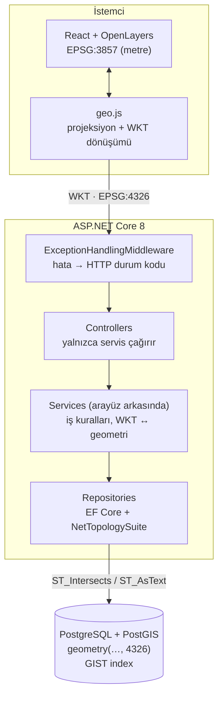

# Staj Projesi — Harita Uygulaması

.NET 8 Web API · PostgreSQL + PostGIS · React (Vite) + OpenLayers · JWT

Katmanlı mimariye sahip bir Web API, PostGIS destekli mekânsal veritabanı ve OpenLayers
tabanlı harita arayüzü. Kullanıcı haritada nokta/çizgi/poligon çizer, öznitelik girer,
kayıtlar WKT formatında veritabanına yazılır ve alanlar üzerinde kesişim analizi yapılır.

| | |
|---|---|
| **Giriş** | `admin` / `staj123` (ilk açılışta otomatik oluşturulur) |
| **API** | `http://localhost:5000` · Swagger: `/swagger` |
| **Arayüz** | `http://localhost:5173` |
| **Test** | 44 birim testi |

---

## İçindekiler

- [Mimari](#mimari)
- [Ödevler ve karşılıkları](#ödevler-ve-karşılıkları)
- [1) Katmanlı mimari](#1-katmanlı-mimari-n-tier)
- [2) Sistem durum takibi](#2-sistem-durum-takibi-soft-delete--audit)
- [3) Harita ve çizim işlemleri](#3-harita-ve-çizim-işlemleri)
- [4) WKT ve projeksiyon yönetimi](#4-wkt-ve-projeksiyon-yönetimi)
- [5) Öznitelik giriş pop-up'ı](#5-öznitelik-giriş-pop-upı)
- [6) Kesişim ve envanter analizi](#6-kesişim-ve-envanter-analizi)
- [Kurulum](#kurulum)
- [API uçları](#api-uçları)
- [Doğrulama sorguları](#veritabanı-doğrulama-sorguları)

---

## Mimari



**Bağımlılık yönü tek yönlüdür:** `API → Business → DataAccess → Entities`
Entities hiçbir katmana bağımlı değildir; katman atlama ve döngüsel bağımlılık yoktur.

---

## Ödevler ve karşılıkları

| Ödev | İstenen | Nerede |
|---|---|---|
| 2 | JWT ile login, korumalı uçlar, OpenLayers harita | `AuthService`, `auth.js`, `MapPage.jsx` |
| 3 | `is_deleted` / `is_active` / `modified_date` | `IAuditableEntity`, `AppDbContext.ApplyAuditRules` |
| 3 | Point / Line / Polygon çizimi, her tip kendi tablosuna | `tbl_point` · `tbl_line` · `tbl_polygon` |
| 3 | Geometry tipi, WKT, projeksiyon dönüşümü | `WktConverter.cs`, `geo.js` |
| 4 | Katmanlı mimari revizyonu, servisler arayüz arkasında | `BusinessRegistration`, `DataAccessRegistration` |
| 4 | drawend pop-up'ı: isim + renk | `MapPage.jsx` → `popup-form` |
| 4 | Kesişim ve envanter analizi | `AnalysisService`, `AnalysisRepository` |

---

## 1) Katmanlı mimari (N-Tier)

**Controller'lar yalnızca servis çağırır.** Hiçbir controller `DbContext` veya repository
görmez; tamamı servis **arayüzlerine** bağlıdır:

```csharp
public class AnalysisController : ControllerBase
{
    private readonly IAnalysisService _analysisService;   // tek bağımlılık

    [HttpPost("intersect")]
    public async Task<ActionResult<AnalysisResultDto>> Intersect(AnalysisRequestDto request)
        => Ok(await _analysisService.KesisimAnaliziAsync(request));
}
```

**Her servisin arayüzü vardır:** `IAuthService`, `IGeometryService<TEntity>`,
`IAnalysisService`, `ILocationService`, `IDatabaseSeeder`.
Repository katmanında da aynısı geçerlidir.

**Her katman kendi DI kaydını yapar** — `Program.cs` hangi sınıfın hangi arayüzü
karşıladığını bilmez:

```csharp
builder.Services.AddDataAccessLayer(builder.Configuration);  // DbContext + repository'ler
builder.Services.AddBusinessLayer(builder.Configuration);    // servisler + JwtSettings
```

**Hata yönetimi tek merkezde.** Controller'larda `try/catch` yoktur;
`ExceptionHandlingMiddleware` iş katmanı hatalarını HTTP durumlarına çevirir
(doğrulama hatası → `400`, beklenmeyen → `500`, ayrıntı log'a yazılır istemciye sızmaz).

**Başlangıç verisi Business katmanındadır.** Şifre hash'leme bir iş kuralıdır;
`Program.cs` içinde durması katman ihlaliydi, `DatabaseSeeder`'a taşındı.

**Generic yapı:** Üç geometri tipi için üç ayrı repository/service yazmak yerine
`GeometryRepository<TEntity>` ve `GeometryService<TEntity, TGeometry>` DI'da üç kez,
farklı tip argümanlarıyla kaydedilir. Controller'lar
`GeometryControllerBase<TEntity>`'den türeyen 3 satırlık sınıflardır.

---

## 2) Sistem Durum Takibi (Soft Delete & Audit)

`users` ve üç geometri tablosuna aynı desen uygulanmıştır:

| Kolon | Tip | Varsayılan | Anlamı |
|---|---|---|---|
| `is_deleted` | `boolean` | `false` | Soft delete bayrağı — kayıt fiziksel olarak silinmez |
| `is_active` | `boolean` | `true` | Kayıt kullanılabilir mi (pasif ≠ silinmiş) |
| `modified_date` | `timestamptz` | `NULL` | Son güncelleme damgası (UTC) |

- **Otomatik damga:** `AppDbContext.SaveChanges(...)` override edilir; `ChangeTracker`'da
  `Modified` durumundaki her `IAuditableEntity` için `ModifiedDate` atanır. Servislerde
  tek satır kod yoktur.
- **Global query filter:** `HasQueryFilter(e => !e.IsDeleted)` — silinmiş kayıtlar hiçbir
  sorguda görünmez. Görmek gerekirse `.IgnoreQueryFilters()` denir (seed ve *geri alma*
  bunu kullanır).
- **Partial unique index:** `IX_users_username` yalnızca `WHERE is_deleted = false`
  satırlarını kapsar; silinen bir kullanıcı adı tekrar kullanılabilir.
- **Giriş engeli:** `user.IsDeleted || !user.IsActive` durumunda şifre doğru olsa bile
  giriş reddedilir. Dışarıya ayrı mesaj verilmez (*user enumeration* önlemi).
- **Geri alma:** `POST /api/points/{id}/restore` — silme tek `UPDATE` ile geri alınır.
  Arayüzde onay kutusu yerine "sil + **Geri al**" deseni kullanılır.

> **Neden UTC?** Kolon tipi `timestamp with time zone` ve Npgsql `Kind`'ı `Utc` olmayan
> değeri reddeder. Ayrıca UTC saat dilimi/yaz saati değişimlerinden bağımsızdır.

---

## 3) Harita ve Çizim İşlemleri

| Araç | Kısayol | OpenLayers tipi | Tablo | Endpoint |
|---|---|---|---|---|
| Nokta | `1` | `Point` | `tbl_point` | `/api/points` |
| Çizgi | `2` | `LineString` | `tbl_line` | `/api/lines` |
| Poligon | `3` | `Polygon` | `tbl_polygon` | `/api/polygons` |
| Düzenle | `D` | `Modify` + `Snap` | — | `PUT` |
| Envanter Analizi | `A` | `Polygon` (geçici) | — | `/api/analysis/intersect` |

> OGC standardında çizgi tipinin adı `Line` değil **`LineString`**'tir; tablo adı `tbl_line`.

**Diğer kısayollar:** `/` arama · `Esc` iptal/kapat · `⌫` son köşeyi sil

**Sağ panel:** yer arama (Nominatim) → çizim araçları → analiz sonucu → katman aç/kapa →
sekmeli kayıt listesi (hover'da haritada vurgu, tıklamada zoom, soft delete + geri al).

**Haritada etkileşim:** Çizim aracı kapalıyken geometri üzerine gelince vurgulanır,
tıklanınca bilgi kartı açılır (ad, görsel, konum özeti, "Yakınlaş" / "Sil").
Boş alana tıklamak haritayı oraya kaydırır.

---

## 4) WKT ve Projeksiyon Yönetimi

### WKT (Well-Known Text)

OGC'nin tanımladığı, geometriyi insan okuyabilir metin olarak ifade eden standart:

```
POINT (32.8597 39.9334)
LINESTRING (32.85 39.93, 32.86 39.94, 32.87 39.92)
POLYGON ((32.85 39.93, 32.87 39.93, 32.87 39.95, 32.85 39.95, 32.85 39.93))
```

- Koordinat sırası **`X Y` = boylam enlem** (Google Maps'in `enlem, boylam` sırasının tersi)
- Poligonda **çift parantez**: dış parantez halkalar listesi, ikinci bir iç parantez "delik"
- Poligon **kapalı** olmalı: ilk koordinat = son koordinat
- **WKT'nin içinde SRID bilgisi yoktur** (o EWKT'nin işi: `SRID=4326;POINT(...)`)

Akrabaları: **WKB** (ikili hâli), **EWKT** (SRID'li), **GeoJSON** (JSON tabanlı).

**Neden WKT?** Nokta iki sayıyla taşınabilir ama çizgi/poligon değişken sayıda koordinat
içerir. WKT üç tipi de tek bir `string` alanında taşır — DTO üç tip için de aynı kalır.

### Projeksiyon dönüşümü

| | EPSG:4326 (WGS84) | EPSG:3857 (Web Mercator) |
|---|---|---|
| Birim | Derece | Metre |
| Ankara | `32.8597, 39.9334` | `3657925, 4856269` |
| Kullanım | **Veritabanı, WKT** | **Harita (OSM altlığı)** |

Dönüşüm mantığının tamamı `frontend/src/geo.js` içindedir:

```js
// Kaydetme yönü: harita (3857) → veritabanı (4326)
export function geometryToWkt(geometry) {
  const clone = geometry.clone()        // ⚠️ transform() geometriyi YERİNDE değiştirir
  clone.transform(MAP_PROJECTION, DATA_PROJECTION)
  return wktFormat.writeGeometry(clone, { decimals: 6 })
}

// Okuma yönü: veritabanı (4326) → harita (3857)
export function wktToFeature(wkt) {
  return wktFormat.readFeature(wkt, {
    dataProjection: DATA_PROJECTION,
    featureProjection: MAP_PROJECTION,
  })
}
```

**İki kritik nokta:**

1. **`clone()` olmadan `transform()`** haritadaki feature'ı da bozar; çizim (0,0) civarına
   — Gine Körfezi'ne — sıçrar ve hata mesajı alınmaz.
2. **Backend'de `geometry.SRID = 4326` elle atanır** (`WktConverter.Read`). WKT metninde
   SRID olmadığı için `WKTReader` SRID'si 0 olan geometri üretir; PostGIS
   `geometry(Point, 4326)` kolonu bunu kabul etmez.

`decimals: 6` → yaklaşık 11 cm hassasiyet.

---

## 5) Öznitelik Giriş Pop-up'ı

Çizim tamamlandığı anda (`drawend`) **haritada, çizilen geometrinin üzerinde** bir pop-up
açılır (`ol/Overlay`) — kullanıcı neyi isimlendirdiğini görerek yazar.

```js
draw.on('drawend', (evt) => {
  const geometry = evt.feature.getGeometry()
  setPending({ wkt: geometryToWkt(geometry), ozet: describeGeometry(geometry) })
  popupOverlayRef.current?.setPosition(popupKonumu(geometry))
})
```

| Alan | Durum |
|---|---|
| **İsim** | Zorunlu — boşken Kaydet düğmesi pasif |
| **Renk** | Zorunlu — 6 hazır renk + serbest renk seçici |
| Açıklama, görsel adresi, WKT önizlemesi | İsteğe bağlı |

Renk `#RRGGBB` olarak `color` kolonuna yazılır ve **haritadaki geometri kendi rengiyle**
çizilir. Doğrulama iki katmanlıdır: DTO'da `[RegularExpression]`, serviste ayrıca
normalleştirme (kırpma, küçük harfe indirme, biçim kontrolü) — servis, kendisini çağıran
katmana güvenmez.

Pop-up konumu geometri tipine göre belirlenir: nokta → kendisi, çizgi → orta noktası,
poligon → `getInteriorPoint()`. Sınırlayıcı kutunun merkezi kullanılmaz; içbükey bir
poligonda o nokta şeklin dışına düşebilir.

---

## 6) Kesişim ve Envanter Analizi

### Çizilen poligon analizi

Bir poligon kaydedilir kaydedilmez, onunla kesişen envanter otomatik sayılır ve
bildirimle gösterilir. Poligonun **kendisi hariç tutulur** (`haricTutulanPolygonId`).

### Geçici "Envanter Analizi" aracı

Kullanıcı geçici bir poligon çizer; alanla kesişen envanterler sayılır, listelenir ve
**haritada işaretlenir**. Bu poligon **veritabanına kaydedilmez**; "Analizi temizle" ile
kaldırılır.

### Kesişim neden `ST_Intersects`?

```csharp
_context.Points.Where(e => alan.Intersects(e.Geom))   // → SQL: ST_Intersects(@alan, geom)
```

Ödevin şartı *"objelerin tamamen kapsanması gerekmez, ufak bir kesişim dahi"* idi.

| Fonksiyon | Anlamı |
|---|---|
| **`ST_Intersects`** | En ufak temas bile sayılır ✔ **kullanılan** |
| `ST_Contains` / `ST_Within` | Tam kapsama arar ✘ şarta aykırı |

Hesap **veritabanında** yapılır: `geom` kolonundaki GIST index kullanılabilsin ve
envanterin tamamı ağdan geçmesin diye. Alternatif — tüm tabloyu belleğe çekip C#'ta
döngüyle karşılaştırmak — her iki avantajı da kaybettirirdi.

---

## Kurulum

### Gereksinimler
- .NET 8 SDK · PostgreSQL 17 + **PostGIS 3.5** · Node.js 18+

### 1. Veritabanı

PostgreSQL kurulumunda **Stack Builder → Spatial Extensions → PostGIS Bundle** seçilmelidir.

```bash
psql -U postgres -f backend/db/setup.sql
```

Betik `stajyer` rolünü, `staj_db` veritabanını oluşturur ve PostGIS'i etkinleştirir.

> PostGIS eklentisi **veritabanı bazındadır**: sunucuya kurmak yetmez, her veritabanında
> ayrıca `CREATE EXTENSION postgis` çalıştırılmalıdır.

### 2. Yapılandırma (sırlar)

`appsettings.json` git'te izlenir ve **yer tutucu** değerler içerir. Gerçek şifre ve JWT
anahtarı `appsettings.Development.json` içindedir; bu dosya `.gitignore`'dadır.

```bash
cp backend/StajProject.API/appsettings.Development.json.example \
   backend/StajProject.API/appsettings.Development.json
# sonra kendi değerlerinizi girin
```

> ASP.NET Core yapılandırmayı katman katman okur:
> `appsettings.json` → `appsettings.<Ortam>.json` → ortam değişkenleri.
> Sonraki katman öncekini ezer; bu yüzden Development dosyasında yalnızca **değişen**
> anahtarlar bulunur.

### 3. Backend

```bash
dotnet run --project backend/StajProject.API
```

Şema **EF Core migration** ile yönetilir; uygulama açılışta bekleyen migration'ları
otomatik uygular. Yeni değişiklik için:

```bash
dotnet ef migrations add MigrationAdi -p StajProject.DataAccess -s StajProject.API
```

**Başlangıç verisi:** İlk açılışta `admin` kullanıcısı ve — ilgili tablo **boşsa** —
Türkiye geneline dağılmış 14 örnek envanter (7 nokta, 3 güzergâh, 4 alan) yüklenir.
Dolu tabloya dokunulmaz, yani kendi çizimleriniz korunur.

Örnek veriyi yeniden yüklemek için tabloları boşaltıp uygulamayı yeniden başlatın:

```sql
TRUNCATE tbl_point, tbl_line, tbl_polygon RESTART IDENTITY;
```

### 4. Frontend

```bash
npm install --prefix frontend && npm run dev --prefix frontend
```

`/api` istekleri Vite proxy ile backend'e yönlenir.

### Testler

```bash
dotnet test backend/StajProject.sln
```

44 test: durum kolonlarının davranışı (EF InMemory ile gerçek `DbContext` üzerinde),
WKT çözümleme / tip doğrulama / SRID yönetimi, görsel adresi güvenliği, geri alma,
başlangıç verisi kuralları ve `LocationService`.

---

## API Uçları

| Metot | Yol | Açıklama |
|---|---|---|
| POST | `/api/auth/login` | JWT alır (10 dk geçerli, IP başına **5 deneme/dk**) |
| GET | `/api/points` · `/api/lines` · `/api/polygons` | Kayıtları WKT olarak listeler |
| GET | `/api/points/{id}` | Tek kayıt |
| POST | `/api/points` | `{ name, color, description?, imageUrl?, wkt }` |
| PUT | `/api/points/{id}` | Öznitelik (+ opsiyonel geometri) günceller |
| DELETE | `/api/points/{id}` | Soft delete |
| POST | `/api/points/{id}/restore` | Silmeyi geri alır |
| POST | `/api/points/{id}/active` | Aktif/pasif değiştirir |
| **POST** | **`/api/analysis/intersect`** | `{ wkt, haricTutulanPolygonId? }` → kesişen envanter |
| GET/POST/DELETE | `/api/locations` | 2. ödevden kalan tablo (geriye dönük uyumluluk) |

Geometri ve analiz uçlarının tamamı `[Authorize]` ile korunur — token yoksa veya süresi
dolduysa **401**. Geçersiz WKT/renk/görsel adresi → **400** ve açıklayıcı mesaj.

Swagger arayüzünde tüm uçlar koddaki `/// <summary>` açıklamalarıyla belgelenmiştir.

---

## Veritabanı Doğrulama Sorguları

```sql
-- Geometri kolonlarının tipi ve SRID'si
SELECT f_table_name, f_geometry_column, coord_dimension, srid, type FROM geometry_columns;

-- Kayıtlar WKT olarak
SELECT id, name, color, ST_SRID(geom), ST_AsText(geom) FROM tbl_point;

-- Durum kolonları
SELECT id, name, is_deleted, is_active, modified_date FROM tbl_polygon;

-- Kesişim analizinin SQL karşılığı
SELECT COUNT(*) FROM tbl_point
WHERE ST_Intersects(geom, ST_GeomFromText('POLYGON((32.6 39.8,33.1 39.8,33.1 40.1,32.6 40.1,32.6 39.8))', 4326));
```

---

## Proje Yapısı

```
StajProject/
├── backend/
│   ├── StajProject.API/          → Controllers, Program.cs, Middleware, Swagger, CORS
│   ├── StajProject.Business/     → Services (+arayüzler), DTOs, Geo/WktConverter
│   ├── StajProject.DataAccess/   → DbContext, Repositories (+arayüzler), Migrations
│   ├── StajProject.Entities/     → Entity tanımları, IAuditableEntity
│   ├── StajProject.Tests/        → 44 birim testi (xUnit)
│   └── db/setup.sql              → Rol + veritabanı + PostGIS kurulumu
└── frontend/src/
    ├── geo.js                    → Projeksiyon + WKT dönüşümleri (tek merkez)
    ├── api.js                    → API çağrıları
    ├── auth.js                   → Token yönetimi, otomatik çıkış
    ├── geocode.js                → Nominatim yer arama
    ├── icons.jsx                 → Inline SVG ikonlar
    ├── ErrorBoundary.jsx         → Beyaz ekran yerine hata kartı
    ├── index.css                 → Tasarım sistemi (koyu krom / aydınlık içerik)
    └── pages/                    → Login.jsx · MapPage.jsx
```

---

## Notlar

- **Renk senkronu:** Çizim tipi renkleri iki yerde tanımlıdır ve aynı tutulmalıdır —
  `frontend/src/geo.js` (`DRAW_TYPES[*].color`) ve `frontend/src/index.css`
  (`--nokta`, `--cizgi`, `--poligon`, `--analiz`).
- **`describeGeometry`** içindeki uzunluk/alan değerleri Mercator düzleminde hesaplanır;
  Türkiye enlemlerinde gerçek değerden yaklaşık %30 sapar. Yalnızca bilgi amaçlıdır.
- **Tasarım sistemi:** Üst bar ve panel koyu ("krom"), harita ve üzerindeki kartlar
  aydınlık ("içerik"). Renk token'ları iki kademelidir (ham → anlamsal); etkileşim
  durumları `color-mix()` ile türetilir. Metin/zemin kontrastları WCAG AA (≥4.5:1)
  ölçütünü karşılar.
