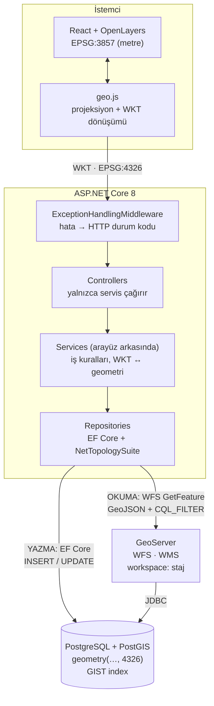
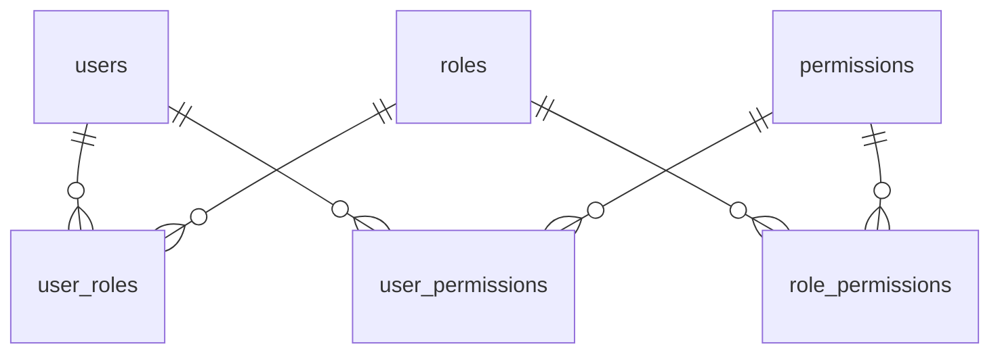

# Staj Projesi — Harita Uygulaması

.NET 8 Web API · PostgreSQL + PostGIS · React (Vite) + OpenLayers · JWT

Katmanlı mimariye sahip bir Web API, PostGIS destekli mekânsal veritabanı ve OpenLayers
tabanlı harita arayüzü. Kullanıcı haritada nokta/çizgi/poligon çizer, öznitelik girer,
kayıtlar WKT formatında veritabanına yazılır ve alanlar üzerinde kesişim analizi yapılır.
Operatörler haritaya kategorili **POI** (ilgi noktası) girer; ayrı bir yönetim paneli
kullanıcıları, rolleri, yetkileri ve POI/kategori sözlüğünü yönetir. Kayıtların
**okunması** artık doğrudan veritabanından değil, **GeoServer'ın WFS servisi**
üzerinden yapılır; POI'ler haritada **kategori başına ayrı SLD** ile boyanır ve
haritanın üstündeki **arama barından** aranır.

| | |
|---|---|
| **Giriş** | `admin` / `staj123` (Admin) · `ayse` / `staj123` (Operatör) · `mehmet` / `staj123` (Kullanıcı) |
| **API** | `http://localhost:5000` · Swagger: `/swagger` (yalnızca geliştirmede) |
| **Arayüz** | `http://localhost:5173` · Yönetim paneli: `/admin` |
| **GeoServer** | `http://localhost:8080/geoserver` · `admin` / `geoserver` · workspace `staj` |
| **Test** | 238 birim testi |

---

## İçindekiler

- [Mimari](#mimari)
- [Ödevler ve karşılıkları](#ödevler-ve-karşılıkları)
- [1) Katmanlı mimari](#1-katmanlı-mimari-n-tier)
- [2) Sistem durum takibi](#2-sistem-durum-takibi-soft-delete--audit)
- [3) Harita ve çizim işlemleri](#3-harita-ve-çizim-işlemleri)
- [4) WKT ve projeksiyon yönetimi](#4-wkt-ve-projeksiyon-yönetimi)
- [5) Öznitelik giriş pop-up'ı](#5-öznitelik-giriş-pop-upı)
- [6) Kesişim ve envanter analizi](#6-kesişim-ve-envanter-analizi)
- [7) Yönetim paneli ve dinamik yetkilendirme](#7-yönetim-paneli-ve-dinamik-yetkilendirme)
- [8) Coğrafi yetki tanımlama](#8-coğrafi-yetki-tanımlama)
- [9) GeoServer entegrasyonu](#9-geoserver-entegrasyonu)
- [10) SQL View ve ısı haritası](#10-sql-view-ve-ısı-haritası)
- [11) İl/bölge yetkisi ve kayıt olma](#11-ilbölge-yetkisi-ve-kayıt-olma)
- [12) Kapalı bölge, termometre, hesap değiştirme](#12-kapalı-bölge-termometre-hesap-değiştirme)
- [13) POI ve kategori yönetimi](#13-poi-ve-kategori-yönetimi)
- [14) POI GeoServer entegrasyonu, arama barı ve mesai planı](#14-poi-geoserver-entegrasyonu-arama-barı-ve-mesai-planı)
- [15) Konum analizi ve ağırlıklı ısı haritası](#15-konum-analizi-ve-ağırlıklı-ısı-haritası)
- [16) Kategoriye özgü POI simgeleri](#16-kategoriye-özgü-poi-simgeleri)
- [17) Akıllı ulaşım modülü — durak ve güzergah](#17-akıllı-ulaşım-modülü--durak-ve-güzergah-yönetimi)
- [Kurulum](#kurulum)
- [API uçları](#api-uçları)
- [Doğrulama sorguları](#veritabanı-doğrulama-sorguları)

---

## Mimari



Ödev 8'den sonra veri **iki farklı yoldan** akıyor: kayıt **okunurken** GeoServer'ın
WFS servisinden, **yazılırken** doğrudan EF Core üzerinden. İki yol da sonunda aynı
PostGIS veritabanına çıkıyor — veri tek yerde duruyor, kopyalanmıyor.

**Bağımlılık yönü tek yönlüdür:** `API → Business → DataAccess → Entities`
Entities hiçbir katmana bağımlı değildir; katman atlama ve döngüsel bağımlılık yoktur.

---

## Ödevler ve karşılıkları

| Ödev | İstenen | Nerede |
|---|---|---|
| 2 | JWT ile login, korumalı uçlar, OpenLayers harita | `AuthService`, `auth.js`, `MapPage.jsx` |
| 3 | `is_deleted` / `is_active` / `modified_date` | `IAuditableEntity`, `AppDbContext.ApplyAuditRules` |
| 3 | Point / Line / Polygon çizimi, her tip kendi tablosuna | `tbl_point` · `tbl_line` · `tbl_polygon` |
| 3 | Geometry tipi, WKT, projeksiyon dönüşümü | `WktConverter.cs`, `geo.js` |
| 4 | Katmanlı mimari revizyonu, servisler arayüz arkasında | `BusinessRegistration`, `DataAccessRegistration` |
| 4 | drawend pop-up'ı: isim + renk | `MapPage.jsx` → `popup-form` |
| 4 | Kesişim ve envanter analizi | `AnalysisService`, `AnalysisRepository` |
| 5 | Standart hata yönetimi, izleme kolonları, sahiplik süzgeci | `GeometryControllerBase.Calistir`, `ICurrentUserService` |
| 6 | Admin paneli: sol dikey navbar, Kullanıcı ve Rol listesi | `AdminLayout.jsx`, `AdminUsers.jsx`, `AdminRoles.jsx` |
| 6 | Permission tablosu, rol/kullanıcı yetki atamaları | `roles` · `permissions` · `user_roles` · `role_permissions` · `user_permissions` |
| 6 | Rolden gelen yetki kullanıcıda tekrar seçtirilmez | `PermissionService.Birlestir`, `UserAdminService.SetPermissionsAsync` |
| 6 | Yetkiler çizim/analiz uçlarında da zorunlu | `[YetkiGerekli]`, `[EklemeYetkisiGerekli]`, `yetkiler.js` |
| 7 | Kullanıcı/rol bazlı coğrafi yetki, Türkiye'ye zoomlu harita | `CografiYetkiModal.jsx`, `geo_permissions` |
| 7 | Tanımlı alanın dışına çizim engelleniyor | `GeoPermissionService.DogrulaAsync` |
| 7 | Yetkisi olmayana buton hiç gösterilmiyor | `MapPage.jsx`, `AdminUsers.jsx`, `AdminRoles.jsx` |
| 8 | GeoServer kurulumu, Workspace / Store / Layer | `geoserver/KURULUM.md`, `geoserver/gs-yapilandir.ps1` |
| 8 | PostGIS store, üç tablo katman olarak yayınlandı | `staj:tbl_point` · `staj:tbl_line` · `staj:tbl_polygon` |
| 8 | Veri getirme GeoServer üzerinden (WFS) | `GeoServerGeometryRepository`, `GeoServerAnalysisRepository` |
| 8 | WMS katmanı (backend vekili üzerinden) | `GeoServerController.Wms`, `frontend/src/wms.js` |
| 9 | Katmanlar SQL View ile, `is_deleted = false` view içinde | `staj:vw_point` · `vw_line` · `vw_polygon` |
| 9 | Kullanıcı bazlı filtreleme `cql_filter` ile | `GeoServerGeometryRepository.SahiplikSuzgeci` |
| 9 | Genel gösterim WMS, etkileşim WFS | `MapPage.jsx` → WMS varsayılan açık |
| 9 | "Isı Haritası Analizi" menü seçeneği | `MapPage.jsx` → `IsiIkonu` düğmesi |
| 9 | Dinamik ısı haritası (SLD / `gs:Heatmap`) | `geoserver/isi-haritasi.sld` |
| 9 | Lejant (sağ alt, 0–1 yoğunluk) | `.isi-lejant` → `ISI_GRADYANI` (Ödev 11'de CSS'e taşındı) |
| 10 | Coğrafi yetki: il seçimi (81 il, haritadan tıklayarak) | `iller` tablosu, `CografiYetkiModal` |
| 10 | Coğrafi yetki: bölge seçimi (7 coğrafi bölge) | `Bolgeler.cs`, `IlRepository.BolgeGeometrisiAsync` |
| 10 | Elle çizim korundu | `GeoPermissionService.AlanGeometrisiAsync` |
| 10 | Giriş ekranında yıldız alanı | `index.css` → `.yildiz-alani` |
| 10 | Kayıt olma + yönetici onayı | `AuthService.RegisterAsync`, `users.is_approved` |
| 11 | Çoklu bölge seçimi | `GeoPermissionService.BolgeleriBirlestirAsync` |
| 11 | Yetki alanı dışı **pasif** (maskeli + tıklanamaz) | `MapPage.jsx` → maske katmanı + `Draw.condition` |
| 11 | Isı haritası "termometre" — her noktada anlık değer | `isi-deger.sld`, `wms.js` → `degerOku` |
| 11 | Termometre: gezinirken canlı okuma, tıklayınca sabitleme | `MapPage.jsx` → `anlikOlcum` / `sabitOlcum` |
| 11 | Isı yarıçapı sabit mesafe (200 km), zoom'dan bağımsız | `wms.js` → `yaricapAyarla` → `ENV=radius:N` |
| 11 | Gökkuşağı yerine tek yönlü sıcaklık rampası | `isi-haritasi.sld` · `wms.js` → `ISI_RAMPASI` |
| 11 | Mevcut poligonlardan yetki alanı seçimi | `PoligonlariBirlestirAsync`, `/api/admin/geo-permissions/poligonlar` |
| 11 | Hesap değiştirici (üst bar) | `auth.js` → `hesabaGec`, `aktifOturumuBirak` |
| 12 | Üç temel rol: **Admin / Operatör / Kullanıcı** | `DatabaseSeeder.RolleriYenidenAdlandirAsync` |
| 12 | `poi` tablosu (`is_active` · `is_deleted` · `created_date` · `user_id` + `kategori_id` · `isim` · `mesai_saatleri`) | `Poi.cs`, `AppDbContext.ConfigurePoi` |
| 12 | Hiyerarşik `poi_category` (Parent-Child) | `PoiCategory.ParentId` (self FK), `PoiCategoryService` |
| 12 | Admin panelinde "POI Yönetimi" menüsü + ekleyen kullanıcı | `AdminPoi.jsx` → POI Listesi sekmesi |
| 12 | Kategori yönetimi (ekleme / düzenleme) aynı panelde | `AdminPoi.jsx` → Kategoriler sekmesi |
| 12 | Operatör için haritada POI ekleme aracı (Point) | `MapPage.jsx` → `POI` aracı, `poiStili` |
| 12 | Formda isim + kategori dropdown'ı + mesai saatleri | `MapPage.jsx` → `MesaiAlanlari`, `/api/poi/kategoriler` |
| 12 | POI'ye tıklayınca bilgi paneli | `MapPage.jsx` → POI popup kartı |
| 13 | POI tablosu GeoServer'a katman olarak eklendi, veri buradan çekiliyor | `staj:vw_poi`, `GeoServerPoiRepository` |
| 13 | Her POI kategorisi için ayrı SLD — farklı ikon ve renk | `geoserver/poi-*.sld` (5 stil) |
| 13 | Belirli zoom'dan sonra POI adları nokta üzerinde | SLD → `<MaxScaleDenominator>75000` |
| 13 | Google Maps benzeri arama barı (POI + yer), Kullanıcı rolüne de açık | `MapPage.jsx` → `.arama-bari`, `/api/poi/ara` |
| 13 | Mesai seçiminde gün seçme | `MesaiPlani`, `poi.mesai_plani` (jsonb) |
| 13 | Resmî kurum modu: ortak tatillerde kapalı, çalışma saati belli | `MesaiPlani.ResmiKurum()`, `ResmiTatiller` |
| 13 | Seçilen/aranan yerde konumlandırma ve kategori otomatik | `geocode.js → yeriCoz`, `KategoriEsleme` |
| 13+ | SLD'ler kategori tablosundan üretiliyor (yeni kategori = yeni stil) | `PoiStilUretici`, `PoiStyleService` |
| 13+ | POI kartında canlı "Açık / Kapalı" durumu | `MesaiPlani.Durum`, `mesai.js → suAnDurum` |
| 13+ | Kullanıcı rolünü gösteren üçüncü demo hesabı | `mehmet` / `staj123` |
| 14 | "Konum Analizi" paneli — **Kullanıcı rolüne de açık** | `KonumAnaliziPaneli.jsx`, `Yetkiler.AnalizCalistirma` |
| 14 | Hedef bölge: il listesinden seçim **veya** haritada poligon | `.il-listesi` · `MapPage.jsx` → `KONUM_ALAN` aracı |
| 14 | 2–5 kategori bazlı kriter, her birine 100 üzerinden puan | `AnalizKriteriDto`, `KonumAnaliziService` |
| 14 | Puan toplamı tam 100 değilse analiz başlamıyor | `KriterleriDogrula` + panelde `puan-toplami` |
| 14 | Analiz yalnızca seçilen alandaki POI'ler üzerinde | `AlandakileriGetirAsync` (PostGIS `ST_Intersects`) |
| 14 | Kriter ve puanlara göre dinamik, renklendirilmiş ısı haritası | `AgirlikliIsiIzgarasi` + `isiIzgarasi.js` |
| 14 | Analiz için POI verisi üretimi (~4.100 kayıt, 81 ilin sınırından) | `AnalizPoiUretici` |
| 14+ | *(iyileştirme)* Önerilen konumlar ve her kritere uzaklığı | `AgirlikliIsiIzgarasi.AdaylariSec` |
| 15 | POI'lere kategoriye özgü simgeler | `PoiIkonlari` (14 simge), `PoiStilUretici` → `<ExternalGraphic>` |
| 15 | Simge yönetim panelinden seçiliyor | `poi_category.ikon` + `AdminPoi.jsx` → ikon seçici |
| 15 | Seçilmezse üst kategoriden miras alınıyor | `PoiIkonlari.EtkinAnahtar` |
| 15 | Harita, lejant ve seçici AYNI çizimden besleniyor | `/api/poi/stiller` · `/api/poi/ikonlar` · `poiIkon.js` |
| 15+ | *(düzeltme)* 3. seviye kategoriler de stil alıyor | `PoiStilUretici.Uret` ağacın tamamını geziyor |
| 16 | `durak` ve `guzergah` tabloları, **1-N** ilişki | `Entities/Ulasim.cs`, migration `UlasimModulu` |
| 16 | Ulaşım için **Operatör** ve **Kullanıcı** rolleri | `Ulaşım Operatörü` · `Ulaşım Kullanıcısı` |
| 16 | Haritada "Durak Ekle" (Point) aracı + güzergah dropdown'ı | `MapPage.jsx` → `DURAK` aracı |
| 16 | Menüde "Güzergah Yönetimi" paneli (isim + renk) | `AdminGuzergah.jsx`, `/admin/guzergah` |
| 16 | Duraklar sıra bazlı listeleniyor | `durak.sira`, `GuzergahDto.Duraklar` |
| 16 | **Sürükle-bırak** ile durak sıralaması | `PUT /api/ulasim/guzergahlar/{id}/sira` |
| 16 | Duraklara tıklayınca bilgi kutucuğu | `MapPage.jsx` → `secili.tip === DURAK` kartı |
| 16 | *(not)* Ulaşım rolleri POI/çizim EKLEYEMEZ, POI'leri görür | Rol tanımları + `UlasimTests` |
| 17 | **OSRM** ile otomatik rota üretimi (Docker'da local) | `osrm/`, `OsrmClient.cs` |
| 17 | Rotalar veritabanına kaydediliyor ve haritada gösteriliyor | `guzergah.rota` (LineString), `MapPage.jsx` |
| 17 | Güzergahlar üzerinde **aç/kapat** (katman kontrolü gibi) | `.guzergah-anahtar` + `gizliGuzergahlar` |
| 17 | Durak sırası değişince rota **otomatik** güncelleniyor | `UlasimService.RotayiTazeleAsync` |
| 17 | Rota yönü **ok işaretleriyle** gösteriliyor | `MapPage.jsx` → `yonOklari()` |
| 17 | Ulaşım rolleri POI'de **yalnızca görüntüleme** | `UlasimPoiYetkiTests` |
| 17 | Admin panelinde **duraklar da düzenlenebiliyor** | `AdminGuzergah.jsx` → `.durak-form` |

---

## 1) Katmanlı mimari (N-Tier)

**Controller'lar yalnızca servis çağırır.** Hiçbir controller `DbContext` veya repository
görmez; tamamı servis **arayüzlerine** bağlıdır:

```csharp
public class AnalysisController : ControllerBase
{
    private readonly IAnalysisService _analysisService;   // tek bağımlılık

    [HttpPost("intersect")]
    public async Task<ActionResult<AnalysisResultDto>> Intersect(AnalysisRequestDto request)
        => Ok(await _analysisService.KesisimAnaliziAsync(request));
}
```

**Her servisin arayüzü vardır:** `IAuthService`, `IGeometryService<TEntity>`,
`IAnalysisService`, `ILocationService`, `IDatabaseSeeder`.
Repository katmanında da aynısı geçerlidir.

**Her katman kendi DI kaydını yapar** — `Program.cs` hangi sınıfın hangi arayüzü
karşıladığını bilmez:

```csharp
builder.Services.AddDataAccessLayer(builder.Configuration);  // DbContext + repository'ler
builder.Services.AddBusinessLayer(builder.Configuration);    // servisler + JwtSettings
```

**Hata yönetimi tek merkezde.** Controller'larda `try/catch` yoktur;
`ExceptionHandlingMiddleware` iş katmanı hatalarını HTTP durumlarına çevirir
(doğrulama hatası → `400`, beklenmeyen → `500`, ayrıntı log'a yazılır istemciye sızmaz).

**Başlangıç verisi Business katmanındadır.** Şifre hash'leme bir iş kuralıdır;
`Program.cs` içinde durması katman ihlaliydi, `DatabaseSeeder`'a taşındı.

**Generic yapı:** Üç geometri tipi için üç ayrı repository/service yazmak yerine
`GeometryRepository<TEntity>` ve `GeometryService<TEntity, TGeometry>` DI'da üç kez,
farklı tip argümanlarıyla kaydedilir. Controller'lar
`GeometryControllerBase<TEntity>`'den türeyen 3 satırlık sınıflardır.

---

## 2) Sistem Durum Takibi (Soft Delete & Audit)

`users` ve üç geometri tablosuna aynı desen uygulanmıştır:

| Kolon | Tip | Varsayılan | Anlamı |
|---|---|---|---|
| `is_deleted` | `boolean` | `false` | Soft delete bayrağı — kayıt fiziksel olarak silinmez |
| `is_active` | `boolean` | `true` | Kayıt kullanılabilir mi (pasif ≠ silinmiş) |
| `modified_date` | `timestamptz` | `NULL` | Son güncelleme damgası (UTC) |

- **Otomatik damga:** `AppDbContext.SaveChanges(...)` override edilir; `ChangeTracker`'da
  `Modified` durumundaki her `IAuditableEntity` için `ModifiedDate` atanır. Servislerde
  tek satır kod yoktur.
- **Global query filter:** `HasQueryFilter(e => !e.IsDeleted)` — silinmiş kayıtlar hiçbir
  sorguda görünmez. Görmek gerekirse `.IgnoreQueryFilters()` denir (seed ve *geri alma*
  bunu kullanır).
- **Partial unique index:** `IX_users_username` yalnızca `WHERE is_deleted = false`
  satırlarını kapsar; silinen bir kullanıcı adı tekrar kullanılabilir.
- **Giriş engeli:** `user.IsDeleted || !user.IsActive` durumunda şifre doğru olsa bile
  giriş reddedilir. Dışarıya ayrı mesaj verilmez (*user enumeration* önlemi).
- **Geri alma:** `POST /api/points/{id}/restore` — silme tek `UPDATE` ile geri alınır.
  Arayüzde onay kutusu yerine "sil + **Geri al**" deseni kullanılır.

> **Neden UTC?** Kolon tipi `timestamp with time zone` ve Npgsql `Kind`'ı `Utc` olmayan
> değeri reddeder. Ayrıca UTC saat dilimi/yaz saati değişimlerinden bağımsızdır.

---

## 3) Harita ve Çizim İşlemleri

| Araç | Kısayol | OpenLayers tipi | Tablo | Endpoint |
|---|---|---|---|---|
| Nokta | `1` | `Point` | `tbl_point` | `/api/points` |
| Çizgi | `2` | `LineString` | `tbl_line` | `/api/lines` |
| Poligon | `3` | `Polygon` | `tbl_polygon` | `/api/polygons` |
| Düzenle | `D` | `Modify` + `Snap` | — | `PUT` |
| Envanter Analizi | `A` | `Polygon` (geçici) | — | `/api/analysis/intersect` |

> OGC standardında çizgi tipinin adı `Line` değil **`LineString`**'tir; tablo adı `tbl_line`.

**Diğer kısayollar:** `/` arama · `Esc` iptal/kapat · `⌫` son köşeyi sil

**Sağ panel:** yer arama (Nominatim) → çizim araçları → analiz sonucu → katman aç/kapa →
sekmeli kayıt listesi (hover'da haritada vurgu, tıklamada zoom, soft delete + geri al).

**Haritada etkileşim:** Çizim aracı kapalıyken geometri üzerine gelince vurgulanır,
tıklanınca bilgi kartı açılır (ad, görsel, konum özeti, "Yakınlaş" / "Sil").
Boş alana tıklamak haritayı oraya kaydırır.

---

## 4) WKT ve Projeksiyon Yönetimi

### WKT (Well-Known Text)

OGC'nin tanımladığı, geometriyi insan okuyabilir metin olarak ifade eden standart:

```
POINT (32.8597 39.9334)
LINESTRING (32.85 39.93, 32.86 39.94, 32.87 39.92)
POLYGON ((32.85 39.93, 32.87 39.93, 32.87 39.95, 32.85 39.95, 32.85 39.93))
```

- Koordinat sırası **`X Y` = boylam enlem** (Google Maps'in `enlem, boylam` sırasının tersi)
- Poligonda **çift parantez**: dış parantez halkalar listesi, ikinci bir iç parantez "delik"
- Poligon **kapalı** olmalı: ilk koordinat = son koordinat
- **WKT'nin içinde SRID bilgisi yoktur** (o EWKT'nin işi: `SRID=4326;POINT(...)`)

Akrabaları: **WKB** (ikili hâli), **EWKT** (SRID'li), **GeoJSON** (JSON tabanlı).

**Neden WKT?** Nokta iki sayıyla taşınabilir ama çizgi/poligon değişken sayıda koordinat
içerir. WKT üç tipi de tek bir `string` alanında taşır — DTO üç tip için de aynı kalır.

### Projeksiyon dönüşümü

| | EPSG:4326 (WGS84) | EPSG:3857 (Web Mercator) |
|---|---|---|
| Birim | Derece | Metre |
| Ankara | `32.8597, 39.9334` | `3657925, 4856269` |
| Kullanım | **Veritabanı, WKT** | **Harita (OSM altlığı)** |

Dönüşüm mantığının tamamı `frontend/src/geo.js` içindedir:

```js
// Kaydetme yönü: harita (3857) → veritabanı (4326)
export function geometryToWkt(geometry) {
  const clone = geometry.clone()        // ⚠️ transform() geometriyi YERİNDE değiştirir
  clone.transform(MAP_PROJECTION, DATA_PROJECTION)
  return wktFormat.writeGeometry(clone, { decimals: 6 })
}

// Okuma yönü: veritabanı (4326) → harita (3857)
export function wktToFeature(wkt) {
  return wktFormat.readFeature(wkt, {
    dataProjection: DATA_PROJECTION,
    featureProjection: MAP_PROJECTION,
  })
}
```

**İki kritik nokta:**

1. **`clone()` olmadan `transform()`** haritadaki feature'ı da bozar; çizim (0,0) civarına
   — Gine Körfezi'ne — sıçrar ve hata mesajı alınmaz.
2. **Backend'de `geometry.SRID = 4326` elle atanır** (`WktConverter.Read`). WKT metninde
   SRID olmadığı için `WKTReader` SRID'si 0 olan geometri üretir; PostGIS
   `geometry(Point, 4326)` kolonu bunu kabul etmez.

`decimals: 6` → yaklaşık 11 cm hassasiyet.

---

## 5) Öznitelik Giriş Pop-up'ı

Çizim tamamlandığı anda (`drawend`) **haritada, çizilen geometrinin üzerinde** bir pop-up
açılır (`ol/Overlay`) — kullanıcı neyi isimlendirdiğini görerek yazar.

```js
draw.on('drawend', (evt) => {
  const geometry = evt.feature.getGeometry()
  setPending({ wkt: geometryToWkt(geometry), ozet: describeGeometry(geometry) })
  popupOverlayRef.current?.setPosition(popupKonumu(geometry))
})
```

| Alan | Durum |
|---|---|
| **İsim** | Zorunlu — boşken Kaydet düğmesi pasif |
| **Renk** | Zorunlu — 6 hazır renk + serbest renk seçici |
| Açıklama, görsel adresi, WKT önizlemesi | İsteğe bağlı |

Renk `#RRGGBB` olarak `color` kolonuna yazılır ve **haritadaki geometri kendi rengiyle**
çizilir. Doğrulama iki katmanlıdır: DTO'da `[RegularExpression]`, serviste ayrıca
normalleştirme (kırpma, küçük harfe indirme, biçim kontrolü) — servis, kendisini çağıran
katmana güvenmez.

Pop-up konumu geometri tipine göre belirlenir: nokta → kendisi, çizgi → orta noktası,
poligon → `getInteriorPoint()`. Sınırlayıcı kutunun merkezi kullanılmaz; içbükey bir
poligonda o nokta şeklin dışına düşebilir.

---

## 6) Kesişim ve Envanter Analizi

### Çizilen poligon analizi

Bir poligon kaydedilir kaydedilmez, onunla kesişen envanter otomatik sayılır ve
bildirimle gösterilir. Poligonun **kendisi hariç tutulur** (`haricTutulanPolygonId`).

### Geçici "Envanter Analizi" aracı

Kullanıcı geçici bir poligon çizer; alanla kesişen envanterler sayılır, listelenir ve
**haritada işaretlenir**. Bu poligon **veritabanına kaydedilmez**; "Analizi temizle" ile
kaldırılır.

### Kesişim neden `ST_Intersects`?

```csharp
_context.Points.Where(e => alan.Intersects(e.Geom))   // → SQL: ST_Intersects(@alan, geom)
```

Ödevin şartı *"objelerin tamamen kapsanması gerekmez, ufak bir kesişim dahi"* idi.

| Fonksiyon | Anlamı |
|---|---|
| **`ST_Intersects`** | En ufak temas bile sayılır ✔ **kullanılan** |
| `ST_Contains` / `ST_Within` | Tam kapsama arar ✘ şarta aykırı |

Hesap **veritabanında** yapılır: `geom` kolonundaki GIST index kullanılabilsin ve
envanterin tamamı ağdan geçmesin diye. Alternatif — tüm tabloyu belleğe çekip C#'ta
döngüyle karşılaştırmak — her iki avantajı da kaybettirirdi.

---

## 7) Yönetim Paneli ve Dinamik Yetkilendirme

### Arayüz: sol dikey navbar

`/admin` altındaki ekranlar `AdminLayout` çerçevesinde açılır: solda ekran boyu dikey
navbar, sağda değişen içerik (`<Outlet />`). Menü iki ekran içerir — **Kullanıcı Listesi**
(Ekle / Güncelle / Çıkar) ve **Rol Listesi** (Ekle / Güncelle / Sil).

Menü maddeleri `AdminLayout.jsx` içindeki tek bir `MENU` dizisinden üretilir; yeni ekran
eklemek bir satır yazmak demektir. Panel bağlantısı harita ekranının üst barında yalnızca
yetkili kullanıcıya görünür.

### Veri modeli



`roles` ve `permissions` aynı iskeleti paylaşır (`id`, `name`, `description` + durum
kolonları), bu yüzden ortak bir `AuthorizationEntityBase` sınıfından türer ve DbContext'te
tek bir generic metotla yapılandırılır.

Üç bağlantı tablosunun tamamı **bileşik anahtar** kullanır (`user_id + role_id` gibi):
aynı atamanın iki kez eklenmesi veritabanı seviyesinde imkânsız olur, kod tarafında
tekrar kontrolü gerekmez.

### Yetkiler VERİdir, koda gömülü değildir

Klasik çözüm rolü kullanıcının üstüne metin olarak yazar (`user.Role == "admin"`); o
zaman yeni bir yetki eklemek kod değişikliği ister. Burada yetkiler `permissions`
tablosunda satır olarak durur, dağıtımı panelden yapılır.

Başlangıçta tanımlı sekiz yetki (`Business/Auth/Yetkiler.cs` → seed):

| Yetki | Açıklama |
|---|---|
| **Point Ekleme** | Haritaya nokta çizebilir |
| Line Ekleme / Polygon Ekleme | Çizgi / alan çizebilir |
| Kayıt Güncelleme · Kayıt Silme | Var olan çizimleri düzenler / siler |
| Analiz Çalıştırma | Kesişim analizi yapar |
| Kullanıcı Yönetimi · Rol Yönetimi | Yönetim panelini açar |

Başlangıç rolleri: **Admin** (11 yetki), **Operatör** (7 — yönetim dışındaki her şey +
POI girişi), **Kullanıcı** (1). Adlar Ödev 12 ile bu hâle geldi; öncesinde
Yönetici / Editör / Görüntüleyici idi (bkz. [13. bölüm](#13-poi-ve-kategori-yönetimi)).
`admin` → Admin, `ayse` → Operatör olarak bağlanır. Rol ve atamalar yalnızca **ilk kez**
oluşturulur; panelden yapılan düzenlemeler yeniden başlatmada geri alınmaz.

### Yetki iki yoldan gelir — ve birleştirilir

```
etkin yetki  =  aktif rollerin yetkileri  ∪  doğrudan verilen yetkiler
```

Birleştirme tek bir yerde, `PermissionService.Birlestir` içinde yapılır; hem yönetim
ekranı hem erişim kontrolü aynı hesabı kullanır. İki ayrı yerde hesaplansaydı biri
güncellenip diğeri unutulduğunda "ekranda yetkili görünüyor ama işlem reddediliyor"
durumu çıkardı.

`GET /api/admin/users/{id}/permissions` her yetki için kaynağını da döner:

```json
{ "permissionId": 1, "name": "Point Ekleme",
  "fromRole": true, "roleNames": ["Operatör"], "direct": false, "granted": true }
```

### Rolde olan yetki kullanıcıda tekrar seçtirilmez

Ödevin şartı buydu. İki katmanda birden uygulanır:

- **Arayüz:** rolden gelen yetkinin kutusu **işaretli ve kilitli** çizilir, yanında
  turuncu `🔒 Operatör rolünden` rozeti durur.
- **Servis:** `UserAdminService.SetPermissionsAsync`, gelen listeden rolden gelenleri
  **eler**; `user_permissions` tablosuna yalnızca rolde olmayanlar yazılır. Servis
  kendisini çağıran arayüze güvenmez.

İkinci kural yalnızca titizlik değil: rolden gelen yetki kullanıcıya da kopyalansaydı,
rol değiştiğinde bu kopya arkada kalır ve "yetkiyi rolden almıştı ama rolü aldım, hâlâ
yetkili" durumu doğardı.

### Yetki hangi işlemde aranıyor?

Yetkiler yalnızca yönetim ekranlarında değil, **haritadaki her yazma işleminde** aranır:

| İşlem | Uç | Gereken yetki |
|---|---|---|
| Listeleme / tek kayıt | `GET /api/points` … | — (giriş yeterli) |
| Nokta ekleme | `POST /api/points` | **Point Ekleme** |
| Çizgi ekleme | `POST /api/lines` | **Line Ekleme** |
| Alan ekleme | `POST /api/polygons` | **Polygon Ekleme** |
| Ad / renk / geometri güncelleme | `PUT /api/{tip}/{id}` | Kayıt Güncelleme |
| Askıya alma / aktif etme | `POST /api/{tip}/{id}/active` | Kayıt Güncelleme |
| Silme | `DELETE /api/{tip}/{id}` | Kayıt Silme |
| Silmeyi geri alma | `POST /api/{tip}/{id}/restore` | Kayıt Silme |
| Kesişim analizi | `POST /api/analysis/intersect` | Analiz Çalıştırma |

Okuma uçları bilerek yetkisiz bırakıldı: kullanıcı zaten **yalnızca kendi**
kayıtlarını görüyor (Ödev 5 sahiplik süzgeci), ayrıca bir yetki aramak
"haritayı hiç açamayan kullanıcı" demek olurdu.

Arayüz tarafı da aynı listeye göre kısılır (`frontend/src/yetkiler.js`): yetkisi
olmayan araç düğmesi **soluk ve kilitli** çizilir, silme düğmeleri hiç
görünmez, klavye kısayolu da çalışmaz. Amaç kullanıcıyı yapamayacağı bir işe
kalkıştırıp sonunda hata göstermemek — güvenliği sağlayan yine sunucudur.

### Erişim kontrolü: `[YetkiGerekli]`

```csharp
[Authorize]                                 // token yoksa 401
[YetkiGerekli(Yetkiler.KullaniciYonetimi)]  // yetki yoksa 403
public class AdminUsersController : YonetimControllerBase
```

ASP.NET'in hazır `[Authorize(Roles = "...")]` mekanizması rolleri **token'a** yazar; token
10 dakika geçerli olduğu için panelden verilen yetki ancak yeniden girişte etkili olurdu.
`YetkiGerekliAttribute` her istekte veritabanındaki güncel duruma bakar — dinamik
yetkilendirmenin anlamı budur. Canlı kanıt: `ayse` bir alan çizerken (**201**), yönetici
Operatör rolünden "Polygon Ekleme"yi kaldırır; **aynı token** ile atılan bir sonraki istek
**403** alır, yetki geri verilince yine **201** olur — arada yeniden giriş yok.

Üç geometri controller'ı gövdesini tek taban sınıftan aldığı için "Create" ucu üçünde de
aynı metottur; ama gereken yetki farklıdır. Öznitelik parametresi derleme zamanı sabiti
olmak zorunda olduğundan, `[EklemeYetkisiGerekli]` yetki adını çalışma anında
controller'dan sorar (`IEklemeYetkisiTasiyan.EklemeYetkisi`).

Arayüzdeki gizleme yalnızca nezakettir: `ayse` ile `/admin/users` adresi elle yazıldığında
sunucu **403** döner ve panel "Bu işlem için … yetkisine sahip olmanız gerekiyor." mesajını
gösterir.

### Kendi ayağına sıkma korumaları

Tek yöneticili bir kurulumda yanlış bir tık paneli kimsenin açamayacağı hâle getirebilir.
Bu yüzden giriş yapmış kullanıcı **kendi** hesabını silemez, pasife alamaz ve **kendi**
"Kullanıcı Yönetimi" yetkisini kaldıramaz. Kural yalnızca kişinin kendisi için geçerlidir;
başka bir yönetici aynı işlemi yapabilir.

---

## 8) Coğrafi Yetki Tanımlama

Ödev 7 / Madde 2: *"Kullanıcı/Rol için haritada bir poligon alan çizildikten sonra,
ilgili kullanıcı sistemde bu tanımlı alanın dışına çizim yapamasın."*

### Arayüz

Kullanıcı Listesi ve Rol Listesi ekranlarındaki her satırda **Coğrafi Yetki** düğmesi
vardır. Düğme, **Türkiye sınırlarına zoomlanmış** bir harita modalı açar
(`CografiYetkiModal.jsx`); poligon çizim aracı sürekli açıktır, köşeler tıklanıp çift
tıklamayla alan kapatılır, ad verilip kaydedilir.

Aynı bileşen iki ekranda da kullanılır; tek fark sahibin prop olarak gelmesi
(`{ tur: 'kullanici' | 'rol', id, ad }`). İki kopya yazsaydık haritayla ilgili her
düzeltmeyi iki yerde yapmak gerekirdi.

Modal içinde: kaydedilmiş alanlar **düz mavi**, henüz kaydedilmemiş taslak **kesikli
turuncu** çizilir — projedeki "kesikli = geçici" dili burada da geçerlidir.

### Veri modeli

Tek tablo yetiyor: `geo_permissions`

| Kolon | Anlamı |
|---|---|
| `name` | "Ankara ve çevresi" gibi etiket |
| `user_id` / `role_id` | Sahip — **yalnızca biri** dolu (CHECK kısıtı) |
| `geom` | `geometry(Polygon, 4326)` + GIST index |
| `inserted_user_id` | Kuralı kim koydu izi |
| `is_deleted` / `is_active` / `modified_date` | Projedeki ortak durum deseni |

```sql
CONSTRAINT "CK_geo_permissions_tek_sahip"
  CHECK ((user_id IS NOT NULL AND role_id IS NULL)
      OR (user_id IS NULL AND role_id IS NOT NULL))
```

Kural veritabanına da yazıldı: servis zaten kontrol ediyor, ama tek savunma hattına
güvenmek ileride başka bir yoldan (script, elle INSERT) tutarsız satır girmesine kapı
bırakırdı.

**Neden `tbl_polygon` kullanılmadı?** Oradaki poligonlar kullanıcının ürettiği
**veri**; buradaki ise o veriyi sınırlayan **kural**. Aynı tabloya koysaydık izinli
alan haritada envanter olarak listelenir, kesişim analizinde sayılır ve kullanıcı
tarafından silinebilirdi.

### Kural nasıl uygulanıyor?

```
izinli alan = kendi alanlarım ∪ AKTİF rollerimin alanları
```

`GeoPermissionService.DogrulaAsync` çizim ve güncelleme yolunda çağrılır:

```csharp
// GeometryService.CreateAsync
var geometry = WktConverter.Read<TGeometry>(dto.Wkt);
await _geoPermission.DogrulaAsync(_currentUser.RequireUserId(), geometry);
```

Üç ayrıntı:

- **Tanım yoksa kısıt da yok.** Tersini seçseydik modül eklendiği anda bütün mevcut
  kullanıcılar çizim yapamaz hâle gelirdi. Kısıtlama, *konması gereken* bir kuraldır.
- **Alanlar birleştirilir** (`Union`), tek tek bakılmaz: iki bitişik alan tanımlıysa
  tam sınırlarından geçen bir çizgi de kabul edilmelidir.
- **`Covers` kullanılır, `Contains` değil.** Fark sınırdadır: `Contains` alanın tam
  kenarına konan noktayı reddeder. Bunu kullanıcıya açıklamak imkânsızdır.

Güncelleme yolunda da aynı kontrol var — yoksa kullanıcı alan içine çizip kaydı
sürükleyerek dışarı taşıyabilirdi.

### Kullanıcı ne görüyor?

Harita ekranı açılışta `GET /api/permissions/me/geo` çağırır ve izinli alanı **kesikli
mavi çerçeve** olarak çizer; sağ panelde de "Çizim alanınız sınırlı" kutusu, alanın
adını ve kaynağını (rol / doğrudan) yazar. Sınırı deneme yanılmayla keşfetmek
zorunda kalmaz.

Alan dışına çizim yine de denenirse sunucu **400** ve şu mesajı döner:

> Çizim, size tanımlı alanın dışında kalıyor. Yalnızca "Ankara çevresi" alanı içine
> çizim yapabilirsiniz.

### Yetkisi olmayana buton gösterilmiyor

Ödevin ek maddesi. Önceki adımda yetkisiz araçlar *soluk ve kilitli* çiziliyordu;
artık **hiç render edilmiyor**:

| Yetki | Gizlenen |
|---|---|
| Point / Line / Polygon Ekleme | ilgili çizim aracı düğmesi |
| Kayıt Güncelleme | "Düzenle" aracı, popup'taki "Düzenle" |
| Kayıt Silme | listedeki ve popup'taki silme düğmeleri |
| Analiz Çalıştırma | "Envanter Analizi" aracı |
| Coğrafi Yetki Tanımlama | Kullanıcı/Rol listelerindeki "Coğrafi Yetki" düğmesi |
| Kullanıcı/Rol Yönetimi | üst bardaki "Yönetim" bağlantısı |

Klavye kısayolları da kapalıdır (`aracSec` içinde kontrol var) — düğmeyi gizleyip
kısayolu açık bırakmak, kullanıcıyı çizim yapıp kaydederken 403 yemeye götürürdü.
Panelde tek satırlık bir not hangi araçların gizlendiğini söyler; aksi hâlde eksik
menü "uygulama bozuk" gibi görünürdü.

### Yeni yetki: Coğrafi Yetki Tanımlama

Modül kendi yetkisiyle korunuyor (`[YetkiGerekli(Yetkiler.CografiYetkiTanimlama)]`).

Yeni bir yetki eklendiğinde Admin rolü **zaten var olduğu için** seed ona
dokunmaz — sonuç: yeni özelliğe kimse erişemez. Bunun için seed'e tek bir istisna
eklendi: `AdminRolunuTamamlaAsync()` Admin rolüne eksik yetkileri **ekler**
(hiçbir zaman kaldırmaz). Diğer rollere yalnızca **adı geçen** yetkiler eklenir —
Ödev 12'de Operatör rolüne "POI Ekleme" böyle ulaştı
(`EksikRolYetkileriniEkleAsync`, bkz. [13. bölüm](#13-poi-ve-kategori-yönetimi)).


---

## 9) GeoServer Entegrasyonu

Ödev 8: *"GeoServer mimarisini öğrenin, kurun; point/line/polygon tablolarını katman
olarak ekleyin; web uygulamasındaki çizimleri artık GeoServer servisleri üzerinden
çekin. Backend veri getirme isteklerini bu mimariye uygun revize edin."*

Kurulum adımları ayrı bir belgede: **[`geoserver/KURULUM.md`](geoserver/KURULUM.md)**

### Beş kavram

| Kavram | Nedir | Bizdeki karşılığı |
|---|---|---|
| **Workspace** | Katmanların isim alanı. Katman her zaman `workspace:katman` diye anılır. | `staj` |
| **Store** | Verinin *nereden* okunduğu — bir veritabanı, bir dosya klasörü. Bağlantı bilgisi burada. | `staj_db` (PostGIS) |
| **Layer** | Store içindeki tek bir tablonun yayınlanabilir hâli (SRS + sınır kutusu + stil). | `staj:tbl_point`, `staj:tbl_line`, `staj:tbl_polygon` |
| **WMS** | Katmanı **resim** olarak sunar. Sunucu boyar, tarayıcı PNG alır. | Paneldeki "GeoServer WMS" düğmesi |
| **WFS** | Katmanı **veri** olarak sunar (GeoJSON / GML) — koordinatların kendisi. | Backend'in `/api/points` için kullandığı yol |

**Neden asıl yol WFS?** Uygulamada kayıtlara tıklanıyor, sürüklenerek düzenleniyor,
popup açılıyor. WMS'ten gelen bir PNG'nin içindeki tek bir noktayı seçmek mümkün
değildir. WMS ise kayıt sayısı ne olursa olsun sabit boyutta veri gönderir; bu yüzden
gösterim amaçlı ikinci bir katman olarak duruyor.

### Okuma yolu değişti, yazma yolu değişmedi

`GeoServerGeometryRepository<TEntity>` bir **decorator**'dır: aynı
`IGeometryRepository<TEntity>` arayüzünü gerçekler, okumaları WFS'e yönlendirir,
yazmaları içindeki EF Core repository'sine devreder.

```csharp
// DataAccessRegistration.AddGeoServer — ödevin can alıcı satırı
services.AddScoped<IGeometryRepository<PointEntity>>(sp =>
    new GeoServerGeometryRepository<PointEntity>(
        sp.GetRequiredService<IGeoServerClient>(),
        sp.GetRequiredService<GeometryRepository<PointEntity>>()));
```

`GeometryService`, controller'lar ve frontend'de **tek satır değişmedi**. Veri kaynağını
değiştirmek için tek bir DI kaydı yetti — katmanlı mimarinin somut faydası bu.

Yazmanın WFS-T'ye taşınmamasının sebebi: coğrafi yetki doğrulaması, sahiplik damgası,
soft delete ve `ModifiedDate` tetikleyicisi `AppDbContext` içinde yaşıyor. Ayrıca
GeoServer aynı veritabanını okuduğu için yazılan kayıt bir sonraki listelemede zaten
GeoServer'dan geri geliyor.

### Süzme nerede yapılıyor?

Ödev 5'in sahiplik kuralı ve soft delete, artık **WFS isteğinin içinde** gidiyor:

```
GET /geoserver/staj/wfs
    ?service=WFS&version=1.0.0&request=GetFeature
    &typeName=staj:tbl_point
    &outputFormat=application/json
    &srsName=EPSG:4326
    &CQL_FILTER=is_deleted = false AND inserted_user_id = 3
    &sortBy=inserted_date D
```

`CQL_FILTER`, SQL'in `WHERE`'inin OGC dünyasındaki karşılığıdır. GeoServer bunu kendi
bağlandığı PostGIS'te yine SQL'e çevirir — yani süzme veritabanında, GIST index'i
kullanılarak yapılır. Başkasının kaydı ağdan hiç geçmez. Eski EF karşılıkları:

| EF Core (Ödev 7) | GeoServer CQL (Ödev 8) |
|---|---|
| global query filter `!IsDeleted` | `is_deleted = false` |
| `.Where(e => e.InsertedUserId == userId)` | `inserted_user_id = 3` |
| `.OrderByDescending(e => e.InsertedDate)` | `sortBy=inserted_date D` |
| `alan.Intersects(e.Geom)` → `ST_Intersects` | `INTERSECTS(geom, POLYGON((…)))` |

Kesişim analizi de aynı yoldan gidiyor (`GeoServerAnalysisRepository`): CQL'deki
`INTERSECTS` da `ST_Intersects` gibi "en ufak temas bile sayılır" anlamındadır —
ödevin "tamamen kapsanması gerekmez" şartı korundu.

### Neden WFS 1.0.0? — eksen sırası tuzağı

En güncel sürüm 2.0.0 iken 1.0.0 kullanılmasının tek bir sebebi var: **eksen sırası**.

WFS 1.1.0 ve 2.0.0, EPSG:4326'yı OGC'nin resmî tanımıyla — yani
**(enlem, boylam)** sırasıyla — yorumluyor. WFS 1.0.0 ise her koordinatı
**(x, y) = (boylam, enlem)** kabul ediyor. Bu projenin tamamı (WKT'ler, GeoJSON,
PostGIS kolonları, OpenLayers) boylam/enlem sırasında çalışıyor.

Fark, CQL süzgecine bir **geometri** yazdığımızda ortaya çıkıyor — yani kesişim
analizinde. 2.0.0'da aynı poligon başka bir yeri işaret ediyor ve sorgu
**hata vermeden** her zaman "0 sonuç" dönüyor.

Fark edilmesini zorlaştıran şey: **çıktı tarafı doğruydu.** GeoJSON standardı
(RFC 7946) boylam/enlem sırasını şart koştuğu için haritadaki kayıtlar doğru
yerde görünüyordu; bozuk olan yalnızca **girdi** tarafıydı.

**Denenip vazgeçilen çözüm.** Önce 2.0.0'da kalıp geometriyi EWKT yazımıyla
(`SRID=4326;POLYGON(...)`) göndermeyi denedik. İki koşullu filtrelerde çalıştı,
üçüncü koşul eklenince çöktü:

```
Could not parse CQL filter list.
```

Sebep: **CQL_FILTER'da noktalı virgül "filtre listesi" ayıracıdır.** WMS'te her
katmana ayrı süzgeç vermek için kullanılır (`f1;f2;f3`). `SRID=4326;` öneki bu
yüzden filtreyi ikiye bölüyordu. Yani EWKT ile CQL_FILTER birbiriyle uyumsuz.

Doğrulama, PostGIS'in kendi cevabıyla karşılaştırılarak yapıldı — aynı poligon,
aynı sayılar:

| | nokta | çizgi | poligon |
|---|---|---|---|
| PostGIS (`ST_Intersects`) | 3 | 1 | 1 |
| GeoServer, WFS **1.0.0** | **3** | **1** | **1** |
| GeoServer, WFS 2.0.0 | 0 | 0 | 0 |

1.0.0'ın tek pratik farkı parametre adının çoğul `typeNames` değil tekil
`typeName` olması; `CQL_FILTER`, `sortBy` ve `outputFormat=application/json`
aynen çalışıyor.

Aynı karşılaştırmayı kendin yapmak için: `geoserver/KURULUM.md` → **5.4**.

### WMS neden backend üzerinden geçiyor?

Tarayıcı doğrudan `localhost:8080/geoserver/staj/wms` adresine gidebilirdi; daha az kod
olurdu. Üç sebeple gitmiyor:

1. Ödev "webden backende istek atın, veriyi backend getirsin" diyor.
2. **Sahiplik süzgeci kaybolurdu.** GeoServer bizim JWT'mizi tanımıyor; herkesin
   çizimini boyayıp gönderirdi. Süzgeci tarayıcıya yazdırmak güvenlik değildir —
   kullanıcı adres çubuğundan değiştirebilir.
3. GeoServer'ın kullanıcı adı/şifresi tarayıcıya çıkardı.

`GET /api/geoserver/wms` vekili `[Authorize]` ile korunur, yalnızca `GetMap` isteğini ve
yalnızca bizim üç katmanımızı iletir, `CQL_FILTER`'ı **sunucuda** ekler.

Karolar `` ile değil `fetch` + `blob` ile indiriliyor (`frontend/src/wms.js`):
`` etiketine `Authorization` başlığı eklenemediği için token'lı istek başka türlü
atılamıyordu.

### GeoServer kapalıyken ne oluyor?

Sessizce veritabanına düşmüyoruz — bu, ödevin istediği mimarinin gerçekten çalışıp
çalışmadığını gizlerdi. Bunun yerine `GeoServerErisimException` → **503** ve ekranda
eyleme dönüştürülebilir bir mesaj: *"GeoServer'a ulaşılamıyor. Sunucu çalışıyor mu?"*

Haritanın sağ panelindeki rozet veri kaynağını ve bağlantı durumunu canlı gösteriyor.

Geliştirme sırasında GeoServer olmadan çalışmak gerekirse `appsettings` içinde
`"GeoServer": { "Enabled": false }` — proje Ödev 7'deki (doğrudan EF Core) davranışına
döner. Varsayılan `true`, yani ödevin istediği davranış varsayılandır.

### Güvenlik notu

Varsayılan GeoServer kurulumunda katmanlar **anonim okumaya açıktır**: tarayıcıya
`localhost:8080/.../wfs?...` yazan biri tüm kullanıcıların çizimlerini görebilir.
Uygulamanın sahiplik süzgeci backend'de çalışıyor, GeoServer'ın kendisinde değil.
Kapatmak için:

```bash
powershell -ExecutionPolicy Bypass -File geoserver\gs-yapilandir.ps1 -KatmanlariKilitle
```

Bu, `staj.*.r = ROLE_ADMINISTRATOR` kuralını ekler; backend zaten admin hesabıyla
bağlandığı için uygulama etkilenmez.


---

## 10) SQL View ve Isı Haritası

Ödev 9 iki şey istiyor: katmanların **SQL View** ile kurulması ve GeoServer'da
üretilen **dinamik bir ısı haritası**.

### Katman artık tabloya değil sorguya bakıyor

Ödev 8'de katmanlar doğrudan `tbl_point` / `tbl_line` / `tbl_polygon` tablolarına
bağlıydı. Şimdi her katmanın arkasında bir sorgu var:

```sql
SELECT id, name, description, image_url, color,
       inserted_date, modified_date, inserted_user_id, is_active, geom
FROM   tbl_point
WHERE  is_deleted = false
```

Adlar da değişti (`tbl_point` → `staj:vw_point`) — katmanın arkasında bir tablo
değil bir sorgu olduğu isimden okunsun diye.

**Kazanç: soft delete kuralı tek yerde.** Silinmiş bir kayıt artık GeoServer'ın
*hiçbir* servisinden çıkamaz — WFS'ten de, WMS'ten de, ısı haritasından da,
lejanttan da. Önceden bu kuralı her istekte CQL süzgeciyle backend gönderiyordu;
tek bir çağrı yerinde unutulsa silinmiş veri sızardı. `GeoServerTests` içinde
bunu koruyan bir test var: hiçbir istekte `is_deleted` geçmemeli.

Üç ayar SQL View'da elle bildirilmek zorunda, çünkü GeoServer bir view'in
üstverisini veritabanından okuyamıyor:

| Ayar | Değer | Olmazsa ne olur |
|---|---|---|
| `keyColumn` | `id` | Kaydın kimliği olmaz; WFS'te feature id üretilmez, güncelleme/silme hedefi kaybolur |
| `geometry.name` | `geom` | GeoServer geometri kolonunu bulamaz, katman açılmaz |
| `geometry.type` / `srid` | `Point` / `4326` | Tip ve projeksiyon bilinmez, koordinatlar yanlış yorumlanır |

Yapılandırma `geoserver/gs-yapilandir.ps1` içinde REST çağrısı olarak duruyor
(GeoServer arayüzünde: **Stores → staj_db → Create new SQL view**).

### Süzgeçlerin iş bölümü

| Kural | Nerede | Neden orada |
|---|---|---|
| Silinmiş kayıt gelmesin | **SQL View** | Herkes için aynı, hiç değişmiyor — veriye gömülü olmalı |
| Yalnızca kendi kayıtlarım | **`cql_filter`** | Kullanıcıya göre değişiyor — istek başına gönderilmeli |

Yani `cql_filter` artık sadece şunu taşıyor:

```
CQL_FILTER=inserted_user_id = 3
```

### WMS mi WFS mi — ödevin iş bölümü

Ödev net: *"genel gösterimlerde WMS, çizim/etkileşim işlemlerinde WFS."*

- **WMS katmanı varsayılan AÇIK.** Haritadaki genel görüntü sunucuda boyanmış
  tek bir resimden geliyor; kayıt sayısı artsa da aktarılan veri sabit kalıyor.
- **WFS vektör katmanları** tıklama, popup, sürükleyerek düzenleme, vurgulama ve
  analiz için duruyor — bir PNG'nin içindeki tek noktayı seçmek mümkün değil.

Panelde üç vektör katmanını kapatırsan geriye WMS kalır: harita aynı görünür,
sadece tıklanamaz olur. Farkı göstermenin en kısa yolu bu.

### Isı haritası: hesap sunucuda

Menüdeki **Isı Haritası Analizi** düğmesi, aynı WMS ucuna `STYLES=isi_haritasi`
ekleyerek istek atıyor. Gerisi GeoServer'da:

```xml
<Transformation>
  <ogc:Function name="gs:Heatmap">
    <ogc:Function name="parameter"><ogc:Literal>data</ogc:Literal></ogc:Function>
    ...
```

Normal bir SLD "her noktayı şu sembolle çiz" der. Buradaki **rendering
transformation** ise çizimden önce vektör veriyi bir **rastera** çeviriyor:
GeoServer önce yoğunluk yüzeyini hesaplıyor, `RasterSymbolizer` da o yüzeyi
`ColorMap` ile renklendiriyor. Tarayıcıya yine sadece PNG geliyor.

`gs:Heatmap` yoğunluğu her zaman **0–1** aralığına normalleştirir: en yoğun
hücre 1, boş alan 0. Lejanttaki değerler bunlar.

İki uygulama ayrıntısı:

- **`ImageWMS`, `TileWMS` değil.** Normalleştirme her istek için ayrı yapıldığı
  için 256×256 karolarla çalışsaydık her karo kendi içinde normalleşir, komşu
  kareler arasında görünür dikişler oluşurdu. `ImageWMS` ekranın tamamını tek
  istekte alıyor.
- **WPS eklentisi gerekiyor.** `gs:Heatmap` işlevi GeoServer'ın çekirdeğinde
  kayıtlı değil; eklenti kurulmadan SLD yüklenirken
  *"Unable to find function gs:Heatmap"* hatası alınıyor.

### Lejant

Ödev 9'da sağ alttaki kutu GeoServer'ın **GetLegendGraphic** servisinden resim
olarak geliyordu: SLD'deki `ColorMap`'in birebir karşılığı, stil değişince
kendiliğinden güncellenen bir lejant. Ödev 11'de **CSS'e taşındı** — gerekçesi
ve takası [12. bölümde](#renk-rampası-ve-lejant).

Vekil (`GeoServerController`) yine iki isteği iletiyor: `GetMap` ve
`GetLegendGraphic`. İkincisi arayüzde artık kullanılmıyor ama uç duruyor;
lejant isteğine CQL süzgeci **eklenmiyor**, çünkü lejant veriye değil stile
bakar, kullanıcıya özel bir yanı yoktur.

SLD etiketlerinde Türkçe karakter yok. Sebep: GeoServer lejant metnini çizerken
bozuk gösteriyordu (`yoğun` → `yoÄŸun`) ve lejant bir görüntü olduğu için
sonradan düzeltilemiyordu.


---

## 11) İl/Bölge Yetkisi ve Kayıt Olma

Ödev 10 üç şey getirdi: coğrafi yetkiyi il ve bölge seçerek tanımlama, giriş
ekranında yıldızlı bir gökyüzü, ve kullanıcıların kendi hesabını açabilmesi.

### Coğrafi yetki artık üç yoldan tanımlanıyor

| Yol | Ne gönderiliyor | Geometri nasıl üretiliyor |
|---|---|---|
| **Elle çiz** | `wkt` | Çizilen poligon (Ödev 7'den beri aynı) |
| **İl seç** | `ilPlakalari: [6, 42]` | Seçilen illerin sınırlarının **birleşimi** |
| **Bölge seç** | `bolge: "Ege"` | O bölgedeki tüm illerin birleşimi |

Üçü de sonunda aynı şeye dönüşüyor: `geo_permissions.geom` içindeki bir
geometri. Kuralı **uygulayan** kod (`GeoPermissionService.DogrulaAsync`) alanın
nereden geldiğini hiç bilmiyor — Ödev 7'de yazılan kod tek satır değişmeden
il ve bölge alanlarında da çalışıyor.

**Birleştirme sunucuda yapılıyor**, tarayıcıda değil. Arayüz yalnızca "hangi
iller" bilgisini gönderiyor; böylece kaydedilen alan ile gerçek idari sınır
arasında fark oluşmuyor. İstemci kendi birleşimini gönderseydi, sınırların
doğruluğu tarayıcıdaki veri kopyasına bağlı kalırdı.

**Yalnızca bir yol seçilebilir.** İkisi birden gelirse istek reddediliyor:
hem çizim yapıp hem il seçen yöneticinin ne istediği belirsiz olurdu ve
belirsizliği sessizce bir tarafa yormak yanlış alan kaydetmek demekti.

### `iller` tablosu

81 ilin sınırları REFERANS veridir: kullanıcı üretmez, uygulama değiştirmez.
Bu yüzden soft delete / aktiflik kolonları yok.

| Kolon | Not |
|---|---|
| `id` | **Plaka kodu** (1–81). Otomatik artan bir id kullansaydık veri yeniden yüklendiğinde numaralar kayabilir, kayıtlı yetkiler yanlış ile bağlanabilirdi. |
| `ad` | "Ankara", "Şanlıurfa" |
| `bolge` | Yedi coğrafi bölgeden biri |
| `geom` | `geometry(Geometry, 4326)` + GIST. **Polygon değil**: 81 ilin 17'si adalar/ayrık parçalar yüzünden MultiPolygon. |

Veri kaynağı: [alpers/Turkey-Maps-GeoJSON](https://github.com/alpers/Turkey-Maps-GeoJSON)
(Apache 2.0). Dosya `backend/db/tr-iller.geojson`; Business projesine **gömülü
kaynak** olarak eklenmiş — dosya yolu aramak çalışma dizinine göre değişir ve
sessizce "bulunamadı" ile biterdi.

**Bölge sınırları ayrı tutulmuyor**, illerin birleşimi olarak hesaplanıyor.
Ayrı tutsaydık iki veri kaynağı zamanla birbirinden kayar, il sınırıyla bölge
sınırı çakışmazdı. Plaka → bölge eşlemesi `Bolgeler.cs` içinde ve **ada değil
plakaya** dayanıyor: il adları veri kaynağına göre değişiyor
("Afyon" / "Afyonkarahisar"), plaka kodu sabit.

`geo_permissions.geom` de bu yüzden `Polygon`'dan `Geometry`'ye çevrildi —
seçilen illerin birleşimi çoğu zaman MultiPolygon oluyor.

### Kayıt olma ve yönetici onayı

Giriş ekranındaki **Kayıt Ol** sekmesi `POST /api/auth/register` çağırıyor.
Açılan hesap:

- `is_approved = false` → **giriş yapamaz**
- rol **atanmaz** → onaylansa bile hiçbir araç görünmez (Ödev 7'nin
  "yetkisi olmayana buton gösterme" kuralı)

Yönetici panelde "Onay bekliyor" rozetini görüp **Onayla** düğmesine basıyor;
uygulama onaydan hemen sonra düzenleme formunu açıyor ki rol ataması unutulmasın.

**Neden `is_active` yetmedi?** İkisi farklı şey söylüyor: `is_active = false`
"bu hesap askıya alındı" (bir zamanlar çalışıyordu), `is_approved = false`
"bu hesap hiç onaylanmadı". Aynı kolona bindirseydik yönetici listede yeni
kaydı, askıya alınmış eski bir kullanıcıdan ayırt edemezdi.

**Onay kontrolünün sırası önemli.** Şifre doğrulandıktan *sonra* yapılıyor:

```csharp
if (result == PasswordVerificationResult.Failed) return null;   // önce şifre
if (!user.IsApproved) throw new IsKuraliException("…onay bekliyor…");
```

Önce yapsaydık, şifreyi bilmeyen biri de "onay bekliyor" cevabını alır ve o
kullanıcı adının sistemde var olduğunu öğrenirdi (*user enumeration*). Şimdi bu
bilgiyi yalnızca şifreyi zaten bilen hesap sahibi görüyor — ve onun bilmeye
hakkı var, aksi hâlde neden giremediğini anlamazdı. Yanlış şifrede yine tek tip
"Kullanıcı adı veya şifre hatalı" dönüyor.

Kayıt ucu giriş ucuyla **aynı hız sınırına** tabi (IP başına 5/dk): kayıt ucu da
kullanıcı adı taraması için kötüye kullanılabilir.

### Giriş ekranı

Üç yıldız katmanı farklı boyut ve hızda süzülüyor — hız farkı derinlik
(paralaks) hissi veriyor. Yıldızlar tek tek eleman **değil**: her katman tekrar
eden bir `radial-gradient` deseni, yani 200 div yerine 3 div. Ara ara bir kayan
yıldız geçiyor; görünür kısmı animasyonun yalnızca %6'sı, gerisi bekleme —
sürekli hareket giriş formunu gölgelerdi.

`prefers-reduced-motion` açık kullanıcıda gökyüzü **duruyor** ama yıldızlar
kalıyor: dekoru silmek yerine hareketi kaldırıyoruz.


---

## 12) Kapalı Bölge, Termometre, Hesap Değiştirme

### Yetki alanı dışı artık görünür şekilde kapalı

Ödev 7'de yalnızca izinli alanın sınırı çiziliyordu; kullanıcı dışarı çizmeye
çalışıp sunucudan hata alıyordu. Artık iki katman daha var:

1. **Maske** — izin verilmeyen bölgenin üstüne yarı saydam koyu bir örtü biniyor
2. **Tıklama engeli** — `Draw` etkileşiminin `condition`'ı alan dışındaki
   tıklamaları hiç kabul etmiyor; çizim başlamıyor bile

```jsx
condition: (olay) => izinliMi(olay.coordinate),
```

3. **İmleç** — çizim aracı açıkken kapalı bölgenin üstünde imleç artı
   işaretinden `not-allowed`'a dönüyor, yani "buraya olmaz" bilgisi
   tıklamadan önce geliyor.
4. **Tek cümlelik bilgi** — yine de tıklayan kullanıcıya (4 saniyede bir
   defadan fazla olmamak üzere) "burası çizim alanınızın dışında" deniyor.
   Mutlak sessizlik de bir arıza gibi okunuyordu; bu bir hata mesajı değil,
   kapalı bir düğmeye basıldığında verilen geri bildirim.

Maske tek bir poligon: dış halkası tüm dünya (`±20037508` m), izinli alanlar
onun içine **delik** olarak açılıyor. "Dışarısı" poligonlarını tek tek
hesaplamaktan çok daha ucuz.

> **Delik açmanın koşulu:** deliğin sarım yönü dış halkanın tersi olmalı.
> Tuval `nonzero` dolgu kuralı kullanıyor; aynı yöne sarılmış bir halka delik
> açmaz, üstüne ikinci kez boyar. `halkaSaatYonununTersiMi` bu yüzden var.

**Katman sırası diziye değil `zIndex`'e bağlı.** Isı haritası katmanı haritaya
*sonradan* ekleniyor (GeoServer durum bilgisi ağdan gelince) ve dizinin sonuna
yazıldığı için maskenin üstüne çıkıyordu: ısı haritası açıkken kapalı bölge
sönük görünmüyordu. Artık ısı `500`, maske `900`, sınır `910`, ölçüm işaretçisi
`920` — sonradan eklenen katman araya doğru yerde giriyor.

Sunucudaki kontrol duruyor ve duracak: **arayüz nezaket, kural sunucuda.**
İsteği elle atan biri yine `400` alıyor.

### Isı haritası termometresi

Kullanıcı, kayıtlı bir nokta olmayan yerlere tıklayınca da yoğunluk değerini
görebiliyor. Denenen ve **olmayan** yol WMS `GetFeatureInfo`: `gs:Heatmap` gibi
bir rendering transformation için GeoServer değeri değil grid'in tanımını
döndürüyor.

```
grid = DisposableGridCoverage["Process Results", ...]
```

Çözüm: ekrandaki renkli resmin **yanında**, aynı isteğin gri tonlamalı hâlini de
indirmek (`STYLES=isi_deger`). Gri seviyesi değerin kendisi:

```
deger = gri / 255
```

Gri resim ekranda gösterilmiyor, yalnızca bellekteki bir tuvale çiziliyor; tıklama
gelince o tuvalden tek piksel okunuyor.

**Kritik ayrıntı:** değer resmi, renkli resmin isteğinden **türetiliyor** — aynı
`BBOX`, aynı `WIDTH/HEIGHT`. `gs:Heatmap` yoğunluğu her istek için ayrı
normalleştirdiği için farklı bir alan istenseydi okunan değer ekrandaki renkle
uyuşmazdı.

Renkli resimden geri çözmek de mümkündü ama rampa ara renkleri interpolasyonla
ürettiği için okunan değer yaklaşık olurdu; gri tonlama tek kanal ve doğrusal.

### Termometre nasıl okunuyor

| Ne yapılıyor | Ne oluyor |
|---|---|
| İmleç haritada geziniyor | Kutuda **imlecin altındaki** değer canlı değişiyor |
| Tıklanıyor | Ölçüm **sabitleniyor**, haritada halka işaretçisi kalıyor |
| İmleç haritadan çıkıyor | Sabitlenen ölçüm görünmeye devam ediyor |
| Ölçüm sabitlendi | Haritada halka işaretçisi kalıyor |
| Değer resmi henüz gelmedi | "Ölçüm hazırlanıyor" — resim gelince sayıya dönüyor |

Bu dört davranış, "çalışmıyor" denen dört ayrı durumun karşılığı:

- **Sadece tıklamayla ölçmek yetmiyordu.** İstenen "gezdiğimiz noktalarda
  mevcut değeri öğrenmek"ti; `pointermove` üzerinden canlı okuma eklendi
  (60 ms'de bir — fare olayı saniyede onlarca kez geliyor, her birinde React'i
  yeniden çizdirmenin anlamı yok).
- **Ölçerken harita kayıyordu.** Boş alana tıklamak haritayı oraya
  kaydırıyordu; ısı haritası açıkken bu davranış kapatıldı. Kaymanın iki
  zararı vardı: ölçtüğün yer ekranın ortasına gidiyordu ve `gs:Heatmap` yeni
  görünüm için yeniden normalleştirdiğinden **aynı noktanın değeri
  değişiyordu**.
- **Sayı kimin, belli değildi.** Kutu köşede duruyor; ölçülen noktaya halka
  işaretçisi kondu.
- **Değer okunamadığında hiçbir şey çıkmıyordu.** `degerOku` artık çıplak sayı
  değil `{ durum, deger }` dönüyor; "hazır değil" ile "değer sıfır" ayrı
  şeyler ve arayüz ikisini ayrı gösteriyor.

Bir de sessiz bir hata düzeltildi: harita kaydırıldığında yeni değer resmi
gelene kadar **eski tuval** bellekte duruyor ve okunan değer eski alandan
geliyordu. Artık yeni istek başlar başlamaz tuval boşaltılıyor, ayrıca
isteklere sıra numarası verilerek geç gelen eski cevabın yenisinin üstüne
yazması engelleniyor.

### Sıfır bir arıza değil, cevap

Sekiz kayıt ülkeye seyrek dağıldığı için orta Anadolu'da geniş boşluklar var:
`35.62 · 39.47` noktasında en yakın kayıt **212 km** ötede. Orada yoğunluğun
doğru değeri sıfırdır. "Her tıklamada sıfırdan büyük bir sayı" istemek 400-500
km yarıçap gerektiriyordu — ölçüldü: 300 km'de alanın %44'ü, 500 km'de %67'si
sıfırdan büyük oluyor ama o noktada lekeler birbirine karışıp harita yoğunluk
yüzeyi olmaktan çıkıyor. Yarıçap 200 km'de bırakıldı; asıl düzeltme **sıfırın
nasıl yazıldığı** oldu:

```
veri yok                      ← eskiden "0.00" yazıyordu
0 nokta ~200 km içinde
en yakın: Ev · 212 km
```

Lejantın en solu da zaten "veri yok" diyor; kutu artık aynı dili konuşuyor.

### Renk rampası ve lejant

Gökkuşağı rampası (mavi → yeşil → sarı → kırmızı) **terk edildi**. Sıralı bir
büyüklüğü ton değiştirerek göstermek algısal olarak yanıltıcıdır: yeşil ile
sarı arasındaki fark, sarı ile turuncu arasındakinden daha büyük görünür, oysa
sayısal aralık aynıdır. Yerine tek yönlü bir sıcaklık rampası kondu —
kehribar → mercan → erik:

| Değer | Renk | Saydamlık |
|---|---|---|
| 0.00 | `#ffe3a8` | 0.00 — veri olmayan yer hiç boyanmıyor |
| 0.25 | `#ffc46b` | 0.55 |
| 0.50 | `#f89551` | 0.72 |
| 0.75 | `#e05a45` | 0.85 |
| 1.00 | `#9c2350` | 0.94 |

**Lejant artık CSS ile çiziliyor.** Ödev 9'da GeoServer'ın `GetLegendGraphic`
servisinden resim olarak alınıyordu; avantajı SLD değişince kendiliğinden
güncellenmesiydi. Ama o resim Arial yazı tipi ve kalın renk kutularıyla
uygulamanın kartlarının yanında yamalı duruyordu. Bilinçli takas: rampa
`frontend/src/wms.js` → `ISI_RAMPASI` içinde bir kez tanımlanıp hem lejant
çubuğunu hem termometre çubuğunu besliyor; SLD ile eşlemesi **elle**
korunuyor ve iki dosyada da diğerine işaret eden uyarı var.

> **Ölçek görünüme görelidir.** `gs:Heatmap` her istekte en yoğun hücreyi 1
> kabul eder; değer mutlak bir sayı değil, *o anki görünümdeki* göreli
> yoğunluktur. Bu yüzden ölçüm alırken haritayı sabit tutmak gerekiyor —
> tıklamanın haritayı kaydırmasını kaldırmamızın ikinci sebebi de bu.

### Yarıçap piksel değil METRE

En sinsi kusur buydu: SLD'deki `radiusPixels` adı üstünde **çıktının pikseli**
cinsinden. Sabit `35` bıraktığımızda ısı halkasının coğrafi büyüklüğü ekran
çözünürlüğüne ve zoom'a göre kayıyordu — 1187 piksellik bir ekranda Türkiye'ye
bakarken 35 piksel ≈ 55 km ediyor, yani sekiz kaydın etrafında minik lekeler
kalıyor ve **haritanın neredeyse tamamı 0.00 okunuyordu**. Termometre
çalışıyordu; ölçtüğü yüzey yoktu.

Artık yarıçap her istek için ölçekten hesaplanıyor:

```js
metrePerPiksel = (bbox genişliği) / WIDTH
radiusPixels   = clamp(200 km / metrePerPiksel, 20, 200)   // → ENV=radius:N
```

`env` parametresi zaten SLD'de karşılanıyordu (`env(radius, 35)`); vekil de
bilinmeyen WMS parametrelerini olduğu gibi geçirdiği için GeoServer tarafında
değişiklik gerekmedi. Adresi `imageLoadFunction` içinde yeniden yazıyoruz —
resmi zaten token'lı olarak elle indirdiğimiz için istek tamamen bizim
elimizde. Renkli resim ile gri değer resmi aynı adresten türediği için ikisi de
aynı yarıçapı kullanıyor.

Üst sınır (200 piksel) GeoServer'ı korumak için: çok yakın zoom'da 200 km
ekrandan taşardı ve hesap pahalılaşırdı. O durumda yarıçap küçülüyor, kutu da
gerçek değeri yazıyor ("~49 km içinde") — ölçüm kendi ölçeğini söylüyor.

### Sıfırın da bir anlamı var

Boş bir yere tıklayan kullanıcı `0.00` görüp "sonuç vermedi" diye okuyordu.
Değerin altına iki satır bağlam eklendi:

```
0.00
3 nokta ~200 km içinde
en yakın: Ankara Kalesi · 101 km
```

Mesafe `ol/sphere` → `getDistance` ile küresel hesaplanıyor. EPSG:3857'de
düz Öklit mesafesi kullansaydık Web Mercator'ın enleme bağlı gerilmesi
yüzünden kuzeydeki mesafeler ciddi şekilde şişerdi.

Etki yarıçapını haritada kesikli bir daire olarak da çizmiştik; **geri
alındı**. 200 km yarıçap ülke ölçeğinde ekranın üçte birini kaplayan dev bir
halka demek ve okunmak istenen ısı yüzeyinin önüne geçiyordu. Yarıçap bilgisi
kutuda yazıyla duruyor — aynı bilgi, ekranı kaplamadan.

### Coğrafi yetki: dört yol

| Yol | Ne gönderiliyor |
|---|---|
| Elle çiz | `wkt` |
| İl seç | `ilPlakalari: [6, 42]` |
| **Bölge seç (çoklu)** | `bolgeler: ["Ege", "Karadeniz"]` |
| **Kayıtlı alan** | `poligonIdleri: [11, 12]` |

Son ikisi Ödev 11'le geldi. Kayıtlı alan seçiminde geometri **veritabanındaki
kayıttan** okunuyor, istemcinin gönderdiği WKT'den değil: yönetici listeden bir
alan seçtiğinde kaydedilen sınır, ekranda gördüğü kaydın sınırının birebir
aynısı olmalı.

Hâlâ **yalnızca bir yol** seçilebiliyor — dördü de aynı geometriye dönüştüğü
için kuralı uygulayan kod değişmedi.

### Hesap değiştirici

Üst bardaki kullanıcı rozeti artık bir menü: bu tarayıcıda daha önce giriş yapmış
hesaplar listeleniyor, tıklayınca geçiliyor.

**Şifreler saklanmıyor.** "Şifre kayıtlıysa direkt geçsin" isteğinin güvenli
karşılığı, şifreyi değil **oturumu** saklamak:

| Durum | Davranış |
|---|---|
| Kayıtlı token hâlâ geçerli | Tek tıkla geçiş, şifre sorulmaz |
| Token süresi dolmuş | Giriş ekranı — kullanıcı adı dolu, yalnızca şifre istenir |

Şifreleri `localStorage`'a yazsaydık, tarayıcıya erişen herkes düz metin şifreleri
okuyabilirdi.

Bir incelik: **"Başka hesapla giriş yap"** ve süresi dolmuş bir hesaba geçiş
`clearSession()` değil `aktifOturumuBirak()` çağırıyor. Farkı, o an açık olan
hesabın token'ının **korunması**: Instagram'da olduğu gibi hesap eklemek açık
hesabı kapatmıyor. **Çıkış** düğmesi ise gerçekten `clearSession()` — o oturum
bırakılıyor.

Geçişten sonra sayfa yeniden yükleniyor. Harita, yetkiler, çalışma alanı ve
kayıtlar tamamen yeni kullanıcıya ait; tek tek tazelemek yerine temiz bir
başlangıç hem daha kısa hem daha güvenli — eski kullanıcının verisi ekranda
kalamıyor. Hedef her zaman `/map`: yeni hesabın yönetim yetkisi olmayabilir,
panelde açılıp "yetkiniz yok" ekranına düşmesin.

Menü tek bir bileşende (`HesapSecici.jsx`) ve **iki yerde** kullanılıyor:
harita ekranının üst barı ve yönetim panelinin kenar çubuğu. Panelde rozet ölü
kalsaydı, aynı öğenin bir ekranda tıklanıp diğerinde tıklanmaması arıza gibi
görünürdü. (Panelde menü *yukarı* açılıyor: rozet çubuğun dibinde duruyor.)

---

## 13) POI ve Kategori Yönetimi

Ödev 12. Haritaya artık serbest çizimlerin yanında **POI** (Point of Interest —
ilgi noktası) da giriliyor: adı, kategorisi ve mesai saati olan, herkesin gördüğü
bir kayıt. Modül üç parçadan oluşuyor — üç temel rol, iki yeni tablo ve iki arayüz.

### Üç temel rol: Admin / Operatör / Kullanıcı

Ödev "sisteme 3 temel rol tanımlayın" diyor. Sistemde zaten üç rol vardı ve
kapsamları birebir örtüşüyordu; bu yüzden **yeni rol eklenmedi, var olanların adı
değişti**:

| Eski ad | Yeni ad | Kapsam |
|---|---|---|
| Yönetici | **Admin** | Tüm yetkiler — kullanıcı, rol, coğrafi yetki ve POI/kategori yönetimi |
| Editör | **Operatör** | Haritada çizim + **POI girişi**; kendi kayıtlarını düzenler ve siler |
| Görüntüleyici | **Kullanıcı** | Yalnızca görüntüler ve analiz çalıştırır |

Yeni rol açıp eskisini silmek kolay görünüyordu ama üç tabloyu birden kırardı:
`user_roles`, `role_permissions` ve `geo_permissions.role_id` hep rolün **id**'sine
bağlı. Ad değişikliği tek bir `UPDATE`; bağların hiçbirine dokunulmuyor,
kullanıcılar rollerinde ve tanımlı çalışma alanları yerinde kalıyor.

`RolleriYenidenAdlandirAsync()` her açılışta çalışıyor ama **hedef ad zaten varsa
dokunmuyor**: ikinci çalıştırmada yapacak iş kalmıyor ve yönetici panelden kendi
"Admin" rolünü açtıysa onun üstüne yazılmıyor. Temiz kurulumda eski rol hiç
bulunmuyor, roller doğrudan yeni adlarıyla oluşuyor.

> **Sıra önemli.** Yeniden adlandırma, rolleri oluşturan adımdan **önce** çalışıyor.
> Sonra çalışsaydı `RolleriEkleAsync` "Admin" adında rol bulamayıp yenisini
> oluşturur, ardından yeniden adlandırma "Admin zaten var" diyerek eski
> "Yönetici"yi olduğu yerde bırakırdı — panelde iki rol.

### Var olan bir kuruluma yeni yetki nasıl ulaşıyor?

Seed, var olan bir rolün yetkilerine dokunmuyor — panelden yapılan düzenlemeler her
açılışta geri alınmasın diye. Bu kuralın Ödev 7'de fark edilen bir yan etkisi vardı
ve Ödev 12'de aynısı tekrarlandı: **"POI Ekleme" yetkisi hiç kimseye ulaşmadı.**
`ayse` Operatör rolündeydi, rol zaten vardı, dolayısıyla POI aracı çalışan bir
kurulumda görünmüyordu. Yeni kurulumda sorun yoktu — hatanın fark edilmesi de bu
yüzden zor.

Çözüm, Admin için zaten var olan istisnanın adı geçen yetkilerle sınırlı hâli:

```csharp
private static readonly (string Rol, string[] Yetkiler)[] SonradanEklenenYetkiler =
{
    (OperatorRolu, new[] { Auth.Yetkiler.PoiEkleme }),
};
```

Yalnızca **ekler**, hiçbir zaman kaldırmaz; yöneticinin panelden verdiği başka
yetkiler yerinde kalır. `DatabaseSeederTests.MevcutOperatorRolu_PoiEklemeYetkisiniSonradanAlir`
bu davranışı sabitliyor.

### İki yeni tablo

```
poi_category                          poi
────────────────                      ─────────────────────
id            PK                      id             PK
ad                                    isim
aciklama                              kategori_id    → poi_category(id)  [Restrict]
parent_id     → poi_category(id)      mesai_saatleri
created_date                          geom           geometry(Point, 4326)  [GIST]
is_deleted / is_active / modified     user_id        → users(id)  [SetNull]
                                      created_date
                                      is_deleted / is_active / modified
```

**Kolon adları ödev metnindeki adlandırmayı izliyor** (`isim`, `kategori_id`,
`mesai_saatleri`, `created_date`, `user_id`). Geometri tabloları izleme kolonlarını
`inserted_date` / `inserted_user_id` adlarıyla taşıyor; adlar farklı ama anlamları
aynı ve her iki taraf da `IAuditableEntity` sözleşmesini uyguluyor, yani
`modified_date` damgası ikisinde de merkezî olarak basılıyor.

**Neden `tbl_point`'e kolon eklemek yerine ayrı tablo?** `tbl_point` "kullanıcının
çizdiği serbest nokta"dır: sahibine özeldir, adı ve rengi dışında bir anlamı yoktur.
POI ise ortak referans verisidir — operatör girer, herkes görür, kategorisi ve mesai
saati vardır. İkisini aynı tabloda toplasaydık kolonların yarısı her satırda boş
kalır ve "bu nokta POI mi değil mi?" sorusu her sorguya sızardı.

**İki farklı silme davranışı, iki farklı gerekçe:**

- `kategori_id` → **Restrict.** Dolu bir kategoriyi silmek POI'leri kategorisiz
  (yani listelenemez) bırakırdı.
- `user_id` → **SetNull** ve nullable. POI ortak veridir; ekleyen hesap ortadan
  kalksa da nokta haritada kalmalı. Bu, `geo_permissions`'daki **Cascade**'in
  tersi — orada kayıt sahibine ait bir kuraldı, burada sahibinden bağımsız bir veri.

### Hiyerarşi: tek tablo, `parent_id`

`poi_category` kendi kendine bakan bir yabancı anahtarla ata-çocuk ilişkisi kuruyor.
Kök kategorilerde `parent_id` NULL: "Yeme-İçme" köktür, "Restoran" onun çocuğudur.

İki ayrı tablo (ana kategori / alt kategori) yapmak da mümkündü ama derinlik önceden
bilinmiyor: üçüncü seviye istendiğinde ("Yeme-İçme › Restoran › Kebapçı") şema
değiştirmek gerekirdi. Tek tablo + `parent_id` ile derinlik **verinin** sorunu olur,
şemanın değil.

Ağaç veritabanında değil, **servis katmanında** kuruluyor: `GetAllAsync()` düz bir
liste döner, `AgacKur()` `parent_id`'lere bakarak bağlar. Kategori sayısı onlarla
ölçülüyor; hepsini tek sorguda çekip bellekte bağlamak, her düğüm için ayrı sorgu
atmaktan (N+1) da recursive CTE yazmaktan da hem hızlı hem okunur.

**Veritabanının göremediği kurallar servis katmanında:**

| Kural | Neden veritabanı yapamıyor? |
|---|---|
| Kategori kendisinin atası olamaz | Yabancı anahtar açısından geçerli bir id |
| Kendi torununun altına taşınamaz (A→B→A) | Her iki satır da geçerli bir id'ye işaret ediyor; döngüyü ancak yolu hesaplayan kod görür |
| Kardeşler arasında ad benzersizliği | PostgreSQL benzersiz index'te NULL'ları **farklı** sayar; kök kategorilerde `parent_id` NULL olduğu için index kuralın yalnızca yarısını uygulardı |
| En fazla 3 seviye | Teknik değil arayüz kararı — dördüncü seviye girinti açılır listede okunmuyor |
| Alt kategorisi / bağlı POI'si olan silinemez | `Restrict` fiziksel silmeyi engelliyor ama biz **soft delete** kullanıyoruz; bayrak kaldırmayı FK göremez |

Döngü kontrolü olmasaydı yol hesaplayan her döngü sonsuza kadar dönerdi. Yine de
kod, elle `INSERT` ile veriye döngü sızma ihtimaline karşı sayaçlı emniyet taşıyor
(`ZincirAktifMi`, `YollariHesaplaAsync`).

**Pasiflik daldan aşağı akıyor.** Operatörün açılır listesi yalnızca aktif
kategorileri gösteriyor ve "aktif" demek **ata zincirinin tamamı aktif** demek.
Yalnızca kategorinin kendi `is_active`'ine baksaydık, yönetici "Yeme-İçme"yi pasife
aldığında altındaki "Restoran" listede kalırdı — kapatılmış bir dalın içinden seçim
yaptırmak olurdu bu. Yönetim ekranı ise pasifleri **görüyor**; yoksa geri açılamazlardı.

### POI'ler herkese görünüyor — çizimlerden bilerek farklı

Ödev 5'ten beri kural şu: harita yalnızca giriş yapan kullanıcının çizimlerini
gösterir. POI'de bu süzgeç **yok**:

```csharp
public async Task<List<PoiDto>> GetAllAsync()
{
    // Süzgeç YOK — POI ortak veridir.
    var poiler = await _repository.GetAllAsync();
    ...
}
```

Bir restoranın konumu onu giren operatöre ait değildir. Süzseydik iki operatör aynı
bölgeye aynı restoranı ikinci kez girer, admin panelindeki "eklenen POI'lerin
listesi" de sahibine göre parçalanırdı — oysa ödev tam olarak **hepsinin** ekleyen
kullanıcı bilgisiyle görülmesini istiyor.

Sahiplik yalnızca **değiştirme** tarafında iş görüyor:

```
"POI Yönetimi" yetkisi varsa        → her POI'ye dokunabilir (Admin)
"POI Ekleme" + kaydın sahibiyse     → kendi kaydına dokunabilir (Operatör)
ikisi de değilse                    → reddedilir (400)
```

Bu kural `[YetkiGerekli]` özniteliğine **yazılamıyor**: öznitelik tek bir yetki adı
alıyor, "şu yetki VEYA (bu yetki ve sahiplik)" ifadesini kuramıyor. Sadece
"POI Ekleme" isteseydik, yalnızca yönetim yetkisi olan bir yönetici kendi panelinden
POI silemezdi; sadece "POI Yönetimi" isteseydik operatör kendi kaydını düzeltemezdi.
Kural bu yüzden servis katmanında, tek bir yerde (`PoiService.YetkiliMiAsync`).

Reddin karşılığı **403 değil 400**: kullanıcının yetkisi var, reddedilen şey isteğin
**hedefi** — bu kayıt başkasının. 403 "sen bu işi hiç yapamazsın" derdi, doğru olmazdı.

### İki yetki, iki arayüz

| Yetki | Kim | Ne yapabiliyor |
|---|---|---|
| **POI Ekleme** | Operatör (ve Admin) | Haritadan POI ekler, kendi kayıtlarını düzenler/siler |
| **POI Yönetimi** | Admin | Bütün POI'leri yönetir + **kategori ağacını** düzenler |

Tek yetki olsaydı "POI ekleyebilen herkes kategori de açabilir" olurdu ve ortak
sözlük kısa sürede birbirinin eşi girdilerle dolardı. Operatörün ihtiyacı olan
salt-okunur kategori listesi ayrı bir uçta: `GET /api/poi/kategoriler` yalnızca
**aktif** kategorileri döndürüyor ve giriş yapmış herkese açık.

### Operatör arayüzü: haritadaki POI aracı

Sağ paneldeki **POI Ekle** (kısayol <kbd>P</kbd>) nokta çizdiriyor ama `tbl_point`'e
değil `poi` tablosuna yazıyor; bu yüzden `DRAW_TYPES`'ın bir üyesi değil, ayrı bir
`Draw` etkileşimi. Çizim bitince açılan form üç alan istiyor:

- **İsim** — zorunlu
- **Kategori** — zorunlu; Admin'in tanımladığı ağaç, girintili tek bir açılır listede
  (`Yeme-İçme` / `&nbsp;&nbsp;└ Restoran`). **Ön seçili gelmiyor:** listenin ilk maddesi
  çoğu zaman bir kök kategori ve kullanıcı farkına varmadan onu kaydederdi.
- **Mesai saatleri** — iki saat seçici + "7/24 açık" kutusu

Veritabanında mesai **tek metin kolonu**; form ise saat seçici sunuyor. Serbest metin
kutusu bırakmak herkesin farklı biçimde yazmasına yol açardı ("9-18", "09.00/18.00")
ve liste okunmaz hâle gelirdi. Formun altındaki önizleme, kaydedilecek metni
gösteriyor (`Kaydedilecek: 09:00 - 18:00`) — kullanıcı iki kutunun tek kolona nasıl
dönüştüğünü tahmin etmek zorunda kalmıyor. Servis biçim **dayatmıyor**: gerçek
hayatta "7/24" ya da "Hafta içi 09:00-18:00, Cumartesi 10:00-14:00" gibi girdiler de
olacak; katı bir regex, doğru bilgiyi girmek isteyen kullanıcıyı engellerdi.

**Coğrafi yetki POI'ye de uygulanıyor.** POI de haritaya yapılan bir kayıt: çizim
araçlarıyla **aynı** `IGeoPermissionService.DogrulaAsync` çağrılıyor, iki yol asla
ayrışmasın diye. Sönük bölgeye tıklama `Draw.condition` ile zaten kabul edilmiyor;
isteği elle atan da sunucudan 400 alıyor.

**POI'ye tıklanınca bilgi paneli açılıyor** — kategori tam yolu, mesai, konum, ekleyen
kullanıcı ve tarihler. Geometri kartından ayrı bir blok: gösterilen alanlar farklı.
Yetkisi olan kullanıcı aynı karttan düzenleyebiliyor; konum gönderilmiyor, çünkü bir
ilgi noktasının **yeri** adı gibi sık düzeltilen bir bilgi değil.

### Admin arayüzü: "POI Yönetimi" menüsü

Sol navbara üçüncü madde eklendi ve iki sekme taşıyor:

- **POI Listesi** — bütün POI'ler; ad, kategori yolu, mesai, **ekleyen kullanıcı**,
  durum. Kategoriye göre süzülebiliyor (her kategorinin yanında POI sayısı yazıyor).
  Askıya alma ve soft delete buradan; silinen kayıt bildirimdeki **Geri al**
  düğmesiyle dönüyor.
- **Kategoriler** — ağaç, girintili tek tabloda. Satır başındaki "Alt kategori"
  düğmesi formu o kategori seçili olarak açıyor; "Düzenle" ada, açıklamaya, aktifliğe
  ve **üst kategoriye** dokunuyor.

İkisini iki ayrı menü maddesine bölmek yerine tek ekranda sekme yaptık: sürekli
birlikte kullanılıyorlar — "şu POI'nin kategorisi yanlış" diyen yönetici kategoriye
bakmak için ekran değiştirmek zorunda kalmıyor.

Menü maddesi **yetkiye bağlı**: "POI Yönetimi" olmayan kullanıcıda hiç görünmüyor
(Ödev 7'den beri geçerli olan kuralın aynısı). Aynı gerekçeyle Kullanıcı Listesi ve
Rol Listesi maddeleri de artık kendi yetkilerine bağlandı.

**Düzenleme formunda kendi alt ağacı seçilemiyor.** Sunucu bunu zaten reddediyor;
listeden çıkarmak kullanıcıyı reddedilecek bir seçime hiç götürmüyor.

> **Küçük ama önemli bir ayrım:** yükleme hatası ile işlem hatası ayrı tutuluyor.
> "Dolu kategori silinemez" uyarısı çıktığında liste **ekranda kalıyor** — kullanıcı
> tam da hatanın hangi satırla ilgili olduğunu görmek istiyor. İlk yazımda tek state
> vardı ve bu uyarı bütün tabloyu "Liste görüntülenemedi" ile değiştiriyordu.

### POI okuması da GeoServer'dan (Ödev 13 ile değişti)

> **Ödev 12'de bu bölüm "POI neden GeoServer'dan okunmuyor?" başlığını taşıyordu.**
> Gerekçe şuydu: POI'nin GeoServer'da yayımlanmış bir katmanı yoktu, dolayısıyla
> WFS'ten çekilecek bir kaynağı da yoktu. Ödev 13 / Madde 1 tam olarak o katmanı
> istedi; katman gelince gerekçe de ortadan kalktı ve POI okuması diğer üç tablo
> gibi WFS'e taşındı. Ayrıntısı [14. bölümde](#14-poi-geoserver-entegrasyonu-arama-barı-ve-mesai-planı).

---

## 14) POI GeoServer Entegrasyonu, Arama Barı ve Mesai Planı

**Ödev 13 — dört madde.** Üçü POI'nin görünümü ve girişiyle, biri onu bulmakla ilgili.

| Madde | İstenen | Nerede |
|---|---|---|
| 1 | POI tablosu GeoServer'a katman olarak eklensin, veri buradan çekilsin | `staj:vw_poi`, `GeoServerPoiRepository` |
| 1 | Her kategori için ayrı SLD — farklı ikon/renk | `PoiStilUretici` → kategori başına üretiliyor |
| 1 | Belirli zoom'dan sonra POI adları görünsün | SLD → `<MaxScaleDenominator>75000` |
| 2 | Google Maps benzeri arama barı | `MapPage.jsx` → `.arama-bari` |
| 2 | Kayıtlı POI'ler arasında ara, tıklayınca zoom | `/api/poi/ara`, `poiAramaSonucuSec` |
| 2 | Kullanıcı (User) rolüne de açık | `PoiController.Ara` — yetki özniteliği yok |
| 3 | Mesai seçiminde gün seçme | `MesaiPlani`, `poi.mesai_plani` (jsonb) |
| 3 | Resmî kurum modu: ortak tatillerde kapalı, çalışma saati belli | `MesaiPlani.ResmiKurum()`, `ResmiTatiller` |
| 4 | Seçilen/aranan kayıtlı yerde konumlandırma otomatik | `geocode.js → yeriCoz`, `aramaSonucuSec(yer, true)` |
| 4 | Millî Kütüphane → Eğitim › Kütüphane ata-çocuk gelsin | `KategoriEsleme`, `/api/poi/kategori-oner` |
| + | *(iyileştirme)* Stiller kategori tablosundan üretiliyor | `PoiStilUretici`, `PoiStyleService` |
| + | *(iyileştirme)* "Şu an açık · 17:00 kapanıyor" rozeti | `MesaiPlani.Durum`, `mesai.js → suAnDurum` |
| + | *(iyileştirme)* Kullanıcı rolünde demo hesabı | `mehmet` / `staj123` |
| + | *(iyileştirme)* Karanlık / aydınlık tema | `tema.js`, `TemaDugmesi.jsx` |
| + | *(iyileştirme)* Yetkisiz kullanıcıda çizim bölümü hiç yok | `MapPage.jsx` → `cizimAraciVar` |

---

### Madde 1 — `vw_poi` katmanı: üç tabloyu birleştiren bir görünüm

Çizim katmanları tek tabloya bakıyor (`vw_point` → `tbl_point`). POI katmanı
bakamazdı: SLD'nin "bu nokta Sağlık mı Eğitim mi?" sorusunu sorabilmesi için
kategori **adının** katmanda bir kolon olarak bulunması gerekiyor — yabancı
anahtar (`kategori_id`) yetmez, çünkü SLD JOIN yapamaz.

```sql
WITH RECURSIVE agac AS (
    SELECT id, ad, parent_id, ad AS kok FROM poi_category
     WHERE parent_id IS NULL AND is_deleted = false
    UNION ALL
    SELECT c.id, c.ad, c.parent_id, a.kok
      FROM poi_category c JOIN agac a ON c.parent_id = a.id
     WHERE c.is_deleted = false
)
SELECT p.id, p.isim, p.kategori_id,
       k.ad  AS kategori_adi,
       k.kok AS kok_kategori,          -- SLD stilleri buna göre süzüyor
       p.mesai_saatleri,
       p.mesai_plani::text AS mesai_plani,
       p.created_date, p.modified_date,
       p.user_id, u.username AS kullanici_adi,   -- admin listesindeki "ekleyen"
       p.is_active, p.geom
  FROM poi p
  JOIN agac k ON k.id = p.kategori_id
  LEFT JOIN users u ON u.id = p.user_id AND u.is_deleted = false
 WHERE p.is_deleted = false;
```

Üç karar burada:

**Kök kategori neden özyinelemeli bulunuyor?** Ağacın derinliği önceden belli
değil; "Yeme-İçme › Restoran › Kebapçı" gibi üçüncü bir seviye açılabilir. Tek bir
`LEFT JOIN` ile yalnızca **bir** seviye yukarı çıkılırdı ve üçüncü seviyedeki bir
POI'nin "kökü" yanlışlıkla orta seviye olurdu → SLD onu tanımaz, harita **sessizce**
yanlış simge çizerdi. Özyinelemeli sorgu köke kadar tırmanıyor.

**`mesai_plani::text` neden?** Kolon tipi `jsonb`; GeoServer'ın JDBC sürücüsü
`jsonb`'yi tanıyamayıp kolonu katmandan tamamen dışarıda bırakıyor. `text`'e
çevirince düz bir metin kolonu oluyor ve JSON'u backend kendisi çözüyor.

**`kullanici_adi` neden görünümde?** WFS bir JOIN yapamaz. Kolon burada olmasaydı
GeoServer'dan okunan POI'lerde admin panelindeki "ekleyen kullanıcı" sütunu boş
görünürdü. JOIN'i görünümün kendisi yapıyor.

Okuma yolu, Ödev 8'deki desenin aynısı — **Decorator**:

```csharp
// DataAccessRegistration.AddGeoServer
services.AddScoped<IPoiRepository>(sp => new GeoServerPoiRepository(
    sp.GetRequiredService<IGeoServerClient>(),   // OKUMA  → WFS
    sp.GetRequiredService<PoiRepository>()));    // YAZMA  → EF Core
```

`PoiService` hâlâ `IPoiRepository` görüyor; tek satır değişmedi. `DatabaseSeeder`
ise anahtarlı (`"veritabani"`) depoyu istiyor — açılışta GeoServer'a bağımlı
olmamak için (aynı istisna üç geometri deposunda da var).

---

### Madde 1 — her kategori için ayrı SLD, **kategori tablosundan üretiliyor**

Ödev "**her bir POI kategorisi için ayrı bir Style (SLD)**" diyor.

> **İlk uygulama böyle değildi ve iki açığı vardı.** Depoda beş SLD dosyası elle
> yazılıydı ve her biri **kök** kategoriye göre süzüyordu
> (`kok_kategori = 'Sağlık'`). Yani Restoran ile Kafe aynı simgeyi paylaşıyordu —
> ödevin harfi karşılanmıyordu. Daha önemlisi, stiller **veriyle bağlı değildi:**
> yönetici panelden "Ulaşım" adında yeni bir kök açtığında hiçbir stil onu
> tanımıyor, POI'ler yedek stille çiziliyordu. Sözlük koddaydı, veri tabloda;
> ikisi sessizce ayrışabiliyordu.

Şimdi stiller **kategori tablosundan üretiliyor** ve GeoServer'ın REST API'sine
yazılıyor:

| Ne | Nerede |
|---|---|
| SLD üretimi (renk, şekil, süzgeç, etiket kuralı) | `Business/Poiler/PoiStilUretici.cs` |
| Yazma, katmana bağlama, artık temizleme | `Business/Services/PoiStyleService.cs` |
| GeoServer REST çağrıları | `DataAccess/GeoServer/GeoServerClient.cs` |
| Uçlar | `GET /api/poi/stiller` · `POST /api/admin/poi-categories/stilleri-yenile` |

Seed'deki 13 kategori için 13 stil + 1 yedek üretiliyor:

```
poi_kat_1    #d9822b  circle    Yeme-İçme
poi_kat_2    #de9144  circle    Yeme-İçme › Restoran
poi_kat_3    #e3a262  circle    Yeme-İçme › Kafe
poi_kat_4    #e8b480  circle    Yeme-İçme › Fırın
poi_kat_5    #2d7dd2  square    Konaklama
…
poi_kat_13   #82c5a1  triangle  Eğitim › Kütüphane
poi_diger    #7a7f87  star      Diğer
```

**Renk ve şekil birlikte ayırt ediyor.** Kök kategoriler farklı **şekil** alıyor
(SLD'nin standart altı `WellKnownName` değeri); aynı kökün çocukları o şekli
paylaşıp **ton** olarak açılıyor. Yalnızca renkle ayırmak renk körlüğünde
okunmazdı; yalnızca şekille ayırmak 14 pikselde zor seçilirdi. Tonların hepsi
kökten **daha açık** — ilk denemede aralık kökün iki yanına yayılıyordu ve üç
kardeşte **ortadakinin** kayması sıfır çıkıp kökle birebir aynı rengi alıyordu.

**Süzgeç artık sayıya bakıyor:** `kategori_id = 13`. Bunun iki faydası var:

1. Kategori yeniden adlandırıldığında stil çalışmaya devam ediyor.
2. **Türkçe karakter tuzağı tamamen kalktı.** Elle yazılan SLD'lerde süzgeç metin
   karşılaştırmasıydı (`<ogc:Literal>Sağlık</ogc:Literal>`) ve dosya UTF-8 olarak
   yüklenmezse filtre hiçbir satırla eşleşmiyordu — hata vermeden yanlış çalışan
   bir durum. Bu, geliştirme sırasında gerçekten yaşandı: bütün POI'ler mor
   yıldızla çizildi. Sayının kodlaması yoktur.

**Ne zaman yenileniyor?**

- uygulama ilk açılışta (`DatabaseSeeder` sonunda, **sessizce**)
- kategori eklendiğinde / güncellendiğinde / silindiğinde (**sessizce**)
- yönetim panelindeki **"Harita stillerini yenile"** düğmesiyle (**hata gizlenmez**)

"Sessiz" olması bilinçli: kategori zaten veritabanına yazılmıştır. GeoServer o an
kapalıysa kullanıcıya "kategori eklenemedi" demek **yanlış bilgi** olurdu —
eklendi, yalnızca haritadaki simgesi henüz oluşmadı. Düğmede ise hata gizlenmiyor:
yönetici bastıysa sonucu bilmeli.

**Peki hepsi aynı anda nasıl görünüyor?** WMS aynı katmanı birden çok kez istemeye
izin veriyor:

```
LAYERS=staj:vw_poi,staj:vw_poi,…    (stil sayısı kadar)
STYLES=poi_kat_1,poi_kat_2,…
```

Her kopya kendi stiliyle çiziliyor; her stil de içindeki `Filter` ile kendi
kategorisi dışındaki noktaları eliyor. Sonuç **tek PNG**'de kategoriye göre farklı
simge ve renk.

`poi_diger` bilinçli bir emniyet: filtresi bilinen kategorilerin **dışında** kalan
her şeyi yakalıyor. Stiller artık tablodan türediği için normalde her POI'nin bir
stili var — ama bir yenileme başarısız olmuş ve tablo ile GeoServer bir süre
ayrışmış olabilir. O aralıkta POI'lerin haritadan **tamamen kaybolması**, nötr bir
simgeyle görünmesinden çok daha kötü.

**Lejant da aynı listeden besleniyor.** Sağ paneldeki renk/şekil eşlemesi
`GET /api/poi/stiller` cevabından geliyor — yani haritayı boyayan SLD ile lejantı
çizen liste **aynı kaynaktan**. Önceki sürümde renkler arayüzde elle kopyalanmış
bir dizideydi; "lejantta mavi yazıyor, harita yeşil çiziyor" hatası mümkündü.

> Simge **ve** renk birlikte ayırt ediyor. Yalnızca renkle ayırmak renk körlüğünde
> okunmazdı; sağ paneldeki lejant da aynı iki bilgiyi taşıyor.

**Zoom'a bağlı etiket** aynı SLD'nin üçüncü kuralında:

```xml
<Rule>
  <Name>poi_egitim_etiket</Name>
  <ogc:Filter>… kok_kategori = 'Eğitim' …</ogc:Filter>
  <MaxScaleDenominator>75000</MaxScaleDenominator>
  <TextSymbolizer>…<Label><ogc:PropertyName>isim</ogc:PropertyName></Label>…</TextSymbolizer>
</Rule>
```

Web Mercator'da ölçek paydası kabaca `559.082.264 / 2^zoom`:

| zoom | ölçek paydası | etiket |
|---|---|---|
| 11 | ~273.000 | yok |
| 12 | ~136.000 | yok |
| **13** | ~68.000 | **var** |
| 14 | ~34.000 | var |

Daha erken açsaydık ülke görünümünde yüzlerce ad üst üste binerdi; daha geç
açsaydık kullanıcı sokak seviyesine inmeden adı göremezdi.

**Neden `ImageWMS`, `TileWMS` değil?** Etiketler yüzünden. 256×256 karolarla
çalışsaydık her karo kendi içinde etiketleniyor: karo sınırına denk gelen bir ad ya
ikiye bölünüyor ya da iki komşu karoda iki kez çiziliyor. GeoServer'ın çakışma
çözücüsü (`conflictResolution`) yalnızca **tek bir istek** içindeki etiketleri
görebiliyor. `ImageWMS` ekranın tamamını tek istekte alıyor.

**Tıklama neye düşüyor?** WMS bir resimdir; tarayıcı içindeki tek tek kayıtları
göremez. Bu yüzden vektör POI katmanı haritada kalmaya devam ediyor ama **görünmez**
bir tıklama hedefine dönüşüyor (`poiVurusStili` — yarıçapı simgeden biraz büyük,
neredeyse tamamen saydam bir daire). Ekranda WMS'in simgesi görünüyor, tıklama
vektör katmanına düşüyor ve Ödev 12'nin bilgi paneli çalışmaya devam ediyor.

GeoServer kapalıysa bu katman hiç eklenmiyor; vektör katmanı Ödev 12'deki mor
görünümüne dönüyor. **Tek görüntüleme yolu bırakmak, GeoServer'ı uygulamanın
çalışma şartı hâline getirirdi.**

WMS vekilinde de bir ayrım gerekti: çizim katmanları **kişisel** (sahiplik süzgeci,
`inserted_user_id`), POI katmanı **ortak**. Üstelik `poi` tablosunda
`inserted_user_id` kolonu hiç yok — aynı süzgeci ona da uygulasaydık GeoServer
"unknown property" hatası verirdi. Süzgeç artık katman başına hesaplanıyor ve POI
için `INCLUDE` ("hiçbir şeyi eleme") gönderiliyor.

---

### Madde 2 — arama barı: tek kutu, iki kaynak

Kutu sağ panelden **haritanın üstüne** taşındı. Aranan şey haritada bir yer olduğu
için arama kutusunun da haritanın üstünde durması bekleniyor — Google Maps, Yandex ve
OSM'in hepsinde böyle. Ortada duruyor çünkü OpenLayers'ın kendi zoom düğmeleri sol
üst köşede.

Aynı kutu iki kaynağı **paralel** sorguluyor ve sonuçları iki grupta gösteriyor:

- **Kayıtlı POI'ler** → `/api/poi/ara`. Tıklanınca harita o noktaya uçuyor **ve**
  bilgi paneli açılıyor: kullanıcı POI'yi arayarak buldu, bir de haritada bulup
  tıklaması gerekmesin.
- **Haritada yerler** → Nominatim. Bunlar kayıtlı değil; yeni bir kayıt/POI
  oluşturmanın başlangıç noktası oluyorlar.

```js
const [poiSonuc, yerSonuc] = await Promise.allSettled([
  poiAra(metin, signal, goLogin),
  metin.length >= 3 ? yerAra(metin, signal) : Promise.resolve([]),
])
```

`all` değil **`allSettled`**: Nominatim'e ulaşılamadığında kendi POI sonuçlarımız da
kaybolmasın. Kendi verimiz dış bir servisin erişilebilirliğine bağlı olmamalı.

**Süzme sunucuda.** EF gerçeklemesinde bu bir `ILIKE`, GeoServer gerçeklemesinde bir
CQL `ILIKE` — iki farklı teknoloji, aynı `IPoiRepository.AraAsync` sözleşmesi. Bütün
listeyi indirip tarayıcıda elemek, tablo büyüdükçe her tuş vuruşunda megabaytlar
taşımak demek olurdu.

**Yetki yok — bilerek.** Ödev "bu arama özelliği **Kullanıcı (User) rolüne de** açık
olmalıdır" diyor. `PoiController.Ara` üzerinde `[YetkiGerekli]` yok; zaten listeleme
ucu da süzgeçsiz ve yetkisiz (POI ortak referans verisi). Listeleme herkese açıkken
aramayı kapatmak, korumasız bir kapının yanına kilitli bir kapı koymak olurdu.

**Bunu GÖSTEREBİLMEK için üçüncü bir demo hesabı var:** `mehmet` / `staj123`,
**Kullanıcı** rolünde. Önce yalnızca `admin` (Admin) ve `ayse` (Operatör) vardı;
ikisi de zaten arama yapabildiği için "arama herkese açık mı?" sorusunun ekranda
bir cevabı yoktu — madde yalnızca kodda karşılanıyordu. `mehmet` ile girildiğinde:

| Ne | Durum |
|---|---|
| Çizim / POI araçları | **hiç görünmüyor** (yetkisi yok) |
| Yönetim bağlantısı | yok |
| Kayıtlı Geometriler | 0 (sahiplik süzgeci) |
| **Arama barı** | **çalışıyor** — POI'ye zoom yapıyor, bilgi panelini açıyor |
| `POST /api/poi` denemesi | **403** |

Yani ödevin maddesi tek bir girişle gösterilebiliyor.

Sınır iki yerde: sunucu 2 karakterin altını boş liste sayıyor, arayüz de o sınırın
altında hiç istek atmıyor. **Bağlayıcı olan sunucudaki**; arayüzdeki yalnızca boşuna
istek engelliyor.

> **`İ / I` çifti sınanmıyor, bilerek.** "MİLLÎ" yazıp "Millî" kaydını bulmak kulağa
> doğal gelir ama garanti edilebilir bir davranış değil: eşleştirmeyi veritabanı
> yapıyor ve büyük/küçük harf katlaması kolonun **harmanlama (collation)** ayarına
> bağlı. `tr_TR`'de "İ" → "i" olur, varsayılan `en_US.UTF-8`'de "i" + birleşen nokta
> çıkar ve eşleşmez. Testte geçip üretimde geçmeyecek bir davranışı "doğrulanmış"
> göstermek en kötü test türü olurdu (`Odev13Tests`'te gerekçesiyle yazılı).

---

### Madde 3 — mesai artık gün gün

Ödev 12'de mesai tek bir metindi (`"09:00 - 18:00"`) ve haftanın her günü aynı kabul
ediliyordu. Gerçek hayatta öyle değil: eczane cumartesi yarım gün, kütüphane pazar
kapalı, resmî kurum hafta sonu hiç açılmıyor.

**İki kolon, biri diğerinin türevi:**

| Kolon | Tip | Ne işe yarıyor |
|---|---|---|
| `mesai_plani` | `jsonb` | **Yapısal veri.** Makine okur: "salı 14:00'te açık mı?" |
| `mesai_saatleri` | `varchar(200)` | **Özet metin.** İnsan okur; listelerde, popup'ta, WFS katmanında |

Özet metni kullanıcı **yazmıyor**, plandan **üretiliyor** (`MesaiPlani.OzetMetin`).
Yani iki kolon çelişemez. Metni her okumada plandan hesaplamak da mümkündü, ama o
zaman GeoServer'ın SQL View'ı ve admin listesi JSON'u kendisi çözmek zorunda kalırdı.

```json
{ "tip": "resmi", "resmiTatilKapali": true,
  "gunler": [ { "gun": 1, "acik": true, "acilis": "08:00", "kapanis": "17:00" }, … ] }
```

→ `Pzt-Cum 08:00-17:00 · Cmt-Paz kapalı · resmî tatillerde kapalı`

Özet, **ardışık ve aynı saatli** günleri tek grupta topluyor. Yedi günü tek tek
yazmak 200 karakterlik kolona sığardı ama liste okunmaz olurdu; insanlar mesaiyi
zaten "hafta içi şu, cumartesi bu" diye düşünüyor.

**Formda üç kip:**

- **Haftalık** — yedi satır, her birinde açık/kapalı kutusu ve iki saat seçici.
  Altında "Pzt–Cum için 09:00–18:00 uygula" düğmesi: mesai girişinde en sık yapılan
  hareket tek tıklamaya iniyor.
- **7/24** — gün satırları gizleniyor (kilitlenmiyor: kullanılamayacak bir alanı
  ekranda tutmanın faydası yok). Saatler **siliniyor değil saklanıyor**, kullanıcı
  kipi geri aldığında girdisi duruyor.
- **Resmî kurum** — hafta içi 08:00–17:00, hafta sonu kapalı **şablonu** yükleniyor
  ve "resmî tatillerde kapalı" bayrağı **kilitli açık** kalıyor.

**Neden resmî kurum ayrı bir kip, sadece bir onay kutusu değil?** İki şeyi birden
yapıyor: hazır bir haftalık şablon yüklüyor **ve** tatil kuralını dayatıyor.
Kullanıcı "resmî kurum" dediğinde on iki alanı tek tek doldurmak zorunda kalmıyor —
ödevin istediği "resmî kurum modu seçilince ortak tatillerde kapalı, çalışma saati
belli" davranışı tam olarak bu. Saatler kilitli **değil** (kurumdan kuruma yarım saat
oynuyor); kilitlenen tek şey tatil bayrağı, çünkü o kipin tanımının parçası:
29 Ekim'de açık olan bir resmî kurum diye bir şey yok.

**Resmî tatil listesi iş katmanında** (`Business/Mesai/ResmiTatiller.cs`), arayüz
`/api/poi/resmi-tatiller` ucundan okuyor. Arayüzde tutsaydık her istemci kendi
kopyasını taşır, biri güncellenmeyi unuturdu.

2429 sayılı kanundaki tatillerin çoğu **sabit** tarihlidir (1 Ocak, 23 Nisan,
1 Mayıs, 19 Mayıs, 15 Temmuz, 30 Ağustos, 28–29 Ekim) ve her yıl için hesaplanıyor.
28 Ekim **yarım gün** işaretli — kanunda "13.00'ten itibaren" yazıyor.

**Ramazan ve Kurban bayramları hicrî takvime bağlı olduğu için elle tutuluyor**
(2026, 2027, 2028 tabloda; her bayram arifesiyle birlikte). Hicrî tarihi kodda
hesaplamak mümkündü ama Türkiye'deki resmî tatil, hesaplanan tarih değil **Diyanet'in
ilan ettiği** tarihtir; ikisi bazı yıllarda bir gün ayrışır. Yanlış olabilecek bir
hesap yerine doğruluğu denetlenebilir bir tablo tercih edildi.

Tabloda olmayan bir yıl sorulduğunda liste yalnızca sabit tatilleri döner **ve**
`diniBayramlarTanimli: false` bayrağı düşer; arayüz bunu kullanıcıya söylüyor. Eksik
bir listeyi tam listeymiş gibi göstermek, kullanıcıya "bayramda açığız" dedirtirdi.

#### "Şu an açık mı?" — yapısal kolonun asıl gerekçesi

Özet metin (`Pzt-Cum 09:00-18:00`) insana bilgi verir ama makine ondan
"salı 14:00'te açık mı?" sorusunu **cevaplayamaz**. `mesai_plani` kolonunu açmamızın
sebebi tam olarak bu soruydu; karşılığı `MesaiPlani.Durum(...)`:

```
Açık · 17:00 kapanıyor
Kapalı · bugün 08:00 açılıyor
Kapalı · yarın 09:00 açılıyor
Kapalı · Pzt 09:00 açılıyor        ← cuma akşamı, hafta sonu kapalıysa
Kapalı · Cumhuriyet Bayramı
Açık · 13:00 kapanıyor (Arife)     ← yarım gün tatilde öğleden önce
```

Metot `DateTime.Now` **okumuyor**, zamanı parametre alıyor. Böylece test
edilebiliyor (sabit bir an verilebiliyor) ve sunucunun UTC'sini yerel saat sanma
hatası imkânsız hâle geliyor: çağıran `TurkiyeZamani`'ni kullanmak zorunda.
Projenin tamamı UTC tutuyor — doğru bir tercih — ama "şu an açık mı?" sorusu UTC
ile cevaplanamaz: 20:00'de kapanan bir yer, UTC 17:00 olduğu için hâlâ açık
görünürdü.

**Kural iki yerde, ama işleri farklı.** Sunucudaki
(`MesaiPlani.Durum`) arama sonuçlarının durum metnini üretiyor — o listede planın
kendisi taşınmıyor, yalnızca hazır cevap gidiyor. Arayüzdeki
(`mesai.js → suAnDurum`) açık duran bilgi kartındaki rozeti **canlı** tutuyor:
sunucunun cevabı istek anına sabitlenir, saatlerce açık kalan bir sekmede "Açık"
yazan rozet gerçeği yansıtmaz. Ödediğimiz bedel iki fonksiyonu elle eşlemek —
`planOzeti ↔ OzetMetin` ile aynı bilinçli takas.

Bilgi panelinde ayrıca "resmî tatillerde kapalı" işaretli bir POI'ye **bugün**
resmî tatilde bakıldığında `Bugün Cumhuriyet Bayramı — kapalı` rozeti çıkıyor.

> **Eski kayıtlar bozulmadı.** `mesai_plani`'si `NULL` olan Ödev 12 kayıtları hâlâ
> geçerli; düzenlenmek istendiğinde `MesaiPlani.EskiMetindenCoz` eski biçimi
> (`"7/24"`, `"09:00 - 18:00"`) plana çeviriyor. Bu köprü olmasaydı eski kayıtlar
> formda "hiç mesai girilmemiş" gibi açılır, kullanıcı kaydettiğinde mevcut bilgi
> **sessizce silinirdi**. Tanımadığı bir biçimi (`"Hafta içi 09:00-18:00, Cmt yarım
> gün"`) ise plana çevirmiyor: kullanıcının girmediği bir bilgiyi uydurmak olurdu.

---

### Madde 4 — seçilen yerden ad ve kategori otomatik

Kullanıcı POI eklerken haritadan bir yer seçiyor ya da arama kutusundan gerçek bir
yeri tıklıyor. O yerin ne olduğu **zaten belli**: OpenStreetMap her nesneye bir
sınıf/tür etiketi veriyor (`amenity=library`, `amenity=pharmacy`…). Elimizde bu bilgi
varken kullanıcıya kategoriyi baştan seçtirmek gereksiz bir adım — ve seçim
hatalarının kaynağı.

İki giriş yolu, **tek kural**:

| Yol | Nasıl çalışıyor |
|---|---|
| Arama sonucundaki yere tıklama | Yer nesnesi zaten elde (`tur`, `sinif`, `ad`) |
| POI aracıyla haritaya tıklama | Nominatim **ters** kodlama (`yeriCoz`) ile çözülüyor |

İkisi de aynı `poiOnerisiUygula` fonksiyonuna giriyor, o da
`/api/poi/kategori-oner`'e soruyor.

Sunucu tarafı iki adım:

1. `KategoriEsleme.Oner(tur, sinif, isim)` bir kategori **yolu** tahmin ediyor.
   Önce OSM tür etiketine bakıyor (OSM'in kendi sınıflandırması, ada göre tahminden
   çok daha güvenilir: "Yeşil Vadi" adlı bir yer restoran da olabilir park da, ama
   `amenity=restaurant` tartışmasızdır). Etiket yoksa/tanınmıyorsa ad içindeki
   anahtar kelimeye düşüyor.
2. O yol **veritabanındaki gerçek ağaçta** aranıyor. Sözlük sabit, ağaç ise
   yöneticinin elinde; karşılığı olmayan bir öneriyi döndürseydik arayüz var olmayan
   bir kategoriyi seçmeye çalışırdı. Karşılık yoksa öneri de yok — form kategoriyi
   boş bırakıyor.

```
"Millî Kütüphane" (amenity=library)
        ↓  KategoriEsleme
   Kok = "Eğitim", Alt = "Kütüphane"
        ↓  ağaçta ara (aktif kategoriler)
   { kategoriId: 13, parentId: 12, tamYol: "Eğitim › Kütüphane" }
```

Alt kategori bulunamaz ama kök bulunursa **kök** öneriliyor: "Eğitim" demek
"Kütüphane" demekten daha az bilgi taşır ama yanlış değildir. Pasif kategori
önerilmiyor — pasif kategoriye POI eklenemediği için kaydetmede reddedilen bir form
üretirdik.

**Türkçe harf tuzağı.** Eşleştirme `ToLowerInvariant` ile yapılamıyor: Türkçede "I"
harfinin küçüğü "ı", "İ" harfininki "i"dir; invariant kültür ikisini de "i" sanır ve
"TIP MERKEZİ" metni "tip merkezi" olur — sözlükteki "tıp" ile eşleşmez. Harfler elle
katlanıyor (`ı I i İ → i`, `ş → s`, `ğ → g`, `ü → u`, `ö → o`, `ç → c`), böylece hem
"tıp" hem "tip" aynı anahtara iniyor.

**Öneri bir dayatma değil.** Form kategoriyi seçili getiriyor ama satırın altında
**gerekçesini** de yazıyor: `Otomatik seçildi: Eğitim › Kütüphane (OpenStreetMap
türü: library)`. Sessizce dolan bir alan kullanıcıyı "ben mi seçtim?" diye
düşündürür. Kullanıcı listeden başka bir şey seçtiği anda satır kayboluyor ve ad
alanına da **üzerine yazılmıyor**: kullanıcı zaten bir şey yazdıysa ona dokunulmuyor.

Arama sonucundaki her yer satırında ayrıca küçük bir **POI** düğmesi var (yalnızca
"POI Ekleme" yetkisi olana): tek tıklamayla konum, ad ve kategori dolu bir POI
taslağı açılıyor. Ödevin "aratılan yerlerde konumlandırma otomatik olsun" maddesinin
en kısa yolu bu.

---

### Arayüz iyileştirmeleri

**Karanlık / aydınlık tema.** Üst bardaki düğme üç durum arasında dönüyor:
**Sistem → Aydınlık → Karanlık**. "Sistem" ayrı bir durum olarak duruyor çünkü iki
durumlu bir anahtar yapsaydık kullanıcı bir kez dokunduktan sonra makinesi akşam
karanlığa geçtiğinde uygulama takip edemezdi.

Tema tek bir öznitelikle çalışıyor: `<html data-tema="aydinlik">`. Bunun mümkün
olmasının sebebi renklerin en baştan **iki katmanda** tanımlanmış olması — ham
renkler (`--murekkep-900`) ve **rol** renkleri (`--yuzey-0`, `--metin`, `--kenar`).
Bileşen kuralları hep rol adını kullandığı için tema değiştirmek, rollere başka ham
renkler bağlamaktan ibaret; tek bir bileşen kuralı bile tekrarlanmıyor.

Üç ayrıntı:

- Tema React'ten **önce** uygulanıyor (`main.jsx`). Bir bileşenin `useEffect`'ine
  bıraksaydık ilk kare yanlış palette çizilir, sayfa her açılışta gözle görülür
  şekilde yanıp sönerdi.
- `color-scheme` de ayarlanıyor; bu satır olmadan aydınlık temada tarayıcının kendi
  çizdiği parçalar (kaydırma çubuğu, saat seçici paneli) koyu kalıyordu.
- **Giriş ekranı her iki temada da karanlık.** Uzay sahnesi, yıldız alanı ve gezegen
  o palete göre tasarlandı; aydınlık zeminde yıldızlar görünmez. Rol değişkenleri
  `.login-wrapper` ağacının içinde geri çevriliyor.

**Yetkisiz kullanıcıda çizim bölümü hiç yok.** Ödev 7'den beri kural "yetkisi
olmayan araç görünmesin" idi ama araçları **tek tek** gizliyordu: hiçbir çizim
yetkisi olmayan bir hesapta "Çizim Araçları" başlığı, boş bir düğme kutusu, "Çizime
başlamak için bir araç seçin" yönergesi ve kısayol künyesi kalıyordu. Artık bölümün
çizimle ilgili tarafı topluca gizleniyor ve başlık duruma göre **"Analiz"** oluyor —
Kullanıcı rolünün "Analiz Çalıştırma" yetkisi var, yani çizemeyen biri yine de
envanter sayabiliyor. "Yetkiniz olmadığı için gizlendi" notu da yalnızca **en az bir
aracı olan** kullanıcıya gösteriliyor: hiç çizemeyen birine gizlenen araçların
listesini yazmak, gizlemeye çalıştığımız menüyü metin olarak geri getirmek olurdu.

**İki liste akordiyona alındı.** Mesai formundaki yedi gün satırı (× onay kutusu +
iki saat seçici = on dört alan) popup'ı ekranın tamamına yayıyor, Kaydet düğmesini
görünmez kılıyordu. POI lejandı da stiller kategori tablosundan üretildikten sonra
sabit beş satır olmaktan çıkıp on dörde çıktı. İkisi de `<details>` ile katlanıyor —
açılıp kapanma, klavye erişimi ve ekran okuyucu duyurusu tarayıcıdan geliyor.
Katlıyken de bilgi veriyorlar: özet satırında sırasıyla mesai özeti ve kategori
sayısı yazıyor.

**Giriş ekranındaki sekmeler tam ters görünüyordu.** `.login-sekme button` kuralı
`all: unset` ile `.login-card button`u (dolu teal düğme) ezmeye çalışıyordu ama
ikisinin **özgüllüğü aynıydı** (bir sınıf + bir tip) ve teal kuralı dosyada daha
sonra geldiği için cascade'i o kazanıyordu. `all: unset` kendi kuralı içinde her
şeyi sıfırlıyor, sonraki kuralın kendi bildirimlerini engelleyemiyor.

Sonuç görünür bir hataydı: **seçili** sekme `.active` ile soluk bir zemin alıyor,
**seçili olmayan** sekme ise teal düğmeye düşüyordu — yani kullanıcı hangi sekmede
olduğunu tersinden okuyordu. Seçiciye kapsayıcı eklemek (`.login-card .login-sekme
button`) özgüllüğü bir sınıf artırıp sıralamayı anlamsız kılıyor.

**Arama kutusunun yazı rengi.** Girdi stilleri `.side-panel` kapsamına yazılmıştı;
kutu haritanın üstüne taşınınca o kapsamın dışında kaldı ve rengini kaybetti.
Tarayıcının varsayılanı siyah olduğu için koyu zeminde yazılan metin okunmuyordu.
Kurallar kutunun kendi kapsamında tekrar verildi.

**"Sunucu hatası: 500" artık ne olduğunu söylüyor.** Backend henüz ayağa
kalkmamışken Vite'ın vekili arkadaki sunucuya bağlanamayınca **kendi ürettiği** bir
500 döndürüyor ve gövdesi JSON değil. Ekranda "Sunucu hatası: 500" yazıyordu —
teknik olarak doğru ama yanıltıcı: sunucu hata vermiyor, sunucu henüz yok. Ayrım
gövdeden yapılıyor (uygulamanın her hata cevabı `{ message }` taşır); JSON
gelmiyorsa mesaj "Sunucuya ulaşılamıyor, backend penceresi hazır olana kadar
bekleyin" oluyor.

**POI adlarının zoom eşiği 75.000'den 150.000'e çıktı.** Kâğıt üzerinde 75.000
z≈13'ten itibaren açıyordu ama gerçek ekranlarda adlar çok daha geç çıkıyordu;
sebebi piksel yoğunluğu: OpenLayers `serverType: 'geoserver'` ile kurulduğunda
yüksek yoğunluklu ekranlarda isteğe `FORMAT_OPTIONS=dpi:…` ekliyor (90 ×
devicePixelRatio) ve GeoServer bunu ölçek hesabına katıyor. 1.25× bir ekranda eşik
fiilen 60.000'e iniyor, etiket ancak z≈14'te görünüyordu. 150.000 hangi ekranda
olursa olsun "POI'ye yaklaşınca adı görünüyor" demek.

---

## 15) Konum Analizi ve Ağırlıklı Isı Haritası

**Ödev 14 — iki madde.** Biri hedef bölgeyi seçmekle, biri o bölgenin *neresinin*
daha uygun olduğunu hesaplamakla ilgili.

| Madde | İstenen | Nerede |
|---|---|---|
| 1 | "Konum Analizi" butonu ve paneli, **Kullanıcı rolüne de açık** | `MapPage.jsx` → `Konum Analizi` düğmesi · `Yetkiler.AnalizCalistirma` |
| 1 | Hedef bölge: **iller listesinden seçim** | `KonumAnaliziPaneli.jsx` → `.il-listesi`, `/api/iller` |
| 1 | Hedef bölge: **haritada poligon çizme** | `MapPage.jsx` → `KONUM_ALAN` aracı |
| 2 | **En az 2, en fazla 5** kategori bazlı kriter | `KonumAnaliziService.KriterleriDogrula` |
| 2 | Her kritere 100 üzerinden puan; **toplam tam 100** olmalı | Aynı yer + panelde canlı `puan-toplami` göstergesi |
| 2 | Toplam 100 değilse **analiz başlamaz** | Düğme kapalı + `IsKuraliException` → 400 |
| 2 | Analiz **yalnızca seçilen alandaki POI'ler** üzerinde | `IPoiRepository.AlandakileriGetirAsync` (PostGIS `ST_Intersects`) |
| 2 | Kriter ve puanlara göre **dinamik ısı haritası** | `AgirlikliIsiIzgarasi` (hesap) + `isiIzgarasi.js` (çizim) |
| + | *(veri)* Analiz için binlerce POI üretiliyor | `AnalizPoiUretici`, `DatabaseSeeder.AnalizPoiSetiniEkleAsync` |
| + | *(iyileştirme)* Önerilen konumlar ve her kritere uzaklığı | `AgirlikliIsiIzgarasi.AdaylariSec` |

### Kullanım akışı

```
Konum Analizi düğmesi
        │
        ├── 1 · Hedef bölge      [İl listesi] veya [Haritada çiz]
        ├── 2 · Kriterler        kategori + puan (2–5 satır, toplam = 100)
        └── [Analizi Başlat] ──► POST /api/analysis/konum
                                        │
                                        ▼
                        alan + kriterler → skor ızgarası
                                        │
        harita: renkli yüzey + mor sınır + numaralı aday madalyonları
        panel : kriter özeti, lejant, önerilen konumlar
```

### Hesap: ağırlıklı örtüştürme (weighted overlay)

Yüzey üç adımda üretiliyor (`Business/Analiz/AgirlikliIsiIzgarasi.cs`):

**1) Her kriter için yoğunluk yüzeyi.** Her POI çevresine Gauss çanı biçiminde
puan dağıtıyor: tam üstünde en yüksek, uzaklaştıkça azalan. Bu bir *çekirdek
yoğunluk kestirimi* (KDE) — GeoServer'ın `gs:Heatmap`'inin yaptığı işin aynısı.

**2) Her kriteri kendi içinde 0–1'e normalleştirme.** Bu adımın atlanması
ödevin istediği davranışı sessizce bozardı: alanda 400 eczane, 12 hastane
varsa ham yoğunlukların toplamında eczane kriteri, **ağırlığı ne olursa olsun**
hastaneyi ezerdi. Normalleştirme her kriteri "bu kriterin en yoğun yeri = 1"
ölçeğine çekiyor; ağırlık ancak böyle gerçekten belirleyici oluyor.

**3) Ağırlıklı toplama.** `skor = Σ (ağırlık / 100) × normalize_yoğunluk`.
Ağırlıklar toplamı 100 olduğu için sonuç kendiliğinden 0–1 aralığında kalıyor.

Kritik ayrıntı — **çekirdeğin yayılımı metre değil HÜCRE cinsinden tanımlı**
(`SigmaHucre = 2`). Izgara zaten seçilen alana göre boyutlandığı için, bir ilçe
analizinde de bütün Türkiye analizinde de yüzey aynı "pürüzlülükte" çıkıyor.
Sabit bir metre değeri verilseydi ülke ölçeğinde tek tek noktacıklar, mahalle
ölçeğinde tek renkli bir örtü görürdük.

### Neden GeoServer'ın ısı haritası kullanılmadı?

Ödev 9'daki `gs:Heatmap` katmanı yerinde duruyor; bu onun yanına gelen **ikinci
ve farklı** bir araç. Üç sebep:

1. **Ağırlıklar kullanıcıdan geliyor ve her istekte değişiyor.** `gs:Heatmap`
   ağırlığı bir sütundan okuyor; her denemede veritabanına sütun yazmak ya da
   GeoServer'a yeni bir SLD göndermek gerekirdi.
2. **`gs:Heatmap` her istek için kendi içinde normalleştiriyor**, yani iki
   kriterin yüzeyleri birbiriyle kıyaslanabilir olmuyor — 2. adım imkânsız hâle
   gelirdi.
3. **GeoServer kapalıyken de çalışmalı.** Konum analizi kendi sunucumuzda
   hesaplanıyor; "Isı Haritası Analizi" düğmesi GeoServer'a bağlı, "Konum
   Analizi" değil.

İki katman **bilerek farklı renk rampaları** kullanıyor: Ödev 9 kehribar-erik
(`wms.js → ISI_RAMPASI`), Ödev 14 mor-turkuaz-sarı "viridis"
(`isiIzgarasi.js → UYGUNLUK_RAMPASI`). Aynı olsalardı ikisi aynı anda açıkken
"bu renk yoğunluk mu, uygunluk mu?" sorusu cevapsız kalırdı. Viridis'in ikinci
gerekçesi algısal düzgünlük: eşit puan farkları ekranda eşit renk farkı olarak
görünüyor ve gri tonlamada bile sıralama korunuyor.

### Izgara: neden düz sayı dizisi?

Cevap 96×84 ≈ 8000 hücre taşıyor. Her hücreyi GeoJSON poligonu olarak
göndermek megabaytlarca çıktı üretir, tarayıcıda da her karede 8000 poligon
çizdirirdi. Bunun yerine:

```json
{ "extent": [30.87, 38.63, 33.94, 40.72],
  "sutun": 96, "satir": 84,
  "hucreMetre": 2743, "etkiYaricapiMetre": 16456,
  "degerler": [-1, -1, 0.31, 0.47, …], "enYuksekSkor": 0.661 }
```

- Sıra: `satir * sutun + sutun`; **satır 0 = en üst** (tuvale doğrudan
  çizilebilsin diye ekran sırasıyla, harita sırasıyla değil).
- **`-1` = "alan dışı"**. Sıfırla karıştırılsaydı harita, analiz edilmemiş
  bölgeyi "puanı sıfır olan bölge" gibi boyar, alan sınırı ekranda kaybolurdu.
- İstemci diziyi bir PNG'ye boyayıp `ol/source/ImageStatic` ile haritaya
  koyuyor (`isiIzgarasi.js`). Tek resim = GPU'nun tek işlemi; tarayıcı
  büyütürken yumuşattığı için kareli değil akışkan bir yüzey çıkıyor.

**Mercator düzeltmesi.** Izgara *derece* düzleminde eşit aralıklı, harita ise
Web Mercator — orada enlem doğrusal değil. Görüntüyü olduğu gibi yaymak yüzeyi
kuzey-güney yönünde kaydırırdı (Türkiye ölçeğinde birkaç kilometrelik
sistematik hata). Çözüm: çıktı satırları Mercator'da eşit aralıklı üretiliyor,
her satırın enlemi geri hesaplanıp ızgaradan ara değerle okunuyor.

### Analiz veri seti

Ödev metni "ne kadar çok veri olursa o kadar iyi sonuç verecektir" diyor. Isı
haritası bir **yoğunluk** yüzeyi olduğu için Ödev 12'den kalan dört örnek POI
ile anlamlı bir sonuç çıkmıyor: dört ayrı leke oluyor, "hangi bölge daha
uygun?" sorusunun görünür bir cevabı olmuyor.

`AnalizPoiUretici` **81 ilin gerçek sınır geometrisini** kullanarak ~4.100 POI
üretiyor (`DatabaseSeeder`, tabloda 400'den az POI varsa bir kez çalışır).
Dört tasarım kararı:

| Karar | Neden |
|---|---|
| Veri **kümeli**, rastgele değil: her ilde 3–5 "odak", POI'ler çevrelerine Gauss dağılımıyla | İl sınırının içine düzgün dağıtsaydık yoğunluk her yerde aynı çıkar, ısı haritası tek renkli bir örtüye dönüşürdü — analiz "çalışır" ama hiçbir şey göstermezdi |
| Kategoriler **farklı davranıyor**: eczane/fırın çok ve merkeze yakın, hastane az ve dağınık, okul her yerde | İki farklı kriter seçildiğinde yüzeyler gerçekten farklı çıksın; ağırlık değiştirmenin etkisi ekranda görülsün |
| **Tohum sabit** (`Tohum = 20260825`) | Aynı veri her kurulumda birebir aynı üretiliyor: sunumda gösterilen ısı haritası, hocanın kendi makinesinde de aynı çıkacak |
| Konumlar **il sınırından**, elle yazılmış şehir listesinden değil | Hem 81 satırlık bir koordinat tablosunun bakımı çıkmıyor hem de üretilen nokta sınırın dışına düşerse fark ediliyor (kabul-ret örneklemesi + test) |

Dağılım büyükşehirlere yığılıyor (küçük ilde 14, büyükşehirde 164 POI). Önemli
olan toplam sayı değil **analiz edilen alandaki yoğunluk**: 81 ile eşit
dağıtılmış on bin POI, tek bir ilin analizinde yine seyrek kalırdı. Üstelik
toplamı büyütmenin bedeli var — harita ekranı açılışta bütün POI'leri
indiriyor (tıklama hedefi olarak gerekiyor).

Üretilen kayıtlar **sahipsiz** (`user_id = null`): bunlar bir kullanıcının
girdiği kayıt değil, analiz için üretilmiş referans envanteri. Birine
yazsaydık admin panelindeki "ekleyen kullanıcı" sütunu binlerce satırda yanlış
bilgi verirdi. Yabancı anahtar zaten `SetNull` olduğu için `null` geçerli bir
değer ("ekleyen bilinmiyor").

### Doğrulama kuralları

| Kural | Nerede | Hata |
|---|---|---|
| Kriter sayısı 2–5 | `KriterleriDogrula` | 400 — "en az 2, en fazla 5 kriter seçilmelidir" |
| Puan toplamı tam 100 | `KriterleriDogrula` | 400 — "toplamı tam olarak 100 olmalıdır. Şu anki toplam: 90" |
| Aynı kategori iki kez seçilemez | `KriterleriDogrula` | 400 — panelde o kategori diğer satırlarda kapalı geliyor |
| Alan ya il listesinden ya çizimle; **ikisi birden değil** | `AlaniCozAsync` | 400 |
| Çizilen alan POLYGON olmalı | `WktConverter` | 400 |
| Kendini kesen poligon | `WktConverter` | 400 — "Geometri geçersiz…" |

Üçüncü kural ödev metninde yazmıyor ama zorunlu: aynı kategori iki satırda
30 + 30 puanla seçilseydi o kategorinin yüzeyi iki kez toplanır, kullanıcı 60
puanlık tek bir kriter yazmış gibi olurdu — yani sessizce "çalışan" ama anlamsız
bir sonuç. **Sessiz yanlıştansa açık hata.**

Panel aynı kuralları önden uyguluyor: düğme kapalıyken *neden* kapalı olduğunu
yazıyor ("Puan toplamı 100 olmalı (şu an 90)."). Kapalı bir düğmeye tıklayıp
hiçbir şey olmamasını izlemek, kapalı düğmenin en can sıkıcı hâli.

### Kullanıcı (User) rolü

Ödev, panelin "Kullanıcı rolünün de erişebileceği" olmasını istiyor. Bu koşul
zaten sağlanmış durumda: `Yetkiler.AnalizCalistirma` seed'de **Kullanıcı**
rolüne veriliyor (`DatabaseSeeder.BaslangicRolleri`). Ayrı bir yetki açmak var
olan rolleri yeniden düzenlemeyi gerektirir ve "analiz" adında iki farklı yetki
bırakırdı.

`mehmet / staj123` ile giriş yapıldığında sol panelde **yalnızca** üç araç
görünüyor: Envanter Analizi, Isı Haritası Analizi, Konum Analizi. Çizim
araçları ve "Yönetim" bağlantısı hiç çıkmıyor (Ödev 7'deki "yetkisi yoksa
butonu hiç gösterme" kuralının devamı).

### Coğrafi yetki neden uygulanmıyor?

Konum analizinin alanı, kullanıcının **çizim** yetkisiyle sınırlanmıyor.
Gerekçe: analiz alanı bir *kayıt* değil, bir *sorgu penceresi*; POI'ler ortak
referans verisidir ve listeleme zaten süzülmüyor (bkz. `IPoiService`). Analizi
çizim alanına hapsetmek, "POI'leri görebiliyorum ama sayamıyorum" gibi
tutarsız bir kural olurdu. Panel bunu kullanıcıya da yazıyor.

### Aday konumlar

Izgaranın en yüksek puanlı hücrelerinden beş tanesi öneri olarak dönüyor. En
önemli ayrıntı **ayrıklık şartı**: adaylar arasında en az `max(sütun,satır)/10`
hücrelik mesafe olmalı. Bu olmasaydı ilk beş aday hep aynı tepenin beş komşu
hücresi çıkardı — kullanıcıya beş öneri gibi görünen tek bir öneri.

Her aday, her kriter için **en yakın POI'yi ve uzaklığını** taşıyor
("Eczane: 842 m · Okul: 1.8 km"). "Burası neden iyi?" sorusunun somut cevabı
bu; puanın kendisi tek başına soyut kalıyor. Uzaklık düzlemsel
(equirectangular) yaklaşımla ölçülüyor — birkaç yüz kilometreye kadar hatası
binde birin altında, haversine bu ölçekte fark yaratmadan pahalıya gelirdi.

### Alan içindeki POI süzgeci neden veritabanından?

`GeoServerPoiRepository.AlandakileriGetirAsync` bilinçli bir istisna: okuma
GeoServer'a değil, doğrudan PostGIS'e gidiyor. Gerekçesi somut bir hata —
WFS 1.1.0/2.0.0'da `CQL_FILTER`'a yazılan geometri EPSG:4326'nın resmî eksen
sırasıyla (enlem, boylam) okunuyor, bizim WKT'lerimiz ise (boylam, enlem).
Sorgu **hata vermiyor, sessizce 0 sonuç dönüyor** — yani analiz "bu alanda hiç
POI yok" diye tamamen inandırıcı bir yanlış cevap üretirdi. Üstelik il
birleşimi gibi on binlerce köşeli bir geometriyi süzgeç olarak URL'e sığdırmak
da ayrı bir sorun. Aynı gerekçeyle `GetCountsByCategoryAsync` de veritabanına
gidiyor.

### Karşılaşılan sorunlar

**Dördüncü araç `DRAW_TYPES`'ta yok.** Araç ipucu zinciri en sonda
`DRAW_TYPES[activeTool].hint` okuyor; `KONUM_ALAN` aracı seçilince o sözlükte
karşılığı olmadığı için ekran komple `ErrorBoundary`'ye düştü. Zincire kendi
dalı eklendi ve son dal `DRAW_TYPES[activeTool] ?` diye korumaya alındı.

**Binlerce POI listeleri kilitledi.** Analiz veri setinden sonra hem harita
panelindeki POI listesi hem de admin ekranındaki tablo bütün kayıtları DOM'a
basıyordu. İkisine de gösterim sınırı kondu (panelde 60, admin tablosunda 200)
ve **kaç kaydın gizlendiği yazılıyor** — sessizce kesilen bir liste
"kayıtlarım kaybolmuş" diye okunurdu. Admin ekranına ayrıca ada/kategoriye göre
arama eklendi.

**`24:00` kabul edilmiyor.** Üretilen kafe POI'lerine hafta sonu `08:00–24:00`
verilmişti; `MesaiPlani.Dogrula` saati 00–23 aralığında istiyor (gece yarısını
aşan mesai bu projede modellenmiyor). `23:59` yapıldı.

**Puan çubuğunun sınıf adı.** Toplam 120 olduğunda da `eksik` sınıfı
uygulanıyordu — renk doğruydu ama ad yanlıştı. `gecersiz` olarak düzeltildi.

---

## 16) Kategoriye Özgü POI Simgeleri

**Ödev 15.** Ödev 13'te her kategori kendi rengini ve *şeklini* (circle / square /
cross / triangle) alıyordu. Şekiller kategorileri ayırt etmeye yetiyordu ama
hiçbir şey **anlatmıyordu**: haritada bir kare gördüğünüzde "burası otel mi
eczane mi?" sorusunun cevabı yalnızca lejanttaydı. Artık her kategorinin gerçek
bir simgesi var — çatal-bıçak, fincan, yatak, haç, kitap…

| İstenen | Nerede |
|---|---|
| POI'lere kategoriye özgü simgeler | `PoiIkonlari` (katalog) · `PoiStilUretici` (SLD) |
| Simge yönetici tarafından seçilebilsin | `poi_category.ikon` + `AdminPoi.jsx` → ikon seçici |
| Haritada (GeoServer) çizilsin | SLD → `<ExternalGraphic>` + stil dizinine yüklenen SVG |
| Arayüzde de aynı simge görünsün | `/api/poi/stiller` → `ikonParcalari` · `poiIkon.js` |
| Simge seçilmezse anlamlı bir şey çizilsin | Ata zincirinden miras → varsayılan harita iğnesi |

### Tek kaynak, üç çıktı

Aynı çizim **üç ayrı yerde** görünüyor. Üçünü ayrı tanımlasaydık bir simge
değiştiğinde üç yeri güncellemek gerekirdi ve biri unutulduğunda haritayla
lejant çelişirdi — Ödev 13'te renkler için tam olarak bu yaşandı, stiller o
yüzden tek kaynaktan üretilir hâle getirildi.

```
        backend/Business/Poiler/PoiIkonlari.cs
         (anahtar + SVG path listesi — TEK KAYNAK)
                        │
        ┌───────────────┼────────────────┐
        ▼               ▼                ▼
   SvgUret()      /api/poi/stiller   /api/poi/ikonlar
   ↓                    ↓                  ↓
 GeoServer'ın      haritadaki          yönetim panelindeki
 stil dizinine     OpenLayers          simge seçici
 yüklenen .svg     simgesi +           (önizlemeler)
 (ExternalGraphic) paneldeki lejant
```

Frontend'de **hiçbir path verisi yok**: `poiIkon.js` yalnızca dönüştürüyor
(parça listesi → SVG metni → base64 data URI → `ol/style/Icon`).

### Neden hazır bir ikon kütüphanesi değil?

Simge **GeoServer tarafında da** çizilmek zorunda. Font Awesome / Material
kullanmak ya sunucuya font kurmayı (`ttf://` işaretleri) ya da lisanslı
SVG'leri veri dizinine elle kopyalamayı gerektirirdi; ikisi de "projeyi
klonla, çalıştır" akışını bozardı. Buradaki 14 simge basit geometrilerden elle
çizildi: kimseye bağımlı değiliz ve aynı yol verisi üç yerde de aynen
kullanılabiliyor.

### Simge nereden geliyor: `ikon` kolonu

`poi_category` tablosuna `ikon` kolonu eklendi (migration:
`PoiKategoriIkonu`). Kolon bir **anahtar** tutuyor ("fincan", "eczane"),
çizimin kendisini değil:

- Ham SVG saklasaydık her kategori kendi çizimini taşırdı; bir simgeyi
  düzeltmek bütün satırları güncellemek olurdu.
- Panelden gelen serbest SVG bir güvenlik yüzeyi açardı (script gömülü SVG).

Anahtar tutmak, **"hangi simge"** sorusunu veriye, **"nasıl çizilir"**
sorusunu koda bırakıyor. Tanınmayan bir anahtar 400 ile reddediliyor —
sessizce yok saysaydık yönetici seçtiğini sandığı simgeyi haritada hiç
göremezdi.

### Miras: alt kategoriler ataya bakar

`ikon` NULL olabilir — "simge seçilmedi" demek. O durumda **atasının** simgesi,
o da yoksa varsayılan harita iğnesi kullanılıyor
(`PoiIkonlari.EtkinAnahtar`). Gerekçe: yönetici "Yeme-İçme"ye çatal-bıçak
verip altına "Kebapçı" açtığında yeni kategori haritada anlamsız bir iğneyle
çıkmasın. Ana kategoriye simge vermek bütün dalı bir kerede giydiriyor;
istisna gereken çocuk kendi simgesini seçiyor.

DTO'da **iki ayrı alan** var ve bu bilinçli:

| Alan | Sorusu | Boş olabilir mi? |
|---|---|---|
| `ikon` | "kullanıcı ne seçti?" | evet |
| `etkinIkon` | "ekranda ne görünecek?" | hayır |

Tek alanı paylaşsalardı düzenleme formu, kullanıcının hiç seçmediği bir
simgeyi seçilmiş gibi gösterir ve kaydedince miras kırılırdı. Yönetim
panelindeki tabloda miras alınan simge **soluk** çiziliyor, `title` da
"Miras alınan simge: kitap" diyor.

### GeoServer tarafı: ExternalGraphic + Resource API

SLD'nin `<ExternalGraphic>`'i bir **dosya adı** gösteriyor
(`poi_kat_13.svg`) ve GeoServer onu stilin kendi dizininde arıyor. Stil REST
API'si yalnızca SLD gövdesini kabul ettiği için simge dosyaları ayrı bir uçtan
yükleniyor:

```
PUT /rest/resource/workspaces/staj/styles/poi_kat_13.svg
```

Sıra **önemli**: SVG'ler SLD'lerden **önce** yazılıyor. Stil yazıldığı anda
GeoServer onu ayrıştırıyor ve hemen bir WMS isteği gelebilir; dosya henüz
yoksa o istek simgesiz çizilir. Sıra tersine çevrilseydi bu, "bazen görünüyor
bazen görünmüyor" diye teşhis edilmesi zor bir hataya dönüşürdü.

SLD'de geometrik işaret **yedek olarak duruyor**:

```xml
<Graphic>
  <ExternalGraphic>…poi_kat_13.svg…</ExternalGraphic>
  <Mark><WellKnownName>triangle</WellKnownName>…</Mark>
  <Size>18</Size>
</Graphic>
```

SLD'de birden çok grafik tanımı sıralanabilir ve GeoServer ilk **çözülebileni**
kullanır. SVG bir sebeple okunamazsa POI haritadan kaybolmuyor, eski
işaretiyle çiziliyor.

### Üçüncü seviye kategoriler artık stil alıyor

Bu ödevde ortaya çıkan bir gerileme düzeltildi. `PoiStilUretici.Uret` yalnızca
**iki seviye** üretiyordu: kökler ve doğrudan çocukları. "Eğitim › Kütüphane ›
B blok" gibi üçüncü seviye bir kategori hiç stil almıyor, yedek "Diğer"
stiliyle çiziliyordu. Renkler birbirine yakın olduğu için bu gözden
kaçıyordu — simgeler gelince açıkça görünür oldu (kitap yerine gri iğne).
Üretici artık ağacın tamamını dolaşıyor.

Ton hesabı **her zaman kök rengine göre** yapılıyor, ebeveynin zaten açılmış
tonuna göre değil: üst üste bindirseydik üçüncü seviyede renk beyaza yaklaşıp
OSM zemininde kaybolurdu.

### Doğrulama

Testler (`PoiIkonTests`, 22 test) üç sessiz arıza sınıfını kapatıyor:

| Risk | Test |
|---|---|
| Bozuk SVG yolu → simge boş çıkar | `Katalog_ButunIkonlarGecerliYolTasir`, `SvgUret_GecerliXmlUretir` |
| Dosya yüklenmeden stil yazılır | `Yenileme_SimgeDosyalariniDaYazar` |
| Miras kurulmaz / döngüye girer | `EtkinIkon_*` (5 test) |
| 3. seviye stil almaz | `Stil_UcuncuSeviyeKategoriDeStilAlirVeSimgeyiMirasAlir` |
| Seed'de yazım hatası | `Seed_BaslangicKategorileriGecerliSimgeAlir` |

Haritada gerçekten çizildiğinin kanıtı, WMS görüntüsünün piksellerinden
okundu: `poi_kat_10` (Eczane) stiliyle istenen kare **315 farklı renk** ve
beyaz oyuklar içeriyor; aynı katman varsayılan stille istendiğinde **tek renk**
(GeoServer'ın kırmızı noktası) dönüyor. Çok renk + beyaz = SVG çiziliyor.

### Karşılaşılan sorunlar

**Simge büyüdü, etiket üstüne bindi.** `<Size>` 14'ten 18'e çıkınca POI adı
simgenin içinde kalıyordu; `DisplacementY` 12'den 14'e alındı.

**Pasif POI'nin solukluğu.** Önceden `fill-opacity` ile yapılıyordu; hazır bir
resmin içindeki renklere `CssParameter` ile karışılamıyor. Saydamlık
`<Graphic>` düzeyine (`<Opacity>`) taşındı — aynı gerekçe arayüz tarafında da
geçerli, orada `Style.setOpacity` kullanılıyor.

**Simgeler ilk yüklemede görünmüyordu.** Vektör katmanının stilini kuran
`useEffect`'in bağımlılık listesinde `poiStilleri` yoktu; simgeler harita
kurulduktan sonra indiği için katman eski görünümde kalıyor, ancak WMS açılıp
kapanınca düzeliyordu. Klasik "bazen çalışıyor" hatası; bağımlılık eklendi.

---

## 17) Akıllı Ulaşım Modülü — Durak ve Güzergah Yönetimi

**Ödev 16 — iki madde.** Biri veri yapısı ve roller, biri operatör/yönetim
işlevleri.

| Madde | İstenen | Nerede |
|---|---|---|
| 1 | `durak` ve `guzergah` tabloları, **1-N** ilişki | `Entities/Ulasim.cs`, migration `UlasimModulu` |
| 1 | Ulaşım için **Operatör ve Kullanıcı rolleri** | `DatabaseSeeder.BaslangicRolleri` |
| 2 | Haritada **"Durak Ekle" (Point)** aracı | `MapPage.jsx` → `DURAK` aracı |
| 2 | Durak ismi + **mevcut güzergahlar dropdown'ı** | Popup formu (`durak-guzergah` seçicisi) |
| 2 | Menüde **"Güzergah Yönetimi"** paneli | `AdminGuzergah.jsx`, `/admin/guzergah` |
| 2 | Yeni güzergah (isim + **renk**), listeleme, düzenleme | `GuzergahSaveDto`, `.renk-secici` |
| 2 | Duraklar **sıra bazlı** listelenmeli | `Durak.Sira`, `GuzergahDto.Duraklar` |
| 2 | **Sürükle-bırak** ile sıra değişimi | `.durak-listesi` + `PUT .../{id}/sira` |
| 2 | Haritada seçilen nokta doğrudan güzergaha eklenebilsin | `DURAK` aracı → `POST /api/ulasim/duraklar` |
| 2 | Duraklara tıklayınca **bilgi kutucuğu** | `MapPage.jsx` → `secili.tip === DURAK` kartı |
| **NOT** | Yeni roller POI/çizim **ekleyemesin**, POI'leri **görebilsin** | Rol tanımları + `UlasimTests` |

### 1-N ilişki: neden N-N değil?

Gerçek hayatta bir durak birden çok hattın uğrağı olabilir ve o model araya
bir bağlantı tablosu ister. Ödev açıkça 1-N istiyor ve bunun somut bir
faydası var:

> **Durağın sırası, güzergaha göre değişen bir bilgidir.**

1-N'de sıra durağın kendi kolonu olabiliyor (`durak.sira`); N-N'de sıranın
bağlantı tablosunda durması gerekirdi ve sürükle-bırak sıralaması iki tabloya
birden dokunurdu.

```
guzergah ── 1 ────< N ── durak
   id                      id
   ad                      ad
   renk                    guzergah_id  (NOT NULL, RESTRICT)
   is_active               sira         (1..N)
                           geom         (Point, 4326 + gist)
```

`ON DELETE RESTRICT` **Cascade değil**: dolu bir güzergahı silmek durakları
sessizce götürürdü. Zaten soft delete kullanıyoruz, yani veritabanı bunu
göremiyor — kural servis katmanında ve durağı olan hat 400 ile reddediliyor
(kategori ağacındaki kuralın aynısı).

### Güzergah çizgisi neden veritabanında yok?

Hattın çizgisi **duraklarından türetiliyor**, ayrı bir `LineString` kolonu
yok. Tutsaydık iki kaynak olurdu: durak listesi ve çizgi. Sürükle-bırakla
sıra değiştiğinde ya da bir durak taşındığında ikisi birbirinden kayabilir,
haritada "duraklar burada ama çizgi şurada" gibi bir çelişki doğardı.

Aynı ilke Ödev 10'da da uygulanmıştı: bölge, illerinin birleşimidir — ayrı
bir geometri değil.

Çizgi istemcide, `ulasimiYukle` içinde kuruluyor: sıralı durak koordinatları
bir `LineString`'e diziliyor. İki katmanlı çiziliyor — altta kalın beyaz bir
taban, üstte hattın rengi; gerçek metro haritalarının numarası, koyu zeminde
hat kaybolmasın diye.

### Sıra (`sira`) kolonu ve sıkıştırma

Sıralamayı "eklenme tarihine göre" bırakmak da mümkündü ama o zaman araya
durak eklemek imkânsız olurdu: yeni kayıt hep sona düşerdi.

Servis her yazma işleminden sonra sırayı **1..N olacak şekilde sıkıştırıyor**
(`SiralariDuzelt`). Boşluk (1, 2, 4, 5) teknik olarak zararsız — sıralama yine
doğru — ama arayüz numarayı ekranda gösteriyor ve "4. durak" yazan satırın
listede üçüncü sırada olması kullanıcıyı yanıltırdı.

Durak **başka bir hatta taşınırsa** sırası yeniden hesaplanıyor: eski
güzergahtaki numarası yeni hatta anlamsız, hatta çakışıyor. Eski hattaki
boşluk da aynı işlemde kapanıyor.

### Sürükle-bırak

Ödev metni sürükle-bırakı açıkça istiyor. **Kütüphane eklenmedi**:
`react-beautiful-dnd` / `dnd-kit` bağımlılık listesini büyütürdü, tarayıcının
kendi HTML5 Drag & Drop API'si bu liste için yeterli.

```jsx
<li draggable
    onDragStart={() => setSuruklenenId(durak.id)}
    onDragOver={(e) => e.preventDefault()}   // ŞART
    onDrop={() => birak(index)}>
```

`onDragOver`'daki `preventDefault()` olmazsa tarayıcı bırakmayı reddediyor ve
`onDrop` **hiç tetiklenmiyor** — bu API'nin en klasik tuzağı.

**Klavye alternatifi de var** (▲▼ düğmeleri): sürükleme fare gerektiriyor,
klavyeyle çalışan kullanıcı da sırayı değiştirebilmeli.

**İyimser güncelleme:** yeni sıra önce ekranda uygulanıyor, sonra sunucuya
yazılıyor. Sunucunun cevabını beklemek, kullanıcının bıraktığı satırın bir an
eski yerinde durmasına yol açar ve sürükleme "tutmadı" gibi hissedilirdi.
Sunucu reddederse liste tazelenip gerçek sıra geri getiriliyor.

**Toplu liste, tek tek değil.** `PUT /api/ulasim/guzergahlar/{id}/sira` gövdesi
bütün durak id'lerini yeni sırasıyla taşıyor:

```json
{ "durakIdleri": [12, 9, 10, 11] }
```

Bir durağı yukarı taşımak aradaki bütün durakların sırasını kaydırıyor. Tek
tek gönderseydik yarısı yazılıp yarısı yazılmadığında liste tutarsız kalırdı;
üstelik her taşımada N istek atılırdı. Sunucu listeyi tek işlemde 1..N olarak
yazıyor ve şunları reddediyor:

| Durum | Cevap |
|---|---|
| Liste eksik (hattın bütün durakları yok) | 400 |
| Başka hattın durağının id'si var | 400 |
| Aynı id iki kez | 400 |

Üçüncüsü olmasaydı repository yabancı id'yi zaten atlardı ama "istek kabul
edildi" cevabı yanıltıcı olurdu.

### Roller — ödev notunun karşılığı

> "Bu yeni rolleri eklerken daha önce yapılan POI ve Harita Çizim araçlarını
> bu roldekiler ekleme işlemlerini yapmasınlar yetkileri olmasın, eklenen
> POI leri görüntüleyebilsinler."

İki yeni yetki ve iki yeni rol:

| Rol | Yetkileri | POI/çizim ekleyebilir mi? |
|---|---|---|
| **Ulaşım Operatörü** | `Durak Ekleme`, `Güzergah Yönetimi` | Hayır |
| **Ulaşım Kullanıcısı** | *(hiç yok)* | Hayır |

**"Görebilsinler" koşulu, listeye bir yetki EKLEYEREK değil hiçbir şey
eklemeyerek sağlanıyor.** POI listeleme ucu (`GET /api/poi`) bilinçli olarak
yetkisiz — POI ortak referans verisidir (bkz. `IPoiService`). Aynı ilke
güzergah ve durak listelerinde de geçerli.

Ulaşım Kullanıcısı rolünün **hiç yetkisi yok** ve bu bir eksiklik değil,
tanımın kendisi: görmek için giriş yapmış olmak yeterli, ekleme/düzenleme
uçlarının hepsi bir yetki özniteliğiyle korunuyor.

`Durak Ekleme` ve `Güzergah Yönetimi` neden ayrı? Bir operatör sahadan durak
girebilir ama hattın kendisini (ad, renk, sıra) değiştirmek hat sorumlusunun
işi. Aynı ayırım POI tarafında da var: `POI Ekleme` ↔ `POI Yönetimi`.

**Demo hesapları:** `kemal / staj123` (Ulaşım Operatörü),
`zeynep / staj123` (Ulaşım Kullanıcısı). "Yetkisi yok" iddiası ancak o rolle
giriş yapıp ekranı göstererek kanıtlanabilir — admin'de her şey açık olduğu
için orada hiçbir kısıt görünmüyor.

### Neden GeoServer'a gitmiyor?

Ödev 8'den beri listeleme GeoServer'ın WFS'ine gidiyor. Ulaşım bilinçli bir
istisna:

1. **Durak listesi sürekli değişiyor** — sürükle-bırak her taşımada yazıyor.
   WMS/WFS önbelleği bir adım geride kalırsa kullanıcı kendi taşıdığı durağı
   eski yerinde görürdü.
2. **Güzergah çizgisi duraklardan türetiliyor ve istemcide çiziliyor** —
   bunun için koordinatlar gerekiyor, hazır bir resim değil.

Aynı gerekçeyle konum analizi de (Ödev 14) PostGIS'e gidiyor.

### Doğrulama

Testler (`UlasimTests`, 28 test) dört kural kümesini kapatıyor:

| Risk | Test |
|---|---|
| Durak güzergahsız / pasif hatta eklenir | `Durak_OlmayanGuzergahaEklenemez`, `Durak_PasifGuzergahaEklenemez` |
| Silme sıra boşluğu bırakır | `Durak_SilinceSiraSikistirilir` |
| Hat değişince sıra çakışır | `Durak_BaskaGuzergahaTasininca_IkiHattinSirasiDuzelir` |
| Eksik/yabancı sıralama listesi kabul edilir | `Siralama_EksikListeReddedilir`, `Siralama_YabanciDurakReddedilir` |
| Dolu hat sessizce silinir | `Guzergah_DuragiVarsaSilinemez` |
| **Ulaşım rolüne POI/çizim yetkisi sızar** | `UlasimRolleri_PoiVeCizimYetkisiIcermez` |

Sonuncusu bu ödevin en kolay gözden kaçacak maddesi: rol tanımına bakıp
"eklemedim herhâlde" demek yetmez — ileride biri listeye bir satır eklerse
kimse fark etmez. Test o kapıyı kapatıyor (bu yüzden `DatabaseSeeder`
başlangıç rollerini salt okunur bir görünümle dışarı veriyor).

Uçtan uca doğrulama, `kemal` hesabıyla gerçek API üzerinden yapıldı: hat
oluşturma → dört durak (sıra 1-2-3-4) → sürükle-bırak (sonuncu başa) →
eksik liste 400 → dolu hat silme 400. Rol kısıtı da aynı yolla sınandı:
`kemal` ve `zeynep` için POI/nokta/poligon ekleme **403**, POI ve güzergah
listeleme **200**.

### Karşılaşılan sorunlar

**`Select(DtoyaCevir)` derlenmedi.** `DtoyaCevir`'in ikinci parametresi
isteğe bağlı olduğu için derleyici bunu `Select`'in "(öğe, indeks)" aşırı
yüklüyle karıştırdı (CS0411). Lambda'ya çevrildi.

**Ulaşım Operatörü araç bölümünü hiç göremiyordu.** Sol paneldeki "Çizim
Araçları" bölümü `cizimAraciVar` koşuluna bağlı ve o koşul yalnızca çizim +
POI yetkilerine bakıyordu. Ulaşım operatörünün ikisi de yok — bölüm hiç
çizilmediği için kendi "Durak Ekle" aracına da ulaşamıyordu. Koşula `DURAK`
eklendi.

---

## 18) OSRM ile Otomatik Rota Üretimi

**Ödev 17 — iki madde.** Biri rota motoru, biri modül yetkilendirmeleri.

| Madde | İstenen | Nerede |
|---|---|---|
| 1 | Güzergaha **"Rota Oluştur"** düğmesi | `AdminGuzergah.jsx` → `rotayiHesapla` |
| 1 | Rota hesabı **OSRM** ile (Docker'da local, HTTP) | `osrm/docker-compose.yml`, `OsrmClient.cs` |
| 1 | Hesaplanan rota **veritabanına** kaydediliyor | `guzergah.rota` · migration `GuzergahRotasi` |
| 1 | Rota **haritada** gösteriliyor | `MapPage.jsx` → `guzergahStili()` |
| 1 | Güzergahlarda **aç/kapat** (katman kontrolü gibi) | `gizliGuzergahlar` + `.guzergah-anahtar` |
| 1 | **Sıra değişince** rota otomatik güncelleniyor | `UlasimService.RotayiTazeleAsync` |
| 1 | Rota yönü **ok işaretleriyle** | `MapPage.jsx` → `yonOklari()` |
| 2 | Ulaşım rolleri POI'de **yalnızca görüntüleme** | `UlasimPoiYetkiTests` |
| 2 | Admin panelinde güzergah **ve durak** düzenleme | `AdminGuzergah.jsx` → `.durak-form` |

Kurulum ve kaynak ihtiyacı: **[`osrm/README.md`](osrm/README.md)**.

### Ödev 16'daki kararın geri alınması

Ödev 16'da güzergahın geometrisi bilerek **saklanmıyordu**. Gerekçe şuydu:

> Çizgi duraklardan türetilebilir bir değer; saklamak ikinci bir doğruluk
> kaynağı yaratır ve ikisi birbirinden kayabilir.

Ödev 17 o gerekçenin **dayanağını** ortadan kaldırdı. Artık çizgi durakları
düz birleştirmiyor; OSRM'in OpenStreetMap yol ağı üzerinden hesapladığı gerçek
sürüş rotası. Bu değer duraklardan tek başına türetilemiyor (dış servis
gerekiyor), hesaplanması saniyeler sürüyor ve OSRM kapalıyken hiç
üretilemiyor. Yani artık *türetilmiş* değil **üretilmiş** bir veri.

**Peki eski endişe — çizgiyle durakların ayrışması?** Ortadan kalkmadı,
**yönetiliyor**:

1. Durak eklendiğinde, taşındığında, silindiğinde ve **sırası değiştiğinde**
   rota kendiliğinden yeniden hesaplanıyor.
2. Buna rağmen ayrışma mümkün: OSRM o an kapalı olabilir. Bu yüzden
   `guzergah.rota_imza` kolonu, rotanın **hangi durak dizilimi için**
   hesaplandığını yazıyor. İmza tutmuyorsa arayüz *"rota güncel değil"* diyor,
   çizgiyi solgun gösteriyor ve panelde uyarı çıkıyor.

Ayrışma **gizlenmiyor, görünür kılınıyor** — sessizce yanlış bir hat
çizmektense.

### İmza neden gerekli, neden böyle?

`rota_imza` = durakların **sırasıyla** id'leri ve koordinatlarının SHA-256
özeti (64 karakter).

| Değişiklik | İmza değişir mi? | Neden doğru |
|---|---|---|
| Durak sırası değişti | ✅ | Rota da değişecek |
| Durak taşındı | ✅ | Koordinat farklı |
| Durak eklendi/silindi | ✅ | Dizilim farklı |
| Durağın **adı** değişti | ❌ | Rota aynı kalacak — boşuna OSRM isteği atılmıyor |

Basit alternatifler neden yetmedi: **durak sayısı** iki durağın yer
değiştirmesini görmez; **son değişiklik tarihi** ise durak tablosundaki her
dokunuşta değişir ve rotayı gereksiz yere eskimiş gösterirdi.

Koordinatlar 6 basamağa yuvarlanıyor (≈11 cm): ham `double` yazsaydık aynı
noktanın farklı yuvarlama artıklarıyla okunması imzayı değiştirir ve rota
durduk yere "eskimiş" görünürdü.

### OSRM kapalıyken kullanıcının işi engellenmiyor

Bu, modülün en önemli tasarım kararı:

```
Kullanıcı durağı sürükledi
        │
        ├─ 1. Sıralama veritabanına YAZILDI  ← kullanıcının asıl işi, BİTTİ
        │
        └─ 2. Rota yenilenmeye çalışılıyor
                 ├─ OSRM açık  → yeni rota yazılır, imza güncellenir
                 └─ OSRM kapalı → SESSİZCE geçilir; eski rota durur,
                                   imza tutmadığı için "güncel değil" görünür
```

İkinci adımda istisna fırlatsaydık kullanıcı *"sıralama kaydedilemedi"* hatası
görürdü — oysa kaydedilmişti. Dış bir servisin arızasını, kullanıcının kendi
verisini kaybettiğine inandırmaya çeviremeyiz.

Elle basılan **"Rota Oluştur"** düğmesi ise tam tersi davranıyor: orada
kullanıcı düğmeye bastı, "olmadı" cevabını ve sebebini görmeyi hak ediyor.

### Yön okları neden ayrı feature değil?

Oklar çizginin üstüne ayrı nesne olarak konmuyor, **çizgiyi çizen stilin
içinde** üretiliyor (`yonOklari()`). Ayrı feature olsalardı kaynakta yüzlerce
fazladan nesne dolaşır, tıklama testine karışır ve hat gizlendiğinde ayrıca
gizlenmeleri gerekirdi.

Oklar her köşeye de konmuyor: OSRM her viraj için bir nokta üretiyor, şehir
içinde bu yüzlerce nokta demek — çizgi okların altında kaybolurdu. Bunun
yerine çizgi boyunca **eşit aralıklarla**, uzunluğa göre 3–24 arası ok
yerleştiriliyor.

Okun açısı hesaplanırken komşu köşeler **kullanılmıyor**: OSRM rotasında
ardışık iki nokta bazen santimetrelerce yakın ve o kadar kısa bir vektörün
açısı gürültüye boğuluyor — oklar titriyordu. Bunun yerine çizgi boyunca
küçük bir ileri/geri adım alınıyor.

### Hat bazlı aç/kapat neden katman gizlemekle yapılmadı?

Bütün hatlar **aynı iki katmanı** paylaşıyor (durak noktaları + çizgiler).
Katman gizlemek hepsini birden kapatırdı. Bunun yerine her feature'a `gizli`
özelliği yazılıyor ve stil fonksiyonu onu görünce `null` dönüyor —
OpenLayers'ta "bu feature çizilmesin" demenin yolu bu.

Durum **kapalı olanları** tutuyor, açık olanları değil. Açıkları tutsaydık
sunucuya yeni giren bir hat listede olmadığı için **gizli** başlar ve
kullanıcı eklediği hattı haritada bulamazdı.

### Kesikli çizgi = kuş uçuşu

Rotası olmayan hat, Ödev 16'daki düz çizgiyle ama **kesikli** çiziliyor.
Aynı görünümü verseydik, OSRM kapalıyken binaların içinden geçen bir çizgi
gerçek güzergah sanılırdı. Yön okları da yalnızca gerçek rotada gösteriliyor:
olmayan bir güzergah hakkında yön bilgisi vermek yanıltıcı olurdu.

### Madde 2 — modül yetkilendirmeleri

**POI'de yalnızca görüntüleme.** Kural Ödev 16'da da vardı ve test edilmişti,
ama o test rol tanımındaki **elle yazılmış** bir yasaklı-yetki listesine
bağlıydı: yeni bir POI yetkisi eklenirse liste güncellenmedikçe test yeşil
kalırdı.

`UlasimPoiYetkiTests` listeyi elle tutmuyor: POI controller'larının **yazma
uçlarını yansımayla okuyup** hangi yetkileri istediklerini kendisi buluyor,
sonra ulaşım rollerinin hiçbirinde o yetkilerden bulunmadığını doğruluyor.
Yeni bir uç eklendiğinde test onu kendiliğinden hesaba katıyor.

"Görüntüleyebilsinler" tarafı bir yetki **ekleyerek** değil, hiçbir şey
eklemeyerek sağlanıyor: `GET /api/poi` bilinçli olarak yetkisiz. Ayrı bir test
bunu da koruyor — biri okuma ucuna yetki eklerse, hiç yetkisi olmayan
"Ulaşım Kullanıcısı" POI'leri göremez hâle gelir ve ödevin şartı sessizce
bozulur.

**Durak düzenleme.** Ödev 16'da `PUT /api/ulasim/duraklar/{id}` ucu vardı ve
testliydi ama **arayüzden erişilemiyordu**: ad düzeltmek için durağı silip
yeniden eklemek gerekiyordu, bu da sırayı bozuyordu. Artık durak satırının
içinde açılan bir form var. Konum bilerek düzenlenmiyor — koordinatı elle
yazmak hataya açık; durağın yeri haritada seçilir.

---

## Kurulum

### Gereksinimler
- .NET 8 SDK · PostgreSQL 17 + **PostGIS 3.5** · Node.js 18+ · **Java 17/21 + GeoServer 2.28**
- **Docker** (Ödev 17 — OSRM rota motoru). İsteğe bağlı: kurulmazsa uygulama
  eksiksiz çalışır, hatlar yalnızca yollara oturmaz. Bkz. [`osrm/README.md`](osrm/README.md).

### 1. Veritabanı

PostgreSQL kurulumunda **Stack Builder → Spatial Extensions → PostGIS Bundle** seçilmelidir.

```bash
psql -U postgres -f backend/db/setup.sql
```

Betik `stajyer` rolünü, `staj_db` veritabanını oluşturur ve PostGIS'i etkinleştirir.

> PostGIS eklentisi **veritabanı bazındadır**: sunucuya kurmak yetmez, her veritabanında
> ayrıca `CREATE EXTENSION postgis` çalıştırılmalıdır.

### 2. Yapılandırma (sırlar)

`appsettings.json` git'te izlenir ve **yer tutucu** değerler içerir. Gerçek şifre ve JWT
anahtarı `appsettings.Development.json` içindedir; bu dosya `.gitignore`'dadır.

```bash
cp backend/StajProject.API/appsettings.Development.json.example \
   backend/StajProject.API/appsettings.Development.json
# sonra kendi değerlerinizi girin
```

> ASP.NET Core yapılandırmayı katman katman okur:
> `appsettings.json` → `appsettings.<Ortam>.json` → ortam değişkenleri.
> Sonraki katman öncekini ezer; bu yüzden Development dosyasında yalnızca **değişen**
> anahtarlar bulunur.

### 3. Backend

```bash
dotnet run --project backend/StajProject.API
```

Şema **EF Core migration** ile yönetilir; uygulama açılışta bekleyen migration'ları
otomatik uygular. Yeni değişiklik için:

```bash
dotnet ef migrations add MigrationAdi -p StajProject.DataAccess -s StajProject.API
```

**Başlangıç verisi:** İlk açılışta `admin` ve `ayse` kullanıcıları, on bir yetki, üç rol
(Admin / Operatör / Kullanıcı) ve — ilgili tablo **boşsa** — Türkiye geneline
dağılmış 14 örnek envanter (7 nokta, 3 güzergâh, 4 alan), 13 POI kategorisi
(4 kök + 9 alt) ve Ankara'da 4 örnek POI yüklenir. Dolu tabloya
dokunulmaz, yani kendi çizimleriniz ve panelden yaptığınız rol düzenlemeleri korunur.

`geo_permissions` tablosu boşsa iki **çalışma alanı** tanımı da yüklenir (Ödev 7):
`ayse` kullanıcısına *Ege–Akdeniz kıyı şeridi*, `Operatör` rolüne *Ankara çalışma sahası*.
İkisi bilerek farklı sahip tipinde ve **ayrık** — tablodaki "ya kullanıcı ya rol"
kısıtının iki dalını da örnekliyor ve izinli alanın birleşim olduğunu ekranda iki ayrı
çerçeve olarak gösteriyor. Bu tanımlar olmadan Ödev 7 gösterilemez: kural yoksa
"kısıt yok" demektir ve kullanıcı her yere çizebilir.

Örnek veriyi yeniden yüklemek için tabloları boşaltıp uygulamayı yeniden başlatın:

```sql
TRUNCATE tbl_point, tbl_line, tbl_polygon RESTART IDENTITY;
```

### 4. Frontend

```bash
npm install --prefix frontend && npm run dev --prefix frontend
```

`/api` istekleri Vite proxy ile backend'e yönlenir. WMS karoları da bu yoldan geçer
(`/api/geoserver/wms`), doğrudan GeoServer'a gitmez.

### 5. GeoServer (Ödev 8 · Ödev 13)

Ayrıntılı adımlar: **[`geoserver/KURULUM.md`](geoserver/KURULUM.md)**. Özet:

```bash
winget install --id EclipseAdoptium.Temurin.21.JRE -e
```

GeoServer 2.28.5 `bin` arşivini indirip `C:\geoserver` klasörüne açın, sonra:

```bash
powershell -ExecutionPolicy Bypass -File geoserver\gs-baslat.ps1
```

```bash
powershell -ExecutionPolicy Bypass -File geoserver\gs-yapilandir.ps1
```

İkinci betik REST API ile şunları oluşturur; idempotenttir, tekrar tekrar
çalıştırılabilir:

- workspace `staj` ve PostGIS store `staj_db`
- **dört SQL View katmanı** — `vw_point`, `vw_line`, `vw_polygon` ve (Ödev 13)
  `vw_poi`. Sonuncusu `poi` tablosunu kategori ağacı ve `users` ile birleştiriyor;
  `kok_kategori` kolonunu özyinelemeli sorguyla üretiyor.
- iki **ısı haritası stili** — `isi_haritasi` (renkli gösterim), `isi_deger`
  (gri tonlamalı değer okuma)
> **POI stilleri bu betikte DEĞİL.** Kategori tablosundan üretilip backend
> tarafından GeoServer'a yazılıyorlar (bkz. [14. bölüm](#14-poi-geoserver-entegrasyonu-arama-barı-ve-mesai-planı)).
> Betiğin POI ile ilgili tek sorumluluğu `vw_poi` katmanını oluşturmak; stiller
> uygulama ilk açıldığında kendiliğinden yazılıyor.

> **Ödev 13'ten sonra sıralama önemli:** `vw_poi` görünümü `poi.mesai_plani`
> kolonuna bakıyor. Backend'i bir kez çalıştırıp migration'ların uygulanmasını
> bekleyin, sonra `gs-yapilandir.ps1`'i çalıştırın. Kolon yokken katman
> oluşturulamaz ve betik anlamlı bir hatayla durur.

> **Isı haritası için WPS eklentisi şart.** `geoserver-2.28.5-wps-plugin.zip`
> indirilip içindeki jar'lar `C:\geoserver\webapps\geoserver\WEB-INF\lib`
> klasörüne kopyalanır, GeoServer yeniden başlatılır. Eklenti yokken stil
> yüklenirken *"Unable to find function gs:Heatmap"* hatası alınır.

> Yapılandırmayı arayüzden tıklayarak da yapabilirsiniz (KURULUM.md 4-B). Betik
> tercih edilmesinin sebebi `backend/db/setup.sql` ile aynı: tıklamalar depoda
> kayıtlı kalmaz, betik yapılandırmayı belge hâline getirir.

`baslat.bat` GeoServer'ın ayakta olup olmadığını kontrol eder, kapalıysa başlatır.

### 6. OSRM — rota motoru (Ödev 17) · *isteğe bağlı*

Ayrıntılı adımlar ve kaynak ihtiyacı: **[`osrm/README.md`](osrm/README.md)**. Özet:

```bash
powershell -ExecutionPolicy Bypass -File osrm\osrm-kur.ps1
```

```bash
cd osrm
docker compose up -d
```

Birinci komut OpenStreetMap Türkiye verisini indirip (≈500 MB) OSRM'in
sorgulayabileceği hâle getiriyor; **bir kez** çalıştırılır ve 5–20 dakika
sürer. Makine zorlanırsa haritayı bir dikdörtgene kırpın:
`-Kutu "31.5,39.0,39.5,42.2"`.

> **İSTEĞE BAĞLI, çünkü kurulmazsa uygulama eksiksiz çalışıyor.** Rotası olmayan
> hat, Ödev 16'daki düz çizgiyle (kesikli olarak) çiziliyor — hat yine görünüyor,
> sadece yollara oturmuyor. Projeyi yalnızca haritayı görmek için açan biri
> gigabaytlarca OSM verisi hazırlamak zorunda kalmamalı.
>
> Hiç denenmesin isterseniz: `appsettings.json` → `Osrm:Enabled: false`.

`baslat.bat` OSRM'i de kontrol ediyor — ama **veri hazır değilse konteyneri hiç
başlatmıyor.** Veri olmadan açılan OSRM porta cevap verir ama her isteğe hata
döner; "çalışıyor" gibi görünen bozuk bir servis, hiç çalışmayandan daha kafa
karıştırıcıdır.

### Testler

```bash
dotnet test backend/StajProject.sln
```

```bash
cd frontend && npm test
```

**368 backend + 77 frontend testi.** İkisini birden (ve derlemeleri) tek komutta
çalıştırmak için: `dogrula.bat` — CI'nin (`.github/workflows/ci.yml`) yerel
karşılığı.

Backend tarafında: durum kolonlarının davranışı (EF InMemory ile gerçek `DbContext` üzerinde),
WKT çözümleme / tip doğrulama / SRID yönetimi, görsel adresi güvenliği, geri alma,
başlangıç verisi kuralları, sahiplik süzgeci, `LocationService`, yetki birleştirme
kuralları (`YetkiTests.cs`), coğrafi alan kısıtı (`CografiYetkiTests.cs`) ve — Ödev 8 —
GeoJSON çözümleme + CQL süzgeçlerinin doğruluğu (`GeoServerTests.cs`). Ödev 12 ile
`PoiTests.cs` eklendi: kategori hiyerarşisinin kuralları (ata seçimi, döngü engeli,
derinlik, "dolu kategori silinemez") ve POI'nin sahiplik / coğrafi yetki davranışı.
Ödev 13 ile `Odev13Tests.cs` (44 test): mesai planının doğrulanması ve özet metne
dönüşü, eski `"09:00 - 18:00"` biçiminden plana köprü, resmî tatil takvimi (sabit
tatiller, yarım günler, tanımsız yılda düşen bayrak), kategori önerisi (OSM türü,
ad içindeki kelime, Türkçe harf katlaması, pasif kategori) ve POI araması.

Ödev 16 ile `UlasimTests.cs`: 1-N ilişkisi, sıra sıkıştırma, sürükle-bırak
sıralamasının doğrulanması ve ulaşım rollerinin POI/çizim yetkisi taşımaması.

Ödev 17 ile iki dosya daha:
- `RotaTests.cs` (22 test) — rota hesabı, **döndürme tetikleyicileri** (sıra
  değişince OSRM'e yeni istek gidiyor mu), **gereksiz istek atmama** (yalnızca ad
  değişince gitmiyor), imza davranışı ve OSRM kapalıyken sıralamanın yine de
  kaydedilmesi. Gerçek OSRM'e bağlanmıyor: sınanan şey OSRM'in doğru rota bulup
  bulmadığı değil — o OSRM'in kendi işi — bizim ne zaman istek attığımız ve
  cevap gelmediğinde ne yaptığımız.
- `UlasimPoiYetkiTests.cs` (7 test) — POI controller'larının yazma uçlarını
  **yansımayla** okuyup ulaşım rollerinin o yetkilerden hiçbirini taşımadığını
  doğruluyor. Elle tutulan bir yasaklı-yetki listesi yok; yeni bir uç eklenince
  test onu kendiliğinden hesaba katıyor.

Frontend tarafında (Vitest + jsdom): saf yardımcılar, `KonumAnaliziPaneli`'nin
puan-toplamı kuralı, yenileme anahtarı akışı ve — Ödev 17 — **yön oku açısı**
(`rotaOklari.test.js`). Sonuncusu tek bir satırı koruyor:
`rotation = π/2 − atan2(dy, dx)`. Yanlış yazılırsa hata mesajı alınmaz; oklar
sessizce yanlış yöne bakar.

> **Madde 1 birim testinde yok:** karşılığı bir GeoServer yapılandırmasıdır,
> ayakta bir GeoServer'la doğrulanır. `gs-yapilandir.ps1` sonunda her katman için
> bir WFS `GetFeature` isteği atıp kaç kayıt döndüğünü yazdırarak kendini denetliyor.

`GeoServerTests` ağ kullanmaz: sahte bir `IGeoServerClient` hem gerçek GeoJSON
metinlerini çözümletir hem de **hangi CQL süzgeciyle** çağrıldığını kaydeder. Ödevin
"süzme GeoServer'da yapılıyor" iddiası böyle kanıtlanıyor.

---

## Denetimler (CI)

393 test yazıp bunları "unutmadıkça" elle çalıştırmak, korumayı insan
hafızasına bağlamak demek. İki yol var, ikisi de **aynı dört adımı** çalıştırır:

| | Nerede | Ne zaman |
|---|---|---|
| `.github/workflows/ci.yml` | GitHub Actions (ubuntu) | her push ve pull request |
| `dogrula.bat` | kendi makinenizde | itmeden önce, elle |

Dört adım: backend derleme (Release) → backend testleri → frontend testleri →
frontend üretim derlemesi.

**Veritabanı gerekmiyor.** Testlerin tamamı EF Core'un bellek içi sağlayıcısını
kullanıyor; PostGIS'e bağlanan tek satır yok. Bu yüzden CI'de PostgreSQL servisi
tanımlanmadı (boşuna bir konteyner her koşuya dakikalar eklerdi) ve `dogrula.bat`
sunucular kapalıyken de çalışıyor.

Birkaç ayrıntı bilerek böyle:

- **İki iş ayrı** (backend / frontend). Tek işte birleştirseydik backend'deki bir
  hata frontend testlerinin hiç çalışmamasına yol açar, "ikisi birden mi bozuldu?"
  sorusu cevapsız kalırdı.
- **`npm ci`**, `npm install` değil: kilit dosyasına birebir uyar, uymuyorsa hata
  verir. `install` olsaydı CI farklı sürümler kurup "bende çalışıyordu" durumunu
  sessizce üretebilirdi.
- **Testler geçse de derleme kırılabilir** (kullanılmayan import, çözülemeyen yol),
  o yüzden üretim derlemesi de bir adım.
- `dogrula.bat` içinde `npm test` **`call` ile** çağrılıyor. `call` olmadan .bat
  dosyası npm'in hata kodunu kaybeder ve betik kırmızıyı yutup "hepsi geçti" derdi.

> **Not:** Depoda henüz uzak sunucu (`git remote`) tanımlı değil, bu yüzden
> Actions iş akışı GitHub'a itilene kadar çalışmaz. `dogrula.bat` bugün çalışıyor.

Betiğin gerçekten kırmızı yakabildiği doğrulandı: bir teste kasıtlı hata eklenince
`SONUC: BASARISIZ` yazdı ve **çıkış kodu 1** döndü; geri alınınca yeniden yeşil.

---

## Oturum: kısa ömürlü token, uzun ömürlü oturum

**Sorun.** Erişim token'ı (JWT) 10 dakika yaşıyor. Bu bilinçli bir seçim: JWT
**iptal edilemiyor** — sunucu onu doğrularken veritabanına bakmaz, yalnızca imzayı
kontrol eder. Yani çalınan bir token, kullanıcıyı pasife alsanız bile süresi dolana
kadar çalışır; o pencereyi dar tutmak gerekir.

Ama tek başına 10 dakika, kullanıcıyı yarım kalan poligonun üstünde giriş ekranına
atıyordu. "Süreyi uzatalım" yanlış çözüm olurdu: çalınan token'ın ömrünü uzatmak demek.

**Çözüm — iki anahtarı ayırmak:**

| | Erişim token'ı (JWT) | Yenileme anahtarı |
|---|---|---|
| Ömür | 10 dakika | 7 gün |
| Doğrulama | yalnızca imza (veritabanı yok) | **her kullanımda veritabanı** |
| İptal edilebilir mi | ❌ | ✅ |
| Nerede kullanılır | her istekte | yalnızca `/api/auth/refresh` |

### Döndürme ve yeniden kullanım tespiti

Her yenilemede eski anahtar **iptal edilir** ve yenisi verilir. Yani her anahtar tek
kullanımlık. Bunun asıl kazancı hırsızlığı **görünür** kılmasıdır:

> Anahtar çalındıysa aynı değer iki kez kullanılır — biri gerçek kullanıcı, biri
> hırsız. İkincisi geldiğinde artık iptal edilmiş bir anahtar sunulmuş olur. Bu
> normal kullanımda **asla** olmaz; tek açıklaması kopyalanmadır. O anda kullanıcının
> **bütün** oturumları kapatılır.

Döndürme olmasaydı hırsız da gerçek kullanıcı da aynı anahtarı yedi gün boyunca
sessizce paylaşırdı ve kimse fark etmezdi.

**Canlı kanıt** (`refresh_tokens` tablosu, gerçek çalıştırma):

```
 id |  olusma  |  iptal   |      sebep       | zincir
----+----------+----------+------------------+--------
  1 | 11:29:49 | 11:30:20 | yeniden-kullanim | f
  2 | 11:30:17 | 11:30:17 | dondurme         | t
  3 | 11:30:17 | 11:30:20 | yeniden-kullanim | f
  4 | 11:30:21 | 11:30:21 | cikis            | f
```

`2` yenilendi ve `3` ile değiştirildi (`zincir = t`). Sonra `2` **tekrar** sunuldu:
alarm çaldı ve o an açık olan **her iki** oturum — taze `3` ve ilgisiz, çok daha eski
`1` — birlikte kapandı. "Bütün oturumları kapat" garantisi verinin kendisinde görünüyor.

### Anahtar veritabanında düz metin durmuyor

Saklanan şey SHA-256 özeti (64 karakter). Bu tablo şifre tablosunun ikizi: içindeki
değer sahibinin yerine geçmeye yetiyor. Düz metin saklasaydık, veritabanını okuyabilen
biri (yedek dosyası, SQL enjeksiyonu, bakış yetkisi olan bir çalışan) o an açık olan
**tüm** oturumları devralırdı.

Şifrelerde PBKDF2 kullanılıyor ama burada SHA-256 yetiyor: şifreyi insan seçer, tahmin
edilebilir ve yavaş hash gerekir; bu anahtar ise 32 baytlık kriptografik rastgele veri —
denenecek bir sözlük yok.

### Arayüz tarafı

- Erişim token'ı süresi dolmadan **bir dakika önce** sessizce yenileniyor.
- Buna rağmen 401 gelirse (uyuyan sekme, ağ kesintisi) istek **bir kez** tekrarlanıyor.
- Eşzamanlı 401'ler için **tek uçuş**: harita açılışında onlarca istek birden yenilemeye
  kalkarsa, ilki dışındakiler ölmüş anahtarı sunar ve sunucu bunu hırsızlık sayardı —
  yani koruma kendi kullanıcımızı dışarı atardı. Uçuştaki söz paylaşılıyor, sunucuya
  tek istek gidiyor.
- Üst çubuktaki sayaç artık **oturumu** gösteriyor (7 gün), erişim token'ını değil;
  aksi hâlde her 10 dakikada bir sebepsiz "1 dakika kaldı" uyarısı yanardı.

**Bilinen sınır:** yenileme anahtarı `localStorage`'da duruyor. Doğrusu `httpOnly`
çerez olurdu (JavaScript okuyamaz, XSS çalamaz); burada kullanılmadı çünkü arayüz
(5173) ile API (5000) ayrı kaynaklar — çapraz kaynak çerez `SameSite=None`, o da HTTPS
istiyor. Yayına alınırken doğru adım bu anahtarı çereze taşımaktır. Bu arada döndürme
ve yeniden kullanım tespiti, çalınan bir kopyanın ömrünü tek kullanıma indiriyor.

---

## İki adımlı doğrulama (TOTP)

Giriş artık iki kapıdan geçiyor: **şifre** (bildiğiniz şey) ve
**telefonunuzdaki kod** (sahip olduğunuz şey). Şifreniz ele geçse bile,
telefonunuz olmadan hesabınıza girilemiyor.

| | |
|---|---|
| Standart | **RFC 6238 (TOTP)** — Google/Microsoft Authenticator, Authy ile uyumlu |
| Kod | 6 hane, 30 saniyede bir yenileniyor |
| Kurulum | Hesap menüsü → **Güvenlik ayarları** |
| Kapatma | **Şifre** ister (kod değil) |

### Neden SMS ya da e-posta değil?

İkisi de bir **dış servise** bağlanmayı gerektiriyor: SMS sağlayıcısı para ve
sözleşme, e-posta bir SMTP sunucusu ister. Üstelik ikisi de internet olmadan
çalışmaz — jüri önünde bir ağ sorunu, girişin tamamen kilitlenmesi demek
olurdu.

TOTP'de sunucu ile telefon arasında **hiçbir iletişim yok**: ikisi de aynı
gizli anahtarı ve aynı saati bilerek kodu bağımsız hesaplıyor.

### Neden hazır bir kütüphane kullanılmadı?

Algoritma 30 satır ve .NET'in kendi `HMACSHA1` sınıfına dayanıyor
([`Totp.cs`](backend/StajProject.Business/Auth/Totp.cs)). Kimlik doğrulamanın
kalbindeki bir kod için üçüncü parti bağımlılık, denetlenmesi gereken yüzeyi
büyütürdü.

Doğruluğun ölçütü kendi tutarlılığımız değil, **RFC 6238'in resmî test
vektörleri**: kendi ürettiğimizi kendimiz doğrulamak hiçbir şey ispatlamaz —
kullanıcının telefonundaki uygulama başka bir kod gösteriyorsa hata mesajı
alınmaz, sadece kimse giremez. `TotpTests` standardın Appendix B tablosundaki
altı vektörü de sınıyor.

> QR kodu üretiminde tam tersi karar verildi: orada **`qrcode` paketi**
> kullanıldı. Reed-Solomon hata düzeltme, maskeleme desenleri ve kapasite
> tabloları yüzlerce satırlık, gözle denetlenemeyen bir matematik — orada
> hazır kütüphane riski *azaltıyor*. Ölçüt her seferinde aynı: "kendimiz
> yazmak denetim yüzeyini büyütür mü, küçültür mü?"

### En kritik tasarım kararı: ara token'ın audience'ı

Şifre doğrulandıktan sonra, kod girilmeden önce istemciye kısa ömürlü
(5 dakika) bir **ara token** veriliyor. Bu token normal erişim token'ıyla
**aynı anahtarla** imzalanıyor — yani imzası geçerli.

Audience'ı da aynı olsaydı, istemci onu doğrudan `Authorization: Bearer`
başlığına koyup **ikinci adımı tamamen atlayabilirdi**. İki adımlı doğrulama
görünürde var, gerçekte yok olurdu — ve hiçbir hata mesajı alınmazdı.

Bu yüzden ara token `StajProject.IkinciAdim` audience'ıyla imzalanıyor.
Kapatan şey **bizim kodumuz değil**: ASP.NET'in token doğrulaması
`ValidateAudience = true` ile çalışıyor ve eşleşmeyen audience'ı çerçeve
düzeyinde reddediyor. Unutulabilecek bir kontrol değil, yapının kendisi.

Duvar **iki yönlü**: normal bir erişim token'ı da ikinci adımda kabul
edilmiyor.

### Kurulum neden üç adımlı?

```
1. "Aç"        → sunucu anahtar üretir, koruma HENÜZ DEVREDE DEĞİL
2. QR okutulur
3. Kod girilir → ancak şimdi devreye girer
```

Üçüncü adım, kullanıcının gerçekten kod **üretebildiğinin** kanıtı. Olmasaydı,
QR'ı okutmayı yarıda bırakan kişi bir daha hiç giriş yapamazdı: sistem ondan
kod ister, elinde kod üretecek bir şey olmazdı. Bu yüzden `totp_secret` ve
`totp_enabled` **iki ayrı kolon**.

### Kapatma neden kod değil ŞİFRE istiyor?

Kapatma, güvenliği **azaltan** ve tam da saldırganın yapmak isteyeceği işlem.
Açık kalmış bir oturumu ele geçiren biri, şifreyi bilmeden korumayı
kaldıramamalı. Anahtar da siliniyor: kalsaydı, korumayı yeniden açan kullanıcı
eski (belki de sızmış) anahtarla devam ederdi.

### Yönetici onayı neden KALDIRILMADI?

Değerlendirme istendi; karar **kalması** yönünde. Üç gerekçe:

1. **2FA kimlik doğrulamıyor, cihaz doğruluyor.** TOTP "bu kişi kim?" sorusuna
   cevap vermiyor — "bu kişi az önce anahtarı kurduğu telefona sahip mi?"
   sorusuna cevap veriyor. Kayıt olan herkes kendine TOTP kurabilir. Yani 2FA,
   onayın yerini **tutamıyor**: ikisi farklı soruların cevabı.
2. **Onay olmadan kayıt ucu açık kapı olur.** İnternetten gelen herkes hesap
   açıp bütün POI, geometri ve güzergah verisini görebilirdi — okuma uçları
   bilinçli olarak yetkisiz (ortak referans verisi).
3. **Rol ataması zaten insan kararı.** Kayıt olan kullanıcıya rol verilmiyor;
   coğrafi yetki alanı da bir yöneticinin seçmesi gereken bir şey. Onay adımı
   kaldırılsaydı da o insan kararı yerinde kalırdı — sadece görünmez olurdu.

Demo akışındaki sürtünme (kaydol → admin'le onayla → geri dön) gerçek ama tek
seferlik; hazır demo kullanıcıları zaten onaylı geliyor.

---

## "Beni hatırla"

Giriş ekranındaki onay kutusu oturumun **hangi depoda** tutulacağını
belirliyor:

| | Depo | Sonuç |
|---|---|---|
| İşaretli | `localStorage` | Tarayıcı kapansa da oturum sürer (7 gün) |
| **İşaretsiz (varsayılan)** | `sessionStorage` | **Sekme kapanınca oturum biter** |

**Varsayılan işaretsiz.** Ortak bir bilgisayarda oturumu açık bırakmak,
kullanıcının istemediği hâlde başına gelebilecek bir şey olmamalı.

Yalnızca süreyi kısaltmak **yetmezdi**: anahtar `localStorage`'da kalır ve
tarayıcı kapansa bile diskte durmaya devam ederdi. `sessionStorage` sekme
kapanınca tarayıcı tarafından siliniyor — isteğin tam karşılığı.

İki ayrıntı sessizce bozulabilirdi, ikisi de teste bağlandı:

- **Depo değişince ötekisi temizleniyor.** Temizlemeseydik, "hatırlama" ile
  giren kullanıcının bir önceki kalıcı oturumu diskte kalır ve sekme
  kapandığında geri dönerdi.
- **Sessiz yenileme tercihi bozmuyor.** Erişim token'ı 10 dakikada bir
  yenileniyor; o yol `saveSession`'ı tercih parametresi olmadan çağırıyor ve
  mevcut depoyu koruyor. Korumasaydı oturum 10 dakika sonra sessizce diske
  taşınırdı.

Ayrıca "hatırlama" modunda hesap listesine **anahtar yazılmıyor**: yazsaydık,
sekme kapandıktan sonra hesap değiştiriciden tek tıkla o oturuma dönülebilir
ve istek arka kapıdan delinirdi.

---

## Bir durağa giden yol alternatifleri

**İstek:** *"bana işaretlediğimiz durağa giden yollardan alternatifler sunun,
en iyi alternatif otomatik olarak seçilsin, fakat alternatifler de
tıklanabilir olsun ben seçebileyim."*

### Alternatif "neyin" alternatifi?

Bir hattın rotası uçtan uca tek bir çizgi. Kullanıcı bir durağa tıklayıp
"buraya nasıl gidiliyor?" diye sorduğunda sorduğu şey rotanın tamamı değil,
**bir önceki duraktan bu durağa uzanan bacak**. Alternatifler o bacak için
hesaplanıyor.

İlk durağa tıklanırsa alternatif yok — öncesinde bacak yok — ve arayüz bunu
açıkça söylüyor. Boş liste dönüp susmak, "alternatif bulunamadı" ile
"burada alternatif diye bir şey yok"u aynı kefeye koyardı.

### En iyisi nasıl seçiliyor?

Seçmiyoruz: **OSRM'in kendi sıralamasına güveniyoruz.** `alternatives=3` ile
istenen rotalarda ilk sıradaki, motorun en iyi bulduğu yol. Kendi ölçütümüzü
(örneğin "en kısa") koysaydık, en kısa yol çoğu zaman en hızlı yol olmadığı
için kullanıcıya kötü bir öneriyi "en iyi" diye sunardık.

Sunucu ilk sıradakini `enIyi = true` ile işaretliyor, arayüz de onu **açılır
açılmaz seçili** getiriyor. Diğerlerinin yanında "+3 dk daha uzun" yazıyor;
karşılaştırma yapabilmek için mutlak süre değil **farkın kendisi** gerekiyor.

### Seçim iki yerden yapılabiliyor, sonucu ANINDA görünüyor

Listeden ve **doğrudan haritadaki çizgiden** seçilebiliyor. Bir alternatif
seçilir seçilmez **hattın tamamı o yoldan çizilip gösteriliyor** — Google
Haritalar'da alternatife tıklandığında olan şey.

Yalnızca o bacağı vurgulasaydık kullanıcı asıl merak ettiği sorunun cevabını
göremezdi: *"bu yolu seçersem güzergahım ne olur?"* Merak edilen tek bir
parça değil, bütün.

Önizleme **sunucudan** geliyor (`POST …/rota/onizleme`); istemcide kayıtlı
rotanın ilgili parçası kesilip yapıştırılmıyor. Kessek ek yerlerinde kopukluk
oluşurdu; sunucu rotanın tamamını tek seferde çizdiriyor.

| Çizgi | Görünüm | Anlamı |
|---|---|---|
| Kayıtlı rota | hattın kendi rengi, düz | şu an veritabanında olan |
| **Önizleme** | **mavi, kalın, düz** | seçili alternatiften geçen **hattın tamamı** |
| Alternatifler | turuncu, **kesikli** | tıklanabilir **bacak** önerileri |

Harita tıklaması bilgi kutucuğunu **değiştirmiyor**: kullanıcı hâlâ aynı
durağa bakıyor, yalnızca hangi yolu incelediği değişiyor. Kutucuğu kapatıp
yeniden açsaydık liste kaybolur, karşılaştırma imkânsızlaşırdı.

Bütün bunlar **kaydedilmiş değil**. Kalıcı olması için "Bu yolu kullan"
gerekiyor. Önizleme ucu bilerek hiçbir şey yazmıyor: kullanıcı alternatifler
arasında gezinirken her tıklamayı veritabanına yazsaydık, sadece bakmak
isteyen kullanıcı farkında olmadan hattın rotasını değiştirirdi.
(Testi: `ONIZLEME_VERITABANINADOKUNMUYOR`.)

> Önizleme ucu **yetki istemiyor** — hiçbir şeyi değiştirmiyor ve girdisi
> olan güzergah/durak verisi zaten yetkisiz okunabiliyor. POST olması
> "değiştiriyorum" demek değil: ara nokta listesi adres satırına
> sığdırılamayacağı için seçilmiş, **gövdesi olan bir sorgu**. Yapısal
> denetim testi (`YetkilendirmeDenetimiTests`) bu ucu yakaladı ve
> gerekçesiyle istisna listesine yazıldı.

### Kaydederken geometri değil, ARA NOKTA gönderiliyor

Seçilen alternatifin çizgisini olduğu gibi veritabanına yazmıyoruz. Onun
**orta noktası**, bütün rota yeniden hesaplanırken bir *via* (ara nokta)
olarak OSRM'e gidiyor; motor oradan geçmek zorunda kaldığı için sonuç seçilen
yolu izliyor.

Yalnızca bacağın geometrisini saklasaydık ek yerlerinde kopukluk oluşurdu:
bacak kendi başına en iyi, ama komşularıyla birleştiği noktada rota
zıplardı. Via noktası tek parça bir rota üretiyor.

### Canlıda yakalanan hata: via yanlış bacağa düşüyordu

İlk sürümde ara noktanın hangi iki durak arasına gireceğini **geometriden
tahmin** ediyordum: "iki durağa uzaklıklarının toplamı en küçük olan bacak".
Bütün birim testler yeşildi. Ankara verisinde ölçtüğümde yanıldığı ortaya
çıktı:

| Bacak | Uzaklık toplamı |
|---|---|
| Batıkent → Kızılay *(via'nın gerçek bacağı)* | 7014 + 6061 = **13075 m** |
| Kızılay → Ulus | 6061 + 4706 = **10767 m** ← kazanıyor |

Uzaklık toplamı "doğru parçasına yakınlık" ölçmüyor: uçları birbirine yakın
kısa bir bacak, via ondan uzakta olsa bile küçük toplam veriyor. Sonuç, via
komşu bacağa düşüyor ve rota seçilen yolu izlemek yerine dolanıyordu.

**Hatayı gösteren ölçüm.** En iyi alternatifi uygulamak rotayı hiç
değiştirmemeli — o zaten OSRM'in kendi seçtiği yol:

| | tahminle (hatalı) | durak kimliğiyle (düzeltilmiş) |
|---|---|---|
| via'sız | 1 863 032 m | 1 863 032 m |
| en iyi alternatif | 1 872 735 m *(+9,7 km)* | **1 863 032 m** *(fark yok)* |
| 2. alternatif | 1 874 252 m | 1 863 610 m *(+578 m)* |

**Çözüm tahmini iyileştirmek değil, tahmini kaldırmak oldu.** Bacak zaten
biliniyordu: alternatifler tek bir durağa gelen yol için hesaplanmıştı. Artık
ara nokta, ait olduğu durağın kimliğiyle birlikte gidiyor
(`{ durakId, wkt }`) ve sunucu onu o durağın hemen önüne koyuyor.

> Bildiğimiz bir şeyi geometriden yeniden tahmin etmek, tahminin
> yanılabileceği her yerde hata üretmekten başka işe yaramıyor.

Hatayı kilitleyen test: `VIA_KOMSUBACAKDAHAYAKINGORUNSEBILE_DOGRUBACAGAGiriyor`.
Eski tahmin mantığı geri konduğunda **2 test kırmızıya dönüyor**.

### Sıra değişince seçim korunmuyor

Duraklar yeniden dizildiğinde otomatik yenileme devreye giriyor ve ara nokta
**bilinçli olarak** atılıyor. Bir alternatif, o anki durak dizilimi için
anlamlıydı; dizilim başkalaştığında eski ara noktayı zorlamak, artık ilgisi
kalmamış bir yerden geçen tuhaf bir rota üretirdi.

---

## API Uçları

| Metot | Yol | Açıklama |
|---|---|---|
| POST | `/api/auth/login` | Erişim token'ı (10 dk) + yenileme anahtarı (7 gün) — IP başına **5 deneme/dk** |
| POST | `/api/auth/refresh` | `{ refreshToken }` → yeni token **ve yeni anahtar** (döndürme) — **30 istek/dk** |
| POST | `/api/auth/logout` | `{ refreshToken }` → oturumu iptal eder (204) |
| POST | `/api/auth/login/2fa` | `{ araToken, kod }` → iki adımlı girişin 2. adımı — **5 deneme/dk** |
| POST | `/api/auth/2fa/baslat` | TOTP kurulumunu başlatır (anahtar + QR adresi) |
| POST | `/api/auth/2fa/dogrula` | `{ kod }` → kurulumu tamamlar ve korumayı açar |
| POST | `/api/auth/2fa/kapat` | `{ sifre }` → korumayı kapatır ve anahtarı siler |
| GET | `/api/auth/2fa/durum` | `{ etkin }` |
| GET | `/api/points` · `/api/lines` · `/api/polygons` | Kayıtları WKT olarak listeler |
| GET | `/api/points/{id}` | Tek kayıt |
| POST | `/api/points` | `{ name, color, description?, imageUrl?, wkt }` — **Point Ekleme** yetkisi |
| PUT | `/api/points/{id}` | Öznitelik (+ opsiyonel geometri) günceller — **Kayıt Güncelleme** |
| DELETE | `/api/points/{id}` | Soft delete — **Kayıt Silme** |
| POST | `/api/points/{id}/restore` | Silmeyi geri alır — **Kayıt Silme** |
| POST | `/api/points/{id}/active` | Aktif/pasif değiştirir — **Kayıt Güncelleme** |
| **POST** | **`/api/analysis/intersect`** | `{ wkt, haricTutulanPolygonId? }` → kesişen envanter — **Analiz Çalıştırma** |
| GET | `/api/locations` | 2. ödevden kalan tablo (geriye dönük uyumluluk) |
| POST | `/api/locations` | **Point Ekleme** — geometri uçlarıyla aynı kural |
| DELETE | `/api/locations/{id}` | **Kayıt Silme** — DİKKAT: bu uç hard delete yapıyor |
| **GET** | **`/api/geoserver/durum`** | Veri kaynağı durumu: `{ etkin, ayakta, workspace, katmanlar }` |
| **GET** | **`/api/geoserver/wms`** | WMS vekili — `GetMap` (CQL süzgeci sunucuda eklenir) ve `GetLegendGraphic` |
| **POST** | **`/api/auth/register`** | Kayıt olur; hesap yönetici onayı bekler (IP başına **5/dk**) |
| **GET** | **`/api/iller`** | 81 il (plaka, ad, bölge) — geometrisiz |
| **GET** | **`/api/iller/sinirlar`** | İl sınırları WKT olarak — harita seçim katmanı |
| **GET** | **`/api/iller/bolgeler`** | Yedi coğrafi bölge ve il sayıları |
| **GET** | **`/api/admin/geo-permissions/poligonlar`** | Yetki alanı olarak seçilebilecek kayıtlı poligonlar |
| **GET** | **`/api/poi`** | Bütün POI'ler — sahiplik süzgeci YOK (ortak veri) |
| **GET** | **`/api/poi/{id}`** | Tek POI |
| **GET** | **`/api/poi/kategoriler`** | Operatörün açılır listesi — yalnızca aktif kategoriler |
| **POST** | **`/api/poi`** | `{ isim, kategoriId, mesaiPlani?, wkt }` — **POI Ekleme** |
| **PUT** | **`/api/poi/{id}`** | Sahibi (POI Ekleme) **veya** POI Yönetimi |
| **DELETE** | **`/api/poi/{id}`** | Soft delete — sahibi **veya** POI Yönetimi |
| **POST** | **`/api/poi/{id}/active`** | Aktif/pasif — sahibi **veya** POI Yönetimi |
| **POST** | **`/api/poi/{id}/restore`** | Silmeyi geri alır — **POI Yönetimi** |
| **GET** | **`/api/poi/ara?q=`** | POI arama (Ödev 13) — **yetki istemez**, Kullanıcı rolü de arayabilir |
| **GET** | **`/api/poi/resmi-tatiller?yil=`** | Resmî tatil takvimi; `diniBayramlarTanimli` bayrağıyla |
| **GET** | **`/api/poi/kategori-oner?tur=&sinif=&isim=`** | Seçilen yer için kategori önerisi; karşılık yoksa **204** |
| **GET** | **`/api/poi/stiller`** | Kategori başına stil tanımı (ad, renk, şekil) — WMS `STYLES` ve lejant aynı kaynaktan |
| **POST** | **`/api/analysis/konum`** | `{ ilPlakalari? \| wkt?, kriterler[] }` → ağırlıklı uygunluk ızgarası — **Analiz Çalıştırma** (Kullanıcı rolünde de var) |
| **GET** | **`/api/poi/ikonlar`** | Seçilebilir kategori simgeleri ve SVG çizimleri (Ödev 15) — yetki istemez |
| **GET** | **`/api/ulasim/guzergahlar`** | Güzergahlar, durakları SIRALI hâlde — **yetki istemez** (Ödev 16) |
| **POST/PUT/DELETE** | **`/api/ulasim/guzergahlar[/{id}]`** | Hat tanımı — **Güzergah Yönetimi** |
| **PUT** | **`/api/ulasim/guzergahlar/{id}/sira`** | `{ durakIdleri: […] }` → sürükle-bırak sıralaması — **Güzergah Yönetimi** |
| **POST** | **`/api/ulasim/guzergahlar/{id}/rota`** | "Rota Oluştur" — OSRM'den hesaplayıp kaydeder (Ödev 17). Gövde: `{ viaNoktalar: [{ durakId, wkt }] }` — boş bırakılırsa OSRM serbest — **Güzergah Yönetimi** |
| **GET** | **`/api/ulasim/duraklar/{id}/alternatifler`** | Bu durağa gelen bacağın alternatif yolları; ilki en iyi — **yetki istemez** (salt okuma) |
| **POST** | **`/api/ulasim/guzergahlar/{id}/rota/onizleme`** | Seçilen ara noktalarla hattın tamamı nasıl görünürdü — **kaydetmez**, yetki istemez |
| **GET** | **`/api/ulasim/duraklar`** | Bütün duraklar — **yetki istemez** |
| **POST** | **`/api/ulasim/duraklar`** | `{ ad, guzergahId, wkt, aciklama? }` — **Durak Ekleme** |
| **PUT/DELETE** | **`/api/ulasim/duraklar/{id}`** | Sahibi (Durak Ekleme) **veya** Güzergah Yönetimi |

> `/api/points`, `/api/lines`, `/api/polygons` ve `/api/analysis/intersect` uçlarının
> **adresi değişmedi**; değişen, verinin arkada nereden geldiği. Frontend tarafında
> hiçbir çağrı güncellenmedi.

**Yönetim paneli uçları (Ödev 6)**

| Metot | Yol | Gerekli yetki |
|---|---|---|
| GET | `/api/permissions` | giriş yeterli |
| GET | `/api/permissions/me` | giriş yeterli — kendi yetki matrisi |
| GET/POST | `/api/admin/users` | Kullanıcı Yönetimi |
| POST | `/api/admin/users/{id}/approve` | Kullanıcı Yönetimi — kayıt olan hesabı onaylar |
| GET/PUT/DELETE | `/api/admin/users/{id}` | Kullanıcı Yönetimi |
| GET/PUT | `/api/admin/users/{id}/permissions` | Kullanıcı Yönetimi |
| GET | `/api/permissions/me/geo` | giriş yeterli — kendi çizim alanı |
| GET/POST | `/api/admin/geo-permissions` | Coğrafi Yetki Tanımlama |
| DELETE | `/api/admin/geo-permissions/{id}` | Coğrafi Yetki Tanımlama |
| GET/POST | `/api/admin/roles` | Rol Yönetimi |
| GET/PUT/DELETE | `/api/admin/roles/{id}` | Rol Yönetimi |
| GET/POST | `/api/admin/poi-categories` | POI Yönetimi |
| PUT/DELETE | `/api/admin/poi-categories/{id}` | POI Yönetimi |
| POST | `/api/admin/poi-categories/stilleri-yenile` | POI Yönetimi — SLD'leri üretip GeoServer'a yazar |

Geometri, analiz ve yönetim uçlarının tamamı `[Authorize]` ile korunur — token yoksa veya
süresi dolduysa **401**. Yetki eksikse **403**. Geçersiz WKT/renk/görsel adresi ve iş
kuralı ihlalleri (yinelenen kullanıcı adı, kendi hesabını silme…) → **400** ve
açıklayıcı mesaj.

Swagger arayüzünde tüm uçlar koddaki `/// <summary>` açıklamalarıyla belgelenmiştir.

### Swagger üretimde kapalıdır

Swagger yalnızca bir deneme ekranı değil, **API'nin tam haritası**: şeması 173 KB ve
içinde her uç, her DTO alanı ve koddaki `/// <summary>` açıklamalarının tamamı var.
Açık bırakılırsa bunu kimlik doğrulamasız herkes okur. Bu yüzden `Program.cs` içinde
koşula bağlandı:

| Ortam | `Swagger:Enabled` | `/swagger` |
|---|---|---|
| Development | yazılmamış | **200** (açık) |
| Production | yazılmamış | **404** (kapalı) |
| Production | `true` | **200** — bilinçli olarak açıldı |
| Development | `false` | **404** |

Karar yapılandırmaya taşındı ama **varsayılan güvenli**: anahtar hiç yazılmazsa
yalnızca geliştirmede açılır — yani unutmak, açık bırakmak değil kapalı bırakmak
demektir. Üretimde bilerek açmak için:

```bash
set Swagger__Enabled=true
```

---

## Veritabanı Doğrulama Sorguları

```sql
-- Geometri kolonlarının tipi ve SRID'si
SELECT f_table_name, f_geometry_column, coord_dimension, srid, type FROM geometry_columns;

-- Kayıtlar WKT olarak
SELECT id, name, color, ST_SRID(geom), ST_AsText(geom) FROM tbl_point;

-- Durum kolonları
SELECT id, name, is_deleted, is_active, modified_date FROM tbl_polygon;

-- Ödev 6: kullanıcının yetkileri nereden geliyor?
SELECT u.username, p.name AS yetki, 'rol: ' || r.name AS kaynak
FROM users u
JOIN user_roles ur       ON ur.user_id = u.id
JOIN roles r             ON r.id = ur.role_id AND r.is_deleted = false AND r.is_active
JOIN role_permissions rp ON rp.role_id = r.id
JOIN permissions p       ON p.id = rp.permission_id
UNION ALL
SELECT u.username, p.name, 'doğrudan'
FROM users u
JOIN user_permissions up ON up.user_id = u.id
JOIN permissions p       ON p.id = up.permission_id
ORDER BY 1, 2;

-- Ödev 10: bölgeler ve il sayıları
SELECT bolge, count(*) AS il FROM iller GROUP BY bolge ORDER BY 2 DESC;

-- Ödev 10: onay bekleyen hesaplar
SELECT id, username, is_approved, is_active FROM users WHERE NOT is_approved;

-- Ödev 7: kimin nerede çizim yapabildiği
SELECT COALESCE(u.username, 'rol: ' || r.name) AS sahip,
       g.name AS alan, g.is_active, ST_AsText(g.geom) AS sinir
FROM geo_permissions g
LEFT JOIN users u ON u.id = g.user_id
LEFT JOIN roles r ON r.id = g.role_id
WHERE g.is_deleted = false;

-- Bir nokta izinli alanın içinde mi? (servisin yaptığı kontrolün SQL karşılığı)
SELECT ST_Covers(g.geom, ST_SetSRID(ST_MakePoint(32.85, 39.93), 4326)) AS icerideMi
FROM geo_permissions g WHERE g.is_deleted = false;

-- Ödev 12: kategori ağacı, tam yoluyla (recursive CTE)
WITH RECURSIVE agac AS (
  SELECT id, ad, parent_id, ad::text AS yol, 1 AS seviye
  FROM poi_category WHERE parent_id IS NULL AND is_deleted = false
  UNION ALL
  SELECT c.id, c.ad, c.parent_id, a.yol || ' › ' || c.ad, a.seviye + 1
  FROM poi_category c JOIN agac a ON a.id = c.parent_id
  WHERE c.is_deleted = false
)
SELECT seviye, yol FROM agac ORDER BY yol;

-- Ödev 12: POI'ler, kategorisi ve EKLEYEN kullanıcısıyla
SELECT p.isim, c.ad AS kategori, p.mesai_saatleri, u.username AS ekleyen,
       p.is_active, ST_AsText(p.geom) AS konum
FROM poi p
JOIN poi_category c ON c.id = p.kategori_id
LEFT JOIN users u   ON u.id = p.user_id
WHERE p.is_deleted = false
ORDER BY p.created_date DESC;

-- Ödev 12: hangi kategoride kaç POI var? (dolu kategori silinemez)
SELECT c.ad, count(p.id) AS poi
FROM poi_category c
LEFT JOIN poi p ON p.kategori_id = c.id AND p.is_deleted = false
WHERE c.is_deleted = false
GROUP BY c.ad ORDER BY 2 DESC;

-- Ödev 13: vw_poi görünümünün gördüğü hâl — kok_kategori doğru hesaplanıyor mu?
-- (SLD stilleri tam olarak bu kolona göre süzüyor)
WITH RECURSIVE agac AS (
    SELECT id, ad, parent_id, ad AS kok FROM poi_category
     WHERE parent_id IS NULL AND is_deleted = false
    UNION ALL
    SELECT c.id, c.ad, c.parent_id, a.kok
      FROM poi_category c JOIN agac a ON c.parent_id = a.id
     WHERE c.is_deleted = false
)
SELECT p.isim, k.ad AS kategori, k.kok AS kok_kategori, p.mesai_saatleri
FROM poi p JOIN agac k ON k.id = p.kategori_id
WHERE p.is_deleted = false
ORDER BY k.kok, p.isim;

-- Ödev 13: mesai planı ile özet metin çelişiyor mu? (çelişmemeli — özet plandan üretiliyor)
SELECT isim,
       mesai_plani ->> 'tip'               AS kip,
       mesai_plani ->> 'resmiTatilKapali'  AS tatilde_kapali,
       mesai_saatleri
FROM poi
WHERE is_deleted = false AND mesai_plani IS NOT NULL;

-- Ödev 13: salı günü açık olan POI'ler (yapısal kolonun asıl faydası —
-- özet metinle bu sorgu yazılamazdı)
SELECT isim FROM poi, jsonb_array_elements(mesai_plani -> 'gunler') g
WHERE is_deleted = false AND (g ->> 'gun')::int = 2 AND (g ->> 'acik')::bool;

-- Kesişim analizinin SQL karşılığı
SELECT COUNT(*) FROM tbl_point
WHERE ST_Intersects(geom, ST_GeomFromText('POLYGON((32.6 39.8,33.1 39.8,33.1 40.1,32.6 40.1,32.6 39.8))', 4326));

-- Ödev 15: hangi kategoriye simge seçilmiş, hangisi miras alıyor?
SELECT id, ad, COALESCE(ikon, '(miras)') AS ikon, parent_id
FROM poi_category WHERE is_deleted = false ORDER BY parent_id NULLS FIRST, id;

-- Ödev 14: analiz veri seti yüklendi mi? (sahipsiz kayıtlar üretilmiş olanlar)
SELECT count(*) FILTER (WHERE user_id IS NULL)     AS uretilen,
       count(*) FILTER (WHERE user_id IS NOT NULL) AS elle_girilen,
       count(*)                                    AS toplam
FROM poi WHERE is_deleted = false;

-- Kategori başına dağılım — eczane/fırın çok, hastane az olmalı
SELECT k.ad, count(*) FROM poi p JOIN poi_category k ON k.id = p.kategori_id
WHERE p.is_deleted = false GROUP BY k.ad ORDER BY count(*) DESC;

-- Konum analizinin "alan içindeki POI" sorgusunun SQL karşılığı.
-- Panelde görülen "N POI" sayısıyla BİREBİR aynı çıkmalı.
SELECT count(*) FROM poi p
JOIN poi_category k ON k.id = p.kategori_id
JOIN iller i ON i.ad = 'Ankara'
WHERE p.is_deleted = false AND p.is_active
  AND k.ad IN ('Eczane', 'Okul')
  AND ST_Intersects(i.geom, p.geom);

-- Üretilen POI'lerin hepsi gerçekten bir ilin içinde mi? (0 dönmeli)
SELECT count(*) FROM poi p
WHERE p.user_id IS NULL AND p.is_deleted = false
  AND NOT EXISTS (SELECT 1 FROM iller i WHERE ST_Intersects(i.geom, p.geom));
```

### GeoServer doğrulama (Ödev 8 · Ödev 13)

Backend'in attığı isteğin **birebir aynısını** tarayıcıya yapıştırıp karşılaştırın —
"gerçekten GeoServer'dan mı geliyor?" sorusunun en doğrudan cevabı budur:

```
http://localhost:8080/geoserver/staj/wfs?service=WFS&version=1.0.0&request=GetFeature&typeName=staj:tbl_point&outputFormat=application/json&CQL_FILTER=is_deleted%20%3D%20false%20AND%20inserted_user_id%20%3D%201
```

SQL View gerçekten süzüyor mu? Ham tablo ile katmanı karşılaştır:

```sql
SELECT count(*) FILTER (WHERE NOT is_deleted) AS view_gormeli,
       count(*)                                AS tabloda_toplam
FROM tbl_point;
```

```bash
curl -u admin:geoserver "http://localhost:8080/geoserver/staj/wfs?service=WFS&version=1.0.0&request=GetFeature&typeName=staj:vw_point&outputFormat=application/json" | grep -o '"totalFeatures":[0-9]*'
```

Katman listesi (WFS GetCapabilities):

```bash
curl -u admin:geoserver "http://localhost:8080/geoserver/staj/wfs?service=WFS&version=1.0.0&request=GetCapabilities"
```

Backend'in ne gördüğü:

```bash
curl http://localhost:5000/api/geoserver/durum -H "Authorization: Bearer TOKEN"
```

**Ödev 13 — POI katmanı ve stilleri.** Katman kategori kolonlarını gerçekten
yayınlıyor mu?

```bash
curl -u admin:geoserver "http://localhost:8080/geoserver/staj/wfs?service=WFS&version=1.0.0&request=GetFeature&typeName=staj:vw_poi&outputFormat=application/json&maxFeatures=1"
```

Cevaptaki `properties` içinde `isim`, `kategori_adi`, `kok_kategori`,
`mesai_saatleri`, `mesai_plani` ve `kullanici_adi` görünmeli. `kok_kategori` yoksa
bütün SLD süzgeçleri boşa düşer ve harita boş görünür.

Beş stil yüklenmiş mi?

```bash
curl -u admin:geoserver "http://localhost:8080/geoserver/rest/workspaces/staj/styles.json"
```

`poi_kat_*` adlı stiller listelenmeli (kategori başına bir tane) ve bir de
`poi_diger`. Uygulamanın hangi stilleri istediğini görmek için:

```bash
curl http://localhost:5000/api/poi/stiller -H "Authorization: Bearer TOKEN"
```

Tek bir kategoriyi kendi stiliyle önizleme (tarayıcıda açın — yalnızca o
kategorideki POI'ler çıkmalı; `poi_kat_10` seed'de Sağlık › Eczane):

```
http://localhost:8080/geoserver/staj/wms?service=WMS&version=1.1.1&request=GetMap&layers=staj:vw_poi&styles=poi_kat_10&bbox=32.6,39.8,33.1,40.1&width=768&height=460&srs=EPSG:4326&format=image/png&transparent=true
```

Etiketlerin zoom eşiğini denemek için `bbox`'ı daraltın: geniş kutuda yalnızca
simgeler, dar kutuda simgelerin üstünde POI adları görünmeli.

---

## Proje Yapısı

```
StajProject/
├── backend/
│   ├── StajProject.API/          → Controllers, Program.cs, Middleware, Swagger, CORS
│   │   └── Authorization/        → YetkiGerekliAttribute (yetki bazlı erişim)
│   ├── StajProject.Business/     → Services (+arayüzler), DTOs, Geo/WktConverter
│   │   ├── Auth/Yetkiler.cs      → Yetki adları (tek kaynak) + seed tanımları
│   ├── Analiz/               → AgirlikliIsiIzgarasi (ağırlıklı örtüştürme hesabı) — Ödev 14
│   │   ├── Mesai/                → MesaiPlani (gün gün mesai) · ResmiTatiller (Ödev 13)
│   │   ├── Poiler/               → KategoriEsleme · PoiStilUretici (SLD) · PoiIkonlari (14 simge, Ödev 15)
│   │   └── Validation/           → IsKuraliException (iş kuralı ihlali → 400)
│   ├── StajProject.DataAccess/   → DbContext, Repositories (+arayüzler), Migrations
│   │   └── GeoServer/            → WFS/WMS istemcisi, GeoJSON okuyucu, ayarlar (Ödev 8)
│   ├── StajProject.Entities/     → Entity tanımları, IAuditableEntity, Role/Permission, GeoPermission, Poi/PoiCategory, Guzergah/Durak
│   ├── StajProject.Tests/        → 313 birim testi (xUnit)
│   └── db/                       → setup.sql · tr-iller.geojson (81 il, Apache 2.0)
├── geoserver/                    → Ödev 8 · 9 · 13
│   ├── KURULUM.md                → Adım adım kurulum + sorun giderme
│   ├── gs-baslat.ps1             → Java'yı bulur, GeoServer'ı başlatır
│   ├── gs-yapilandir.ps1         → Workspace + store + katmanlar + stiller (REST)
│   ├── isi-haritasi.sld          → Isı yüzeyi (gs:Heatmap) — Ödev 9
│   └── isi-deger.sld             → Aynı hesabın gri ikizi (termometre) — Ödev 11
│                                   (POI stilleri depoda DEĞİL: kategori
│                                    tablosundan üretilip GeoServer'a yazılıyor)
└── frontend/src/
    ├── geo.js                    → Projeksiyon + WKT dönüşümleri (tek merkez)
    ├── api.js                    → Geometri API çağrıları
    ├── wms.js                    → GeoServer WMS katmanı (token'lı karo yükleyici)
    ├── isiIzgarasi.js            → Uygunluk ızgarası → PNG katmanı + viridis rampası (Ödev 14)
    ├── poiIkon.js                → Simge parçaları → SVG / OpenLayers Icon (Ödev 15)
    ├── adminApi.js               → Yönetim paneli API çağrıları
    ├── poiApi.js                 → POI, kategori, arama, tatil, öneri uçları (Ödev 12-13)
    ├── ulasimApi.js              → Güzergah ve durak uçları (Ödev 16)
    ├── mesai.js                  → Mesai planı yardımcıları, özet metin (Ödev 13)
    ├── yetkiler.js               → Yetki adları (backend Yetkiler.cs ile aynı)
    ├── auth.js                   → Token yönetimi, otomatik çıkış
    ├── geocode.js                → Nominatim yer arama + ters kodlama (Ödev 13)
    ├── icons.jsx                 → Inline SVG ikonlar
    ├── ErrorBoundary.jsx         → Beyaz ekran yerine hata kartı
    ├── index.css                 → Tasarım sistemi (koyu krom / aydınlık içerik)
    └── pages/                    → Login.jsx · MapPage.jsx
                                    AdminLayout.jsx · AdminUsers.jsx · AdminRoles.jsx
                                    AdminPoi.jsx (POI listesi + kategori ağacı)
                                    CografiYetkiModal.jsx (Türkiye haritalı alan çizimi)
                                    KonumAnaliziPaneli.jsx (alan seçimi + ağırlıklı kriterler)
                                    AdminGuzergah.jsx (hatlar + sürükle-bırak durak sırası)
```

---

## Notlar

- **Renk senkronu:** Çizim tipi renkleri iki yerde tanımlıdır ve aynı tutulmalıdır —
  `frontend/src/geo.js` (`DRAW_TYPES[*].color`) ve `frontend/src/index.css`
  (`--nokta`, `--cizgi`, `--poligon`, `--analiz`). POI rengi de aynı ikilide:
  `MapPage.jsx` → `POI_RENGI` ve `index.css` → `--poi`.
  Ödev 14'ün konum analizi rengi de öyle: `MapPage.jsx` → `KONUM_RENGI` ve
  `index.css` → `--konum`.
- **Yetki adı senkronu:** Yetki adları da iki yerdedir —
  `backend/StajProject.Business/Auth/Yetkiler.cs` ve `frontend/src/yetkiler.js`.
  Frontend'deki kopya yalnızca düğme gizlemek içindir; adlar birebir aynı olmalıdır,
  aksi hâlde arayüz yetkiyi göremez (sunucu yine doğru davranır, düğme boşuna kilitli kalır).
- **Tablo adı senkronu:** GeoServer katman adları `tbl_point` / `tbl_line` /
  `tbl_polygon` üç yerde geçer: `AppDbContext.OnModelCreating`,
  `GeoServerKatmanlari.cs` ve `geoserver/gs-yapilandir.ps1`. Tablo adı değişirse
  üçü birden güncellenmelidir, aksi hâlde katman "bulunamadı" (404) döner.
- **`describeGeometry`** içindeki uzunluk/alan değerleri Mercator düzleminde hesaplanır;
  Türkiye enlemlerinde gerçek değerden yaklaşık %30 sapar. Yalnızca bilgi amaçlıdır.
- **Tasarım sistemi:** Üst bar ve panel koyu ("krom"), harita ve üzerindeki kartlar
  aydınlık ("içerik"). Renk token'ları iki kademelidir (ham → anlamsal); etkileşim
  durumları `color-mix()` ile türetilir. Metin/zemin kontrastları WCAG AA (≥4.5:1)
  ölçütünü karşılar.
